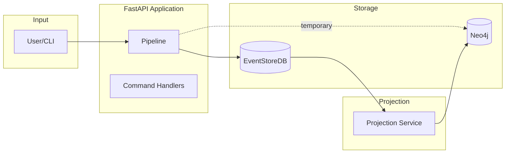
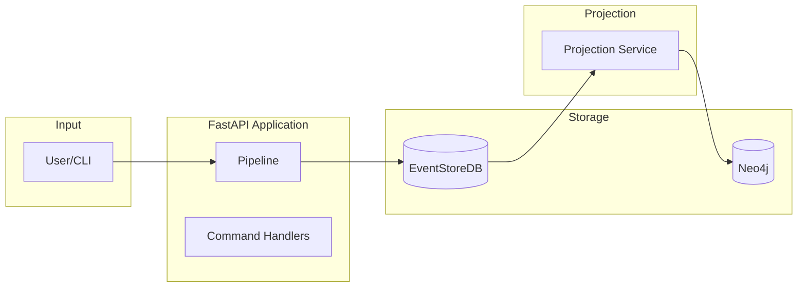

# Architecture Documentation

> **Version:** 2.0 (Event-Sourced Architecture)
> **Last Updated:** 2026-01-18
> **Status:** M2.8 Complete - Production Ready

This folder contains versioned architecture documentation for the Interview Analyzer system using Mermaid diagrams.

## Documents

| Document | Description |
|----------|-------------|
| [System Overview](./system-overview.md) | High-level system context and container diagrams |
| [Data Flow](./data-flow.md) | Pipeline processing and event flow |
| [Event Sourcing](./event-sourcing.md) | CQRS/ES patterns, aggregates, projections |
| [Database Schema](./database-schema.md) | Neo4j graph schema and relationships |

## Quick Reference

### Current State (M2.8 - Dual-Write)

### Target State (M3.0 - Single-Writer)

## Technology Stack

| Component | Technology | Version |
|-----------|-----------|---------|
| Language | Python | 3.10 |
| API Framework | FastAPI | 0.117.0+ |
| Event Store | EventStoreDB | 23.10.1 |
| Graph Database | Neo4j | 5.22.0 |
| Task Queue | Celery | 5.5.3 |
| Message Broker | Redis | 7 Alpine |
| NLP | spaCy | 3.8.7 |
| LLM APIs | OpenAI, Anthropic, Gemini | Various |

## Changelog

| Version | Date | Changes |
|---------|------|---------|
| 2.0 | 2026-01-18 | Migrated to Mermaid, added event sourcing diagrams |
| 1.0 | 2026-01-10 | Initial ASCII diagrams in onboarding docs |
