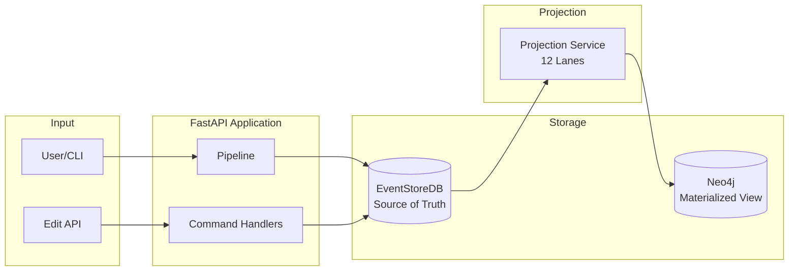

# Architecture Documentation

> **Version:** 3.0 (Single-Writer Event-Sourced Architecture)
> **Last Updated:** 2026-01-26
> **Status:** M3.0 Complete - Single-Writer Production Ready

This folder contains versioned architecture documentation for the Interview Analyzer system using Mermaid diagrams.

## Documents

| Document | Description |
|----------|-------------|
| [System Overview](./system-overview.md) | High-level system context and container diagrams |
| [Data Flow](./data-flow.md) | Pipeline processing and event flow |
| [Event Sourcing](./event-sourcing.md) | CQRS/ES patterns, aggregates, projections |
| [Database Schema](./database-schema.md) | Neo4j graph schema and relationships |

## Quick Reference

### Current State (M3.0 - Single-Writer) ✅



**Key Architecture Points:**
- **EventStoreDB** is the single source of truth
- **Pipeline** only emits events (no direct Neo4j writes)
- **Projection Service** is the SOLE writer to Neo4j
- **Neo4j** is a materialized view that can be rebuilt from events

## Technology Stack

| Component | Technology | Version |
|-----------|-----------|---------|
| Language | Python | 3.10 |
| API Framework | FastAPI | 0.117.0+ |
| Event Store | EventStoreDB | 23.10.1 |
| Graph Database | Neo4j | 6.x (driver) / 5.26.0 (server) |
| Task Queue | Celery | 5.5.3 |
| Message Broker | Redis | 7 Alpine |
| NLP | spaCy | 3.8.7 |
| LLM APIs | OpenAI, Anthropic | Various |

## Test Infrastructure

Running integration tests requires EventStoreDB and Neo4j:

```bash
# Start test infrastructure
make test-infra-up

# Run integration tests
make test-integration

# Run projection rebuild test (validates event sourcing)
make test-rebuild

# Stop infrastructure
make test-infra-down
```

## Changelog

| Version | Date | Changes |
|---------|------|---------|
| 3.0 | 2026-01-26 | M3.0 complete: single-writer, neo4j 6.x, test infrastructure |
| 2.0 | 2026-01-18 | Migrated to Mermaid, added event sourcing diagrams |
| 1.0 | 2026-01-10 | Initial ASCII diagrams in onboarding docs |
