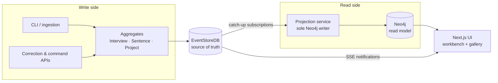

# Architecture Documentation

> **Last Updated:** 2026-07-25
> **Status:** M5.1b complete — event-sourced backend, layered "Mine" analysis
> pipeline, and a live two-surface Next.js UI.

Versioned architecture documentation for the Interview Analyzer, using Mermaid
diagrams. For the milestone history and current test/coverage numbers, see
[../ROADMAP.md](../ROADMAP.md).

## Documents

| Document | Description |
|----------|-------------|
| [System Overview](./system-overview.md) | System context, containers, and the request/projection paths |
| [Data Flow](./data-flow.md) | The layered analysis pipeline, ingest → export/ask |
| [Event Sourcing](./event-sourcing.md) | CQRS/ES patterns, the three aggregates and their events, projection ordering |
| [Database Schema](./database-schema.md) | Neo4j read-model nodes and relationships |

## The system in one diagram


```mermaid
flowchart LR
    subgraph Write["Write side"]
        U[CLI / ingestion]
        API[Correction & command APIs]
        AGG[Aggregates<br/>Interview · Sentence · Project]
    end

    ES[(EventStoreDB<br/>source of truth)]

    subgraph Read["Read side"]
        PS[Projection service<br/>sole Neo4j writer]
        N4[(Neo4j<br/>read model)]
    end

    UI[Next.js UI<br/>workbench + gallery]

    U --> AGG
    API --> AGG
    AGG --> ES
    ES -->|catch-up subscriptions| PS
    PS --> N4
    N4 --> UI
    ES -->|SSE notifications| UI
```

**Load-bearing ideas:**

- **EventStoreDB is the single source of truth.** Every fact is an append-only
  event. Corrections are new events, never in-place edits.
- **CQRS.** The write side (aggregates + commands) and the read side (Neo4j +
  queries) are separate. The UI mirrors this: a workbench for writing, a gallery
  for reading.
- **The projection service is the only writer to Neo4j.** Neo4j is a derived
  view, rebuildable from the event log. Events are replayed in each stream's
  commit-position (causal) order per lane (see the event-sourcing doc, M4.9).
- **Frozen wire format.** Event type names, the `Sentence` aggregate type, and
  `Sentence-{uuid}` stream names never change, even though the projected node is
  `:Fragment` (the `:Sentence` label was dropped in M4.8). New optional
  envelope/metadata fields (like `project_id`) are additive.

## The layered "Mine" model

Analysis is organized as layers, each adding structure over the raw transcript
without rewriting it:

| Layer | What it adds | Key nodes |
|-------|--------------|-----------|
| **1 — Conversation structure** | Fragments (offset-grounded), speakers, utterances, stitching | `Fragment`, `Speaker`, `Utterance` |
| **2 — Enrichment** | Per-dimension analysis, entities, claims, embeddings | `Claim`, `Entity`, `Topic`, `Keyword` |
| **3 — Lenses** | Purpose-built readings (meeting_minutes, persona) via a generic engine | `LensItem` (+ node-type sublabels) |
| **4 — Segments** | Topic episodes over the utterance sequence | `Segment` |
| **5 — Export** | OKF bundles (Markdown + YAML front matter), grounded to source | *(files, not graph)* |

Cross-cutting: **resolution** (canonical `Person` identities across interviews,
`CanonicalEntity` surface-form canonicalization) and **ask** (GraphRAG hybrid
retrieval + cited synthesis) sit on top of the read model.

## Technology stack

| Component | Technology | Version |
|-----------|-----------|---------|
| Language | Python | 3.10 |
| API | FastAPI + Uvicorn | 0.117+ |
| Event store | EventStoreDB | 23.10 |
| Read model | Neo4j | 5.26 (server) |
| Background work | Celery / Redis | 5.5 / 7 |
| NLP | spaCy | 3.8 |
| LLM providers | Anthropic, OpenAI (+ Claude Code) | — |
| UI | Next.js 15 + React + TanStack Query | — |

## Test infrastructure

Integration tests and live smokes need EventStoreDB + Neo4j (and, for the live
smokes, the projection service):

```bash
make test-infra-up        # start EventStoreDB + Neo4j
make test-integration     # integration tests
make projection-smoke     # cold projection-service, ingest → fully projected
make live-feed-smoke      # real ESDB event → live SSE subscriber
make test-infra-down      # stop infrastructure
```

## Changelog

| Date | Changes |
|------|---------|
| 2026-07-25 | Rewrite for the M4.x Mine arc + M5.x UI/liveness (three aggregates, layered model, projection ordering, live two-surface UI) |
| 2026-01-26 | M3.0: single-writer, test infrastructure |
| 2026-01-18 | Migrated to Mermaid, added event-sourcing diagrams |
| 2026-01-10 | Initial ASCII diagrams in onboarding docs |
