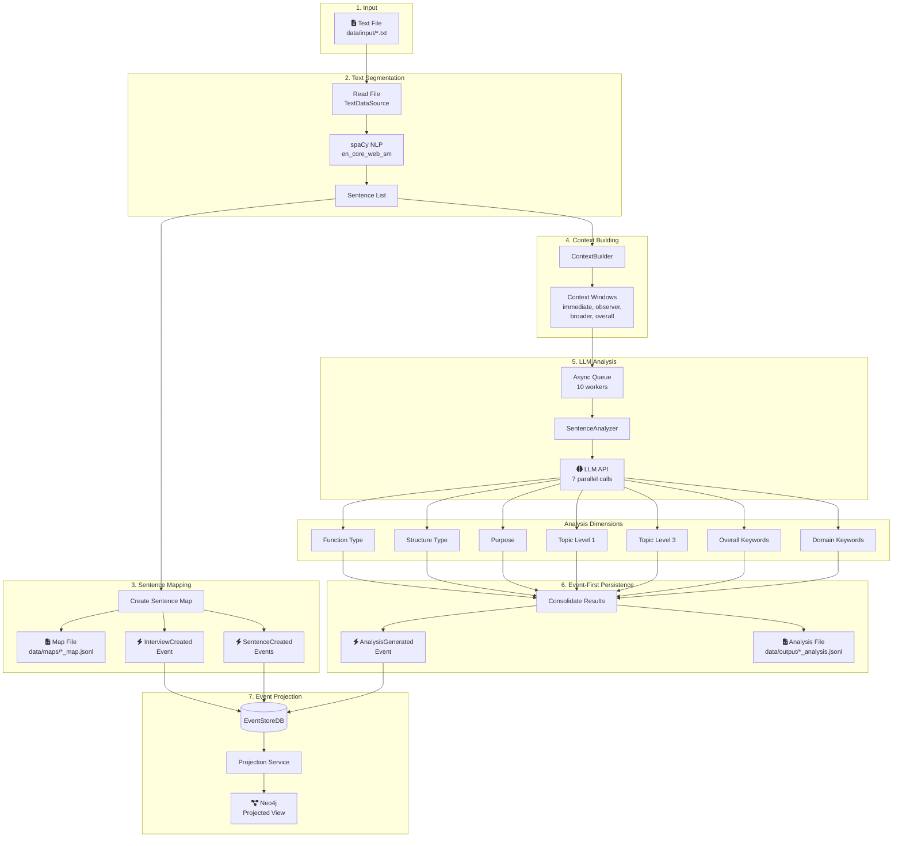
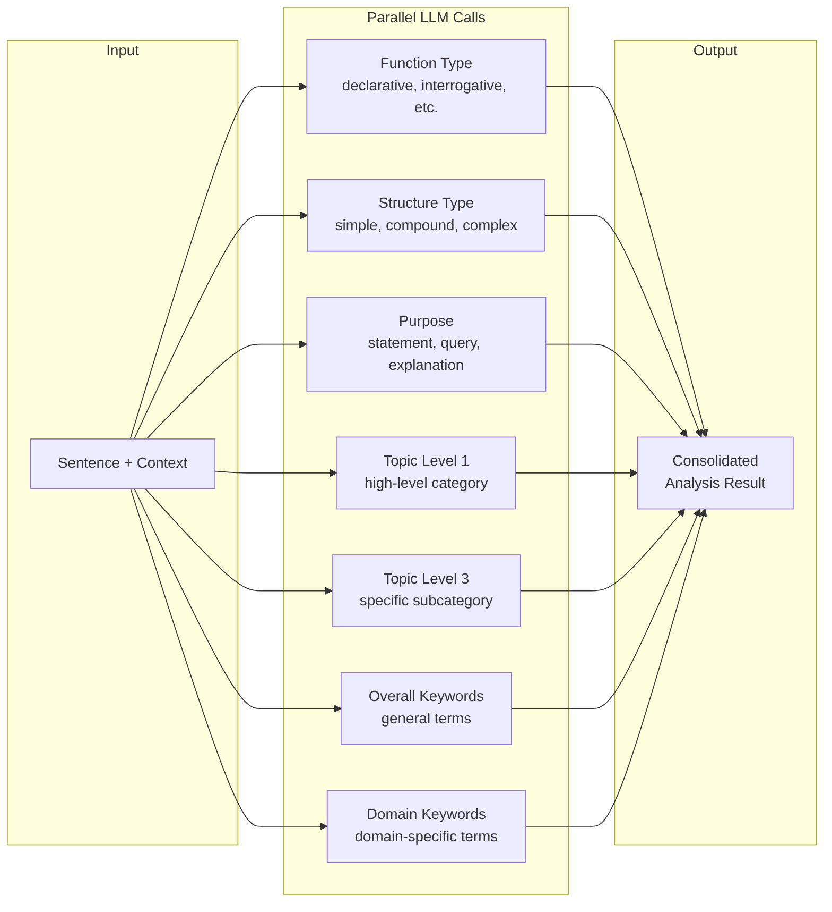
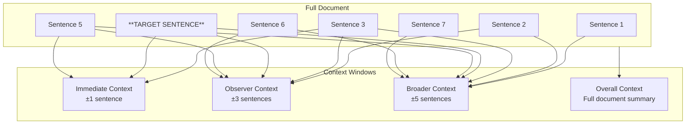
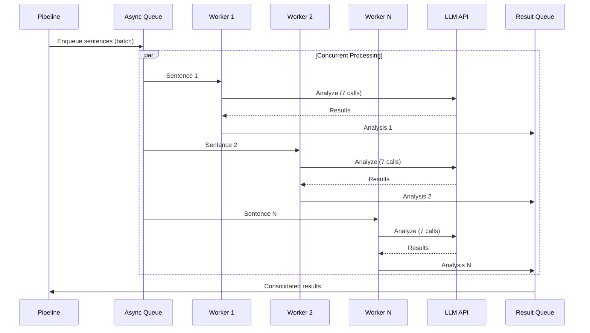
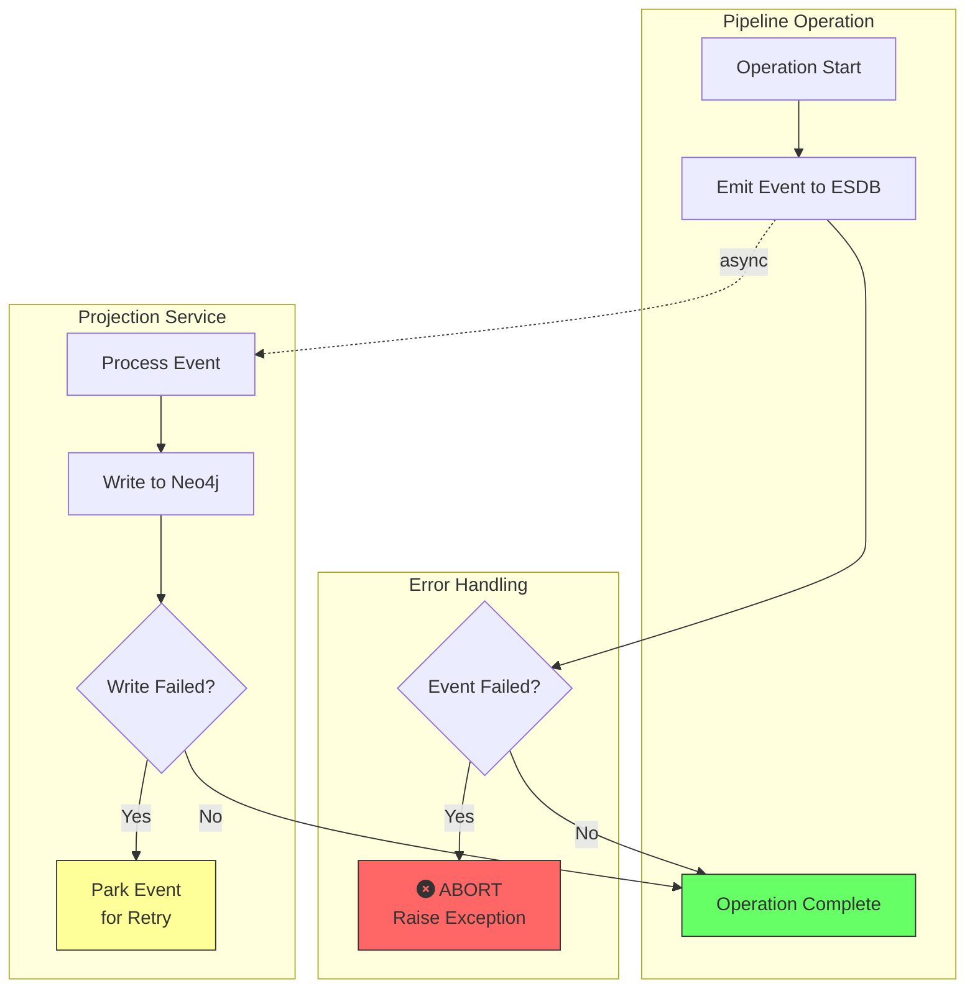

# Data Flow

> **Last Updated:** 2026-01-18

## Pipeline Processing Flow

The core pipeline transforms raw text files into structured, multi-dimensional sentence analysis.



## Analysis Dimensions

Each sentence is classified across 7 dimensions via parallel LLM calls:



## Context Window Building

The `ContextBuilder` creates different context windows around each sentence:



## Async Worker Architecture



## File Input/Output

### Input Files
- **Location:** `data/input/`
- **Format:** Plain text (`.txt`)
- **Content:** Interview transcripts, documents

### Output Files

| File Type | Location | Format | Content |
|-----------|----------|--------|---------|
| Map Files | `data/maps/*_map.jsonl` | JSON Lines | `{sentence_id, sequence_order, sentence}` |
| Analysis Files | `data/output/*_analysis.jsonl` | JSON Lines | Full analysis per sentence |
| Log Files | `logs/pipeline.log` | Text | Processing logs |

### JSONL Analysis Format

```json
{
  "sentence_id": 1,
  "sequence_order": 1,
  "sentence": "The product launch was successful.",
  "filename": "interview_001.txt",
  "function_type": "declarative",
  "structure_type": "simple",
  "purpose": "statement",
  "topic_level_1": "Product",
  "topic_level_3": "Product Launch",
  "overall_keywords": ["product", "launch", "successful"],
  "domain_keywords": ["product launch", "release"]
}
```

## Error Handling Flow



**Key Principle:** Events are the source of truth. Event failures abort the operation. Projection service is the sole writer to Neo4j and handles retries independently.
