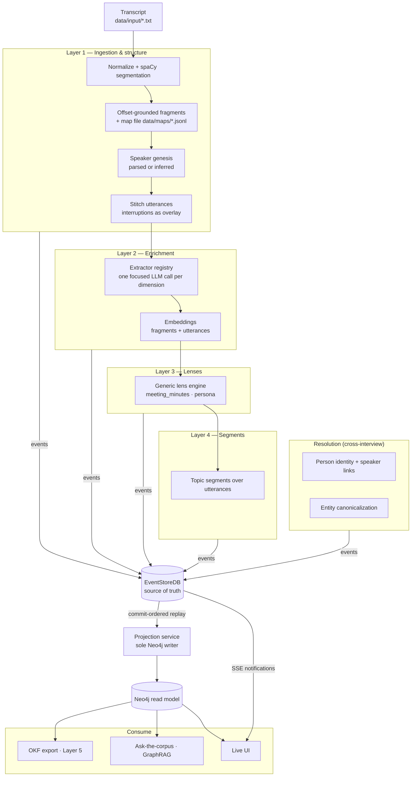
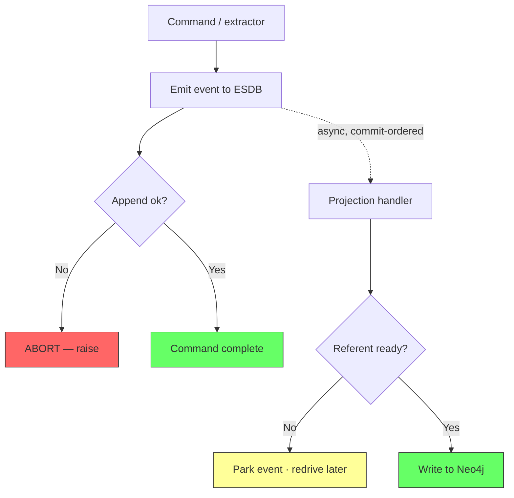

# Data Flow

> **Last Updated:** 2026-07-25

Analysis is organized as **layers** over a transcript. Each layer emits events;
nothing rewrites the verbatim text. The projection service turns those events
into the Neo4j read model. This doc traces the flow layer by layer.

## The pipeline, end to end

```mermaid
flowchart TD
    file[Transcript<br/>data/input/*.txt]

    subgraph L1["Layer 1 — Ingestion &amp; structure"]
        norm[Normalize + spaCy segmentation]
        frags[Offset-grounded fragments<br/>+ map file data/maps/*.jsonl]
        spk[Speaker genesis<br/>parsed or inferred]
        stitch[Stitch utterances<br/>interruptions as overlay]
    end

    subgraph L2["Layer 2 — Enrichment"]
        ext[Extractor registry<br/>one focused LLM call per dimension]
        emb[Embeddings<br/>fragments + utterances]
    end

    subgraph L3["Layer 3 — Lenses"]
        lens[Generic lens engine<br/>meeting_minutes · persona]
    end

    subgraph L4["Layer 4 — Segments"]
        seg[Topic segments over utterances]
    end

    subgraph RES["Resolution (cross-interview)"]
        person[Person identity + speaker links]
        canon[Entity canonicalization]
    end

    es[(EventStoreDB<br/>source of truth)]
    proj[Projection service<br/>sole Neo4j writer]
    n4[(Neo4j read model)]

    subgraph OUT["Consume"]
        export[OKF export · Layer 5]
        ask[Ask-the-corpus · GraphRAG]
        ui[Live UI]
    end

    file --> norm --> frags --> spk --> stitch
    stitch --> ext --> emb
    emb --> lens --> seg
    L1 & L2 & L3 & L4 & RES -->|events| es
    es -->|commit-ordered replay| proj --> n4
    n4 --> export & ask & ui
    es -->|SSE notifications| ui
```

## Layer 1 — Ingestion & structure

`python -m src.ingestion <file>` normalizes the transcript, segments it with
spaCy into **offset-grounded fragments** (every fragment records its exact
source span, written to a map file under `data/maps/`), and establishes
speakers — parsed from labels when present, inferred with a confidence score
when not. Interrupted utterances are stitched back together as a relationship
overlay: the verbatim text is untouched, but "who interrupted whom" becomes
queryable.

Events: `InterviewCreated`, `SpeakerCreated` / `SpeakerAttributed`,
`SentenceCreated` (one per fragment), `UtteranceIdentified`,
`InterruptionRecorded`, `StitchRemoved`.

## Layer 2 — Enrichment

`--enrich` (or `python -m src.enrichment`) runs a **registry of focused
extractors** — one schema-checked LLM call per dimension (function, structure,
purpose, topics, keywords, entities), plus claims and embeddings — behind a
provider failover chain (Anthropic Haiku → Claude Code → OpenAI). Each result
carries a numeric confidence. Fragments and utterances get vector embeddings in
per-model Neo4j indexes for semantic search.

Events: `AnalysisGenerated`, `EntitiesExtracted`, `EmbeddingGenerated` (per
fragment); `ClaimExtracted`, `UtteranceEmbeddingGenerated` (per interview).

## Layer 3 — Lenses

`python -m src.lens <interview_id> <lens>` applies a **lens** — a purpose-built
reading of the interview. A single generic engine serves every lens; the lens
itself is a YAML profile plus a prompts file (no code). `meeting_minutes`
extracts objectives, decisions, action items, and follow-ups; `persona`
extracts traits, goals, pain points, and notable quotes. Human overrides lock a
lens item against future re-runs.

Events: `LensApplied`, `LensExtractionGenerated`, `LensExtractionOverridden`.

## Layer 4 — Segments

Topic **segments** group the utterance sequence into episodes. Events:
`SegmentIdentified`, `SegmentRemoved`.

## Resolution (cross-interview identity)

Speakers across interviews are linked to canonical **Persons**; entity surface
forms are **canonicalized** (merge/split/alias). These are human-in-the-loop
decisions surfaced in the review worklist and applied through the resolution
API. Events (on the `Project` stream): `PersonIdentified`,
`SpeakerLinkedToPerson`, `PersonLinkRemoved`, `EntityCanonicalized`,
`EntityAliasAdded`, `EntityMergeConfirmed`, `EntitySplit`.

## Layer 5 — Export & ask

- **Export** (`python -m src.export <interview_id> <lens>`) writes an OKF bundle
  — Markdown with YAML front matter, git-versionable, every lens item grounded
  back to the verbatim transcript.
- **Ask** (`python -m src.ask <project_id> "..."` or `POST /ask/{project_id}`)
  answers questions with hybrid graph + vector retrieval and cited synthesis
  (GraphRAG).

## Projection & correctness

Events are the source of truth; Neo4j is derived. The **projection service is
the sole writer**. It replays each stream's events in **commit-position (causal)
order** using a per-lane reorder buffer, so a dependent event never lands before
its referent. An event whose referent isn't ready yet is **parked**
(`StreamState.ANY`) rather than dropped, and can be redriven later
(`python -m src.projections.redrive`).

```mermaid
flowchart TD
    op[Command / extractor] --> emit[Emit event to ESDB]
    emit --> ok{Append ok?}
    ok -->|No| abort[ABORT — raise]
    ok -->|Yes| done[Command complete]

    emit -.->|async, commit-ordered| proj[Projection handler]
    proj --> ready{Referent ready?}
    ready -->|No| park[Park event · redrive later]
    ready -->|Yes| write[Write to Neo4j]

    style abort fill:#f66,stroke:#333
    style park fill:#ff9,stroke:#333
    style write fill:#6f6,stroke:#333
    style done fill:#6f6,stroke:#333
```

**Principle:** event-append failures abort the command; projection failures are
handled independently by the sole writer (park + redrive), never by losing data.

## Live updates

An in-process `EsdbWatcher` runs catch-up subscriptions on the category streams
and pushes thin, surface-tagged notifications (`{surface, interview_id?,
project_id?}`) to browsers over SSE (`GET /ui/streams/events`). The UI reacts by
invalidating the matching read queries — the workbench and gallery stay current
without a manual refresh. See [event-sourcing.md](./event-sourcing.md) for the
watcher and ordering details.
