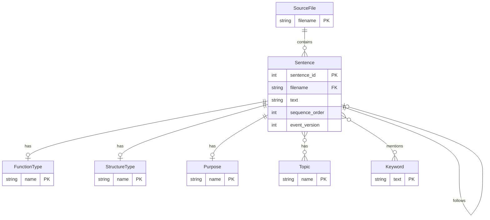
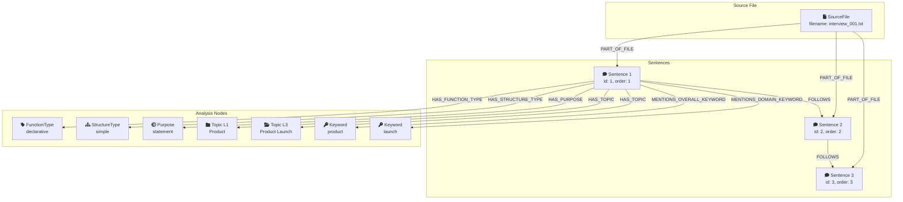

# Database Schema

> **Last Updated:** 2026-01-18

## Neo4j Graph Schema

The Neo4j database serves as the read model in the CQRS architecture, storing projected views of events for efficient querying.

### Entity Relationship Diagram



### Graph Visualization



## Node Types

### `:SourceFile`

Represents an uploaded transcript file.

| Property | Type | Description |
|----------|------|-------------|
| `filename` | string | Unique filename (primary key) |

```cypher
CREATE CONSTRAINT source_file_filename IF NOT EXISTS
FOR (sf:SourceFile) REQUIRE sf.filename IS UNIQUE
```

### `:Sentence`

Represents an individual sentence from a transcript.

| Property | Type | Description |
|----------|------|-------------|
| `sentence_id` | integer | Unique sentence ID within file |
| `filename` | string | Source file reference |
| `text` | string | Sentence text content |
| `sequence_order` | integer | Order in document |
| `event_version` | integer | Latest event version (for idempotency) |

```cypher
CREATE INDEX sentence_id_idx IF NOT EXISTS
FOR (s:Sentence) ON (s.sentence_id, s.filename)
```

### `:FunctionType`

Grammatical function classification.

| Property | Type | Description |
|----------|------|-------------|
| `name` | string | Function type name |

**Values:** `declarative`, `interrogative`, `imperative`, `exclamatory`

### `:StructureType`

Sentence structure classification.

| Property | Type | Description |
|----------|------|-------------|
| `name` | string | Structure type name |

**Values:** `simple`, `compound`, `complex`, `compound-complex`

### `:Purpose`

Communicative purpose classification.

| Property | Type | Description |
|----------|------|-------------|
| `name` | string | Purpose name |

**Values:** `statement`, `question`, `request`, `explanation`, `opinion`, `description`

### `:Topic`

Hierarchical topic classification (Level 1 and Level 3).

| Property | Type | Description |
|----------|------|-------------|
| `name` | string | Topic name |

### `:Keyword`

Extracted keywords (overall and domain-specific).

| Property | Type | Description |
|----------|------|-------------|
| `text` | string | Keyword text |

## Relationship Types

### `:PART_OF_FILE`

Links sentences to their source file.

```
(:Sentence)-[:PART_OF_FILE]->(:SourceFile)
```

### `:FOLLOWS`

Links sentences in sequence order.

```
(:Sentence)-[:FOLLOWS]->(:Sentence)
```

**Note:** Points from current sentence to *previous* sentence (sentence N follows sentence N-1).

### `:HAS_FUNCTION_TYPE`

Links sentence to its function classification.

```
(:Sentence)-[:HAS_FUNCTION_TYPE]->(:FunctionType)
```

### `:HAS_STRUCTURE_TYPE`

Links sentence to its structure classification.

```
(:Sentence)-[:HAS_STRUCTURE_TYPE]->(:StructureType)
```

### `:HAS_PURPOSE`

Links sentence to its purpose classification.

```
(:Sentence)-[:HAS_PURPOSE]->(:Purpose)
```

### `:HAS_TOPIC`

Links sentence to topics (both Level 1 and Level 3).

```
(:Sentence)-[:HAS_TOPIC]->(:Topic)
```

### `:MENTIONS_OVERALL_KEYWORD`

Links sentence to general keywords.

```
(:Sentence)-[:MENTIONS_OVERALL_KEYWORD]->(:Keyword)
```

### `:MENTIONS_DOMAIN_KEYWORD`

Links sentence to domain-specific keywords.

```
(:Sentence)-[:MENTIONS_DOMAIN_KEYWORD]->(:Keyword)
```

## Example Queries

### Find all questions about a topic

```cypher
MATCH (s:Sentence)-[:HAS_FUNCTION_TYPE]->(f:FunctionType {name: "interrogative"})
MATCH (s)-[:HAS_TOPIC]->(t:Topic {name: "product development"})
RETURN s.text, s.sequence_order
ORDER BY s.sequence_order
```

### Get sentence with full analysis

```cypher
MATCH (s:Sentence {sentence_id: 1, filename: "interview_001.txt"})
OPTIONAL MATCH (s)-[:HAS_FUNCTION_TYPE]->(ft:FunctionType)
OPTIONAL MATCH (s)-[:HAS_STRUCTURE_TYPE]->(st:StructureType)
OPTIONAL MATCH (s)-[:HAS_PURPOSE]->(p:Purpose)
OPTIONAL MATCH (s)-[:HAS_TOPIC]->(t:Topic)
OPTIONAL MATCH (s)-[:MENTIONS_OVERALL_KEYWORD]->(ok:Keyword)
OPTIONAL MATCH (s)-[:MENTIONS_DOMAIN_KEYWORD]->(dk:Keyword)
RETURN s.text,
       ft.name AS function_type,
       st.name AS structure_type,
       p.name AS purpose,
       COLLECT(DISTINCT t.name) AS topics,
       COLLECT(DISTINCT ok.text) AS overall_keywords,
       COLLECT(DISTINCT dk.text) AS domain_keywords
```

### Find related sentences by keyword

```cypher
MATCH (s1:Sentence)-[:MENTIONS_OVERALL_KEYWORD]->(k:Keyword)<-[:MENTIONS_OVERALL_KEYWORD]-(s2:Sentence)
WHERE s1.sentence_id <> s2.sentence_id
RETURN s1.text, s2.text, k.text AS shared_keyword
LIMIT 20
```

### Get conversation flow

```cypher
MATCH path = (first:Sentence)-[:FOLLOWS*]->(last:Sentence)
WHERE first.filename = "interview_001.txt"
  AND NOT ()-[:FOLLOWS]->(first)
RETURN [node IN nodes(path) | node.text] AS conversation
```

### Count sentences by topic

```cypher
MATCH (s:Sentence)-[:HAS_TOPIC]->(t:Topic)
RETURN t.name AS topic, COUNT(s) AS sentence_count
ORDER BY sentence_count DESC
LIMIT 10
```

## Schema Creation Script

```cypher
// Constraints
CREATE CONSTRAINT source_file_filename IF NOT EXISTS
FOR (sf:SourceFile) REQUIRE sf.filename IS UNIQUE;

// Indexes for performance
CREATE INDEX sentence_lookup IF NOT EXISTS
FOR (s:Sentence) ON (s.sentence_id, s.filename);

CREATE INDEX sentence_sequence IF NOT EXISTS
FOR (s:Sentence) ON (s.filename, s.sequence_order);

CREATE INDEX topic_name IF NOT EXISTS
FOR (t:Topic) ON (t.name);

CREATE INDEX keyword_text IF NOT EXISTS
FOR (k:Keyword) ON (k.text);

CREATE INDEX function_type_name IF NOT EXISTS
FOR (ft:FunctionType) ON (ft.name);

CREATE INDEX structure_type_name IF NOT EXISTS
FOR (st:StructureType) ON (st.name);

CREATE INDEX purpose_name IF NOT EXISTS
FOR (p:Purpose) ON (p.name);
```

## EventStoreDB Streams

While Neo4j is the read model, EventStoreDB holds the authoritative event streams:

| Stream Pattern | Content |
|----------------|---------|
| `Interview-{uuid}` | Interview lifecycle events |
| `Sentence-{uuid}` | Sentence lifecycle and analysis events |
| `$all` | System stream (all events) |

### Event Types Stored

| Event | Stream | Description |
|-------|--------|-------------|
| `InterviewCreated` | `Interview-{id}` | New interview started |
| `InterviewMetadataUpdated` | `Interview-{id}` | Metadata changed |
| `InterviewStatusChanged` | `Interview-{id}` | Status transition |
| `SentenceCreated` | `Sentence-{id}` | New sentence added |
| `SentenceEdited` | `Sentence-{id}` | User edited text |
| `AnalysisGenerated` | `Sentence-{id}` | AI analysis completed |
| `AnalysisOverridden` | `Sentence-{id}` | User corrected analysis |
