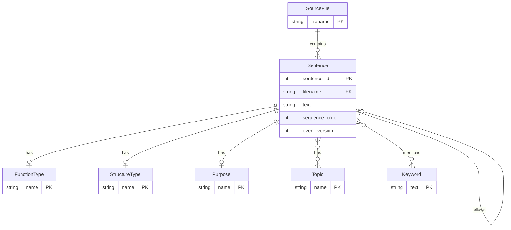
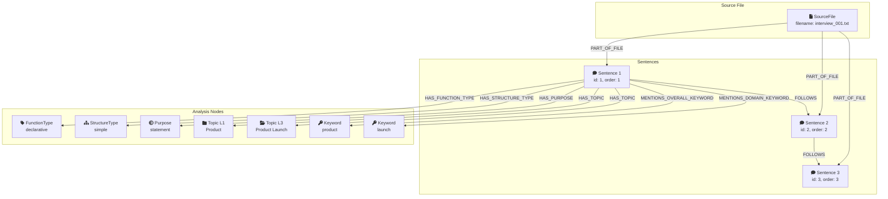

# Database Schema

> **Last Updated:** 2026-07-17

## Neo4j Graph Schema

The Neo4j database serves as the read model in the CQRS architecture, storing projected views of events for efficient querying.

### Entity Relationship Diagram


```mermaid
erDiagram
    SourceFile ||--o{ Sentence : contains
    Sentence ||--o| FunctionType : has
    Sentence ||--o| StructureType : has
    Sentence ||--o| Purpose : has
    Sentence }o--o{ Topic : has
    Sentence }o--o{ Keyword : mentions
    Sentence ||--o| Sentence : follows

    SourceFile {
        string filename PK
    }

    Sentence {
        int sentence_id PK
        string filename FK
        string text
        int sequence_order
        int event_version
    }

    FunctionType {
        string name PK
    }

    StructureType {
        string name PK
    }

    Purpose {
        string name PK
    }

    Topic {
        string name PK
    }

    Keyword {
        string text PK
    }
```

### Graph Visualization


```mermaid
flowchart TD
    subgraph File["Source File"]
        SF[fa:fa-file SourceFile<br/>filename: interview_001.txt]
    end

    subgraph Sentences["Sentences"]
        S1[fa:fa-comment Sentence 1<br/>id: 1, order: 1]
        S2[fa:fa-comment Sentence 2<br/>id: 2, order: 2]
        S3[fa:fa-comment Sentence 3<br/>id: 3, order: 3]
    end

    subgraph Analysis["Analysis Nodes"]
        FT[fa:fa-tag FunctionType<br/>declarative]
        ST[fa:fa-sitemap StructureType<br/>simple]
        P[fa:fa-bullseye Purpose<br/>statement]
        T1[fa:fa-folder Topic L1<br/>Product]
        T3[fa:fa-folder-open Topic L3<br/>Product Launch]
        KW1[fa:fa-key Keyword<br/>product]
        KW2[fa:fa-key Keyword<br/>launch]
    end

    SF -->|PART_OF_FILE| S1
    SF -->|PART_OF_FILE| S2
    SF -->|PART_OF_FILE| S3

    S1 -->|FOLLOWS| S2
    S2 -->|FOLLOWS| S3

    S1 -->|HAS_FUNCTION_TYPE| FT
    S1 -->|HAS_STRUCTURE_TYPE| ST
    S1 -->|HAS_PURPOSE| P
    S1 -->|HAS_TOPIC| T1
    S1 -->|HAS_TOPIC| T3
    S1 -->|MENTIONS_OVERALL_KEYWORD| KW1
    S1 -->|MENTIONS_DOMAIN_KEYWORD| KW2
```

## Node Types

### `:SourceFile`

Represents an uploaded transcript file.

| Property | Type | Description |
|----------|------|-------------|
| `filename` | string | Unique filename (primary key) |

```cypher
CREATE CONSTRAINT source_file_filename IF NOT EXISTS
FOR (sf:SourceFile) REQUIRE sf.filename IS UNIQUE
```

### `:Fragment`

Represents an individual sentence-level fragment from a transcript.
`:Fragment` is the only label — the transitional `:Sentence` shim label
(dual-labeled on write during M4.5-M4.7) was dropped in M4.8; pre-existing
graphs are retargeted by the one-shot `migrate_shim_drop` migration (see
below). Event types (`SentenceCreated`, `SentenceEdited`, …) and the
`Sentence-{id}` EventStoreDB stream pattern are frozen wire format and are
unaffected by this rename.

| Property | Type | Description |
|----------|------|-------------|
| `sentence_id` | integer | Unique sentence ID within file |
| `filename` | string | Source file reference |
| `text` | string | Sentence text content |
| `sequence_order` | integer | Order in document |
| `event_version` | integer | Latest event version (for idempotency) |

```cypher
CREATE INDEX fragment_sentence_id IF NOT EXISTS
FOR (f:Fragment) ON (f.sentence_id)

CREATE INDEX fragment_lookup IF NOT EXISTS
FOR (f:Fragment) ON (f.sentence_id, f.filename)

CREATE INDEX fragment_sequence IF NOT EXISTS
FOR (f:Fragment) ON (f.filename, f.sequence_order)
```

### `:FunctionType`

Grammatical function classification.

| Property | Type | Description |
|----------|------|-------------|
| `name` | string | Function type name |

**Values:** `declarative`, `interrogative`, `imperative`, `exclamatory`

### `:StructureType`

Sentence structure classification.

| Property | Type | Description |
|----------|------|-------------|
| `name` | string | Structure type name |

**Values:** `simple`, `compound`, `complex`, `compound-complex`

### `:Purpose`

Communicative purpose classification.

| Property | Type | Description |
|----------|------|-------------|
| `name` | string | Purpose name |

**Values:** `statement`, `question`, `request`, `explanation`, `opinion`, `description`

### `:Topic`

Hierarchical topic classification (Level 1 and Level 3).

| Property | Type | Description |
|----------|------|-------------|
| `name` | string | Topic name |

### `:Keyword`

Extracted keywords (overall and domain-specific).

| Property | Type | Description |
|----------|------|-------------|
| `text` | string | Keyword text |

### `:Speaker` (Layer 1 / M4.1)

A conversation participant — parsed from labels or inferred (provisional) and
correctable via the speakers API.

| Property | Type | Description |
|----------|------|-------------|
| `speaker_id` | string | Deterministic UUID (uuid5 of `interview:speaker:handle`) |
| `handle` | string | Stable short handle (`S1`, `S2`, … or parsed label) |
| `display_name` | string | Human-readable name (rename clears `provisional`) |
| `provisional` | boolean | True when inferred rather than confirmed |
| `confidence` | float | Inference confidence (0–1) |
| `method` | string | `parsed` \| `inference` \| `human` |
| `interview_id` | string | Owning interview |
| `merged_into` | string? | Surviving speaker id when merged away |

### `:Utterance` (Layer 1 / M4.1)

A speaker's continuous thought, possibly spanning non-adjacent fragments
(stitching overlay — the fragment sequence itself is never modified).

| Property | Type | Description |
|----------|------|-------------|
| `utterance_id` | string | Deterministic UUID (uuid5 of `interview:utterance:ordinal`) |
| `interview_id` | string | Owning interview |
| `confidence` | float | Stitching confidence (0–1) |

**New `:Fragment` properties (Layer 1):** `start_char` / `end_char` — offsets
into the immutable source text such that `source[start_char:end_char] == text`.

## Relationship Types

### `:PART_OF_FILE`

Links sentences to their source file.

```
(:Fragment)-[:PART_OF_FILE]->(:SourceFile)
```

### `:FOLLOWS`

Links sentences in sequence order.

```
(:Fragment)-[:FOLLOWS]->(:Fragment)
```

### Layer 1 relationships (M4.1)

```
(:Interview)-[:HAS_PARTICIPANT]->(:Speaker)
(:Fragment)-[:SPOKEN_BY {confidence, method, locked}]->(:Speaker)
(:Speaker)-[:SPOKE]->(:Utterance)
(:Fragment)-[:PART_OF_UTTERANCE {position}]->(:Utterance)
(:Utterance)-[:INTERRUPTS {at_fragment_id}]->(:Utterance)
```

`SPOKEN_BY.locked = true` marks a human correction that system regeneration
must not overwrite. `INTERRUPTS` records where one utterance broke into
another, enabling the as-spoken visualization with interruption edges.

### Layer 2 enrichment (M4.2)

Nodes: `:Entity {surface (lowercased key), entity_type}`;
`:Claim {claim_id, text, kind, confidence, model, provider, interview_id}`.
Fragment/utterance embeddings are stored on per-model node properties
(`embedding_<sanitized_model>`), each backed by a per-model Neo4j vector index
(`fragment_embedding_<model>`, `utterance_embedding_<model>`, cosine) targeting
ITS property — cross-model isolation even when two models share dimensions.
The generic `embedding` / `embedding_model` / `embedding_dim` convenience
properties remain (latest write wins) for simple queries.
Per-analysis metadata (provider, dimension_confidences, flags) lives on the
`:Analysis` node.

```
(:Fragment)-[:MENTIONS {start, end, text, confidence}]->(:Entity)
(:Claim)-[:MADE_BY]->(:Speaker)
(:Claim)-[:SUPPORTED_BY]->(:Fragment)
```

`MENTIONS` edges are keyed by their `{start, end}` span (character offsets
within the fragment text) — two mentions of one entity in one fragment are two
edges. The `:Entity` node keys on the lowercased surface for coarse
resolution — full canonicalization is Layer 4. `SUPPORTED_BY` fans a claim out
to every fragment of the utterance it came from.

### Layer 3 lens items (M4.3)

Every lens item is a dual-labeled node: the generic `:LensItem` label for
lens-wide queries plus the dynamic label declared in the lens YAML's
`projects_to` (e.g. `:Decision`, `:ActionItem`). Dynamic labels are validated
at emit time against the lens spec AND sanitized (`^[A-Z][A-Za-z0-9]*$`) at the
handler — raw LLM output never reaches Cypher as a label.

```
(:LensItem:Decision {item_id, lens, lens_version, node_type, confidence,
                     model, provider, interview_id, <extracted fields>, locked?})
(:LensItem)-[:SUPPORTED_BY]->(:Fragment)     // fragment grounding
(:LensItem:Decision)-[:DECIDED_BY]->(:Speaker)   // declarative speaker link
(:LensItem:ActionItem)-[:OWNED_BY]->(:Speaker)   // relationship name from lens YAML
```

A `LensApplied` run deletes the interview+lens's prior UNLOCKED items with an
older `lens_version`; `locked = true` (human override via
`LensExtractionOverridden`) always survives re-runs.

### `:CanonicalEntity` (Layer 4 / M4.5b)

The resolved identity behind one or more `:Entity` surfaces within a project.
Never rewrites the Layer 2 `:Entity` node it aliases — resolution is a pure
overlay.

| Property | Type | Description |
|----------|------|-------------|
| `canonical_id` | string | Deterministic UUID (uuid5 of `{project_id}:entity:{normalized_name}:{entity_type}`) |
| `name` | string | Representative display name (most-mentioned surface) |
| `entity_type` | string | Entity type shared by every aliased surface |
| `project_id` | string | Owning project (human id, not the aggregate UUID) |
| `method` | string | `deterministic` \| `human` |
| `confidence` | float | Resolution confidence (0–1) |
| `locked` | boolean | True once a human merges/splits/canonicalizes — survives re-runs |
| `merged_into` | string? | Surviving canonical id when this one lost a merge |

### `:Person` (Layer 4 / M4.5b)

A cross-interview identity behind one or more Layer 1 `:Speaker` nodes within
a project. Never rewrites the `:Speaker` node it identifies.

| Property | Type | Description |
|----------|------|-------------|
| `person_id` | string | Deterministic UUID (uuid5 of `{project_id}:person:{normalized_display_name}`) |
| `display_name` | string | Front-matter spelling if matched, else most common raw speaker name |
| `project_id` | string | Owning project |

### `:Segment` (Layer 4 / M4.5c)

A topic episode over a contiguous fragment range within one interview. Like
the rest of Layer 4, a pure overlay: it never rewrites the Layer 1 fragments
it contains, only links to them.

| Property | Type | Description |
|----------|------|-------------|
| `segment_id` | string | Deterministic UUID (uuid5 of `{interview_id}:segment:{ordinal}`) |
| `topic` | string | Short topic label for the episode |
| `interview_id` | string | Owning interview |
| `confidence` | float | Extractor confidence (0–1) |

### Layer 4 resolution overlay (M4.5b)

Canonical/person nodes and their edges are an overlay: they never rewrite
Layer 1 `:Speaker` / Layer 2 `:Entity` nodes, only link to them. `Project-{id}`
streams and the seven event names below are wire format (frozen).

```
(:Entity)-[:ALIAS_OF {project_id, method, confidence}]->(:CanonicalEntity)
(:Speaker)-[:IDENTIFIED_AS {method, confidence}]->(:Person)
```

`ALIAS_OF` is keyed by `project_id` so the same `:Entity` surface can alias
different canonicals in different projects. A merge (`EntityMergeConfirmed`)
locks both canonicals and moves the losing one's `ALIAS_OF` edges to the
survivor; a split (`EntitySplit`) creates a new canonical and moves the
removed surfaces' edges to it.

Topic segments (M4.5c) join the same overlay:

```
(:Segment)-[:CONTAINS]->(:Fragment)   // one edge per fragment in [start_index, end_index]
```

`SegmentIdentified` rebuilds the segment's `CONTAINS` edges from its range on
every apply (a redraw = `SegmentRemoved` + forced re-run re-derives the same
deterministic `segment_id`); `SegmentRemoved` deletes the node via
`DETACH DELETE`, taking its `CONTAINS` edges with it. The orchestrator never
partially records a rejected proposal: an internally invalid one drops ALL
segments and flags `topic_segments_invalid`, and one that would overlap a
surviving live segment (partial removal + forced re-run) drops ALL segments
and flags `topic_segments_conflict` — degrade, don't guess, in both cases.

### Layer 5 export (M4.4) — no graph schema changes

M4.4 adds no nodes, edges, or properties. Front matter (title, started_at,
participants, raw block) lives in the Interview **aggregate's** metadata
(`InterviewCreated.metadata["front_matter"]`) — it is never projected into
Neo4j. The OKF exporter (`src/export/bundler.py`) loads the Interview
aggregate via the repository for the header, and reads the rest of the
bundle — speakers, lens items, claims, entities, latest analysis — from
Neo4j (`src/export/reader.py`), the same read model described above.

**Note:** Points from current sentence to *previous* sentence (sentence N follows sentence N-1).

### `:HAS_FUNCTION_TYPE`

Links sentence to its function classification.

```
(:Fragment)-[:HAS_FUNCTION_TYPE]->(:FunctionType)
```

### `:HAS_STRUCTURE_TYPE`

Links sentence to its structure classification.

```
(:Fragment)-[:HAS_STRUCTURE_TYPE]->(:StructureType)
```

### `:HAS_PURPOSE`

Links sentence to its purpose classification.

```
(:Fragment)-[:HAS_PURPOSE]->(:Purpose)
```

### `:HAS_TOPIC`

Links sentence to topics (both Level 1 and Level 3).

```
(:Fragment)-[:HAS_TOPIC]->(:Topic)
```

### `:MENTIONS_OVERALL_KEYWORD`

Links sentence to general keywords.

```
(:Fragment)-[:MENTIONS_OVERALL_KEYWORD]->(:Keyword)
```

### `:MENTIONS_DOMAIN_KEYWORD`

Links sentence to domain-specific keywords.

```
(:Fragment)-[:MENTIONS_DOMAIN_KEYWORD]->(:Keyword)
```

## Example Queries

### Find all questions about a topic

```cypher
MATCH (s:Fragment)-[:HAS_FUNCTION_TYPE]->(f:FunctionType {name: "interrogative"})
MATCH (s)-[:HAS_TOPIC]->(t:Topic {name: "product development"})
RETURN s.text, s.sequence_order
ORDER BY s.sequence_order
```

### Get sentence with full analysis

```cypher
MATCH (s:Fragment {sentence_id: 1, filename: "interview_001.txt"})
OPTIONAL MATCH (s)-[:HAS_FUNCTION_TYPE]->(ft:FunctionType)
OPTIONAL MATCH (s)-[:HAS_STRUCTURE_TYPE]->(st:StructureType)
OPTIONAL MATCH (s)-[:HAS_PURPOSE]->(p:Purpose)
OPTIONAL MATCH (s)-[:HAS_TOPIC]->(t:Topic)
OPTIONAL MATCH (s)-[:MENTIONS_OVERALL_KEYWORD]->(ok:Keyword)
OPTIONAL MATCH (s)-[:MENTIONS_DOMAIN_KEYWORD]->(dk:Keyword)
RETURN s.text,
       ft.name AS function_type,
       st.name AS structure_type,
       p.name AS purpose,
       COLLECT(DISTINCT t.name) AS topics,
       COLLECT(DISTINCT ok.text) AS overall_keywords,
       COLLECT(DISTINCT dk.text) AS domain_keywords
```

### Find related sentences by keyword

```cypher
MATCH (s1:Fragment)-[:MENTIONS_OVERALL_KEYWORD]->(k:Keyword)<-[:MENTIONS_OVERALL_KEYWORD]-(s2:Fragment)
WHERE s1.sentence_id <> s2.sentence_id
RETURN s1.text, s2.text, k.text AS shared_keyword
LIMIT 20
```

### Get conversation flow

```cypher
MATCH path = (first:Fragment)-[:FOLLOWS*]->(last:Fragment)
WHERE first.filename = "interview_001.txt"
  AND NOT ()-[:FOLLOWS]->(first)
RETURN [node IN nodes(path) | node.text] AS conversation
```

### Count sentences by topic

```cypher
MATCH (s:Fragment)-[:HAS_TOPIC]->(t:Topic)
RETURN t.name AS topic, COUNT(s) AS sentence_count
ORDER BY sentence_count DESC
LIMIT 10
```

## Schema Creation Script

The authoritative DDL lives in code, not here: `src/projections/schema.py`
(`SCHEMA_DDL`). It covers every MERGE key used by the projection handlers —
including the single-property indexes each `MERGE` anchor needs even where a
documented composite index also exists (composite indexes don't serve
single-property lookups).

It is applied automatically at projection-service startup
(`src/run_projection_service.py`, fail-fast if Neo4j is unreachable or DDL
fails) and can be run manually via:

```bash
python -m src.projections.ensure_schema
```

`:Fragment` is the sole write- and read-path label (the `:Sentence` shim
label and its indexes were dropped in M4.8 — 26 → 23 `SCHEMA_DDL`
statements). Pre-existing graphs created before M4.8 must run the one-shot
`python -m src.projections.migrate_shim_drop` migration once after
deploying this version; it recreates the `fragment_embedding_*` vector
indexes on `:Fragment`, strips the `:Sentence` label from every node, and
drops the shim's btree indexes. It is idempotent — safe to re-run. Fresh
databases (no `:Sentence`-labeled nodes) need nothing.

## EventStoreDB Streams

While Neo4j is the read model, EventStoreDB holds the authoritative event streams:

| Stream Pattern | Content |
|----------------|---------|
| `Interview-{uuid}` | Interview lifecycle events |
| `Sentence-{uuid}` | Sentence lifecycle and analysis events |
| `Project-{uuid}` | Project-scoped resolution events (Layer 4, M4.5b); `{uuid}` is `project_aggregate_id(project_id)` — a uuid5 of the human project id |
| `$all` | System stream (all events) |

### Event Types Stored

| Event | Stream | Description |
|-------|--------|-------------|
| `InterviewCreated` | `Interview-{id}` | New interview started |
| `InterviewMetadataUpdated` | `Interview-{id}` | Metadata changed |
| `InterviewStatusChanged` | `Interview-{id}` | Status transition |
| `SentenceCreated` | `Sentence-{id}` | New sentence added |
| `SentenceEdited` | `Sentence-{id}` | User edited text |
| `AnalysisGenerated` | `Sentence-{id}` | AI analysis completed |
| `AnalysisOverridden` | `Sentence-{id}` | User corrected analysis |
| `SpeakerCreated` | `Interview-{id}` | Speaker parsed or inferred (Layer 1) |
| `SpeakerRenamed` | `Interview-{id}` | Human named a provisional speaker |
| `SpeakerMerged` | `Interview-{id}` | Human merged two speaker handles |
| `SpeakerAttributed` | `Sentence-{id}` | Fragment attributed to a speaker (system) |
| `SpeakerReattributed` | `Sentence-{id}` | Human corrected attribution (locks) |
| `UtteranceIdentified` | `Interview-{id}` | Stitched utterance overlay identified |
| `InterruptionRecorded` | `Interview-{id}` | One utterance broke into another |
| `StitchRemoved` | `Interview-{id}` | Human removed a wrong stitch |
| `EntitiesExtracted` | `Sentence-{id}` | Span-grounded entity mentions (Layer 2) |
| `EmbeddingGenerated` | `Sentence-{id}` | Fragment embedding (base64 vector, Layer 2) |
| `ClaimExtracted` | `Interview-{id}` | Utterance-scoped claim (Layer 2) |
| `UtteranceEmbeddingGenerated` | `Interview-{id}` | Utterance embedding (Layer 2) |
| `LensApplied` | `Interview-{id}` | Lens run marker; supersedes prior unlocked items (Layer 3) |
| `LensExtractionGenerated` | `Interview-{id}` | One lens item (dual-label node, Layer 3) |
| `LensExtractionOverridden` | `Interview-{id}` | Human correction; locks the item (Layer 3) |
| `SegmentIdentified` | `Interview-{id}` | Topic segment over a fragment range (Layer 4, M4.5c) |
| `SegmentRemoved` | `Interview-{id}` | Human correction; removes a segment (redraw = remove + forced re-run) (Layer 4, M4.5c) |
| `EntityCanonicalized` | `Project-{id}` | New canonical entity created from a surface cluster (Layer 4) |
| `EntityAliasAdded` | `Project-{id}` | One more surface aliased to an existing canonical (Layer 4) |
| `EntityMergeConfirmed` | `Project-{id}` | Human merge of two canonicals (Layer 4) |
| `EntitySplit` | `Project-{id}` | Human split-off of surfaces into a new canonical (Layer 4) |
| `PersonIdentified` | `Project-{id}` | New cross-interview person identity (Layer 4) |
| `SpeakerLinkedToPerson` | `Project-{id}` | Speaker linked to a person (`exact_name`/`front_matter`/`human`, Layer 4) |
| `PersonLinkRemoved` | `Project-{id}` | Human unlinked a speaker from a person (Layer 4) |
