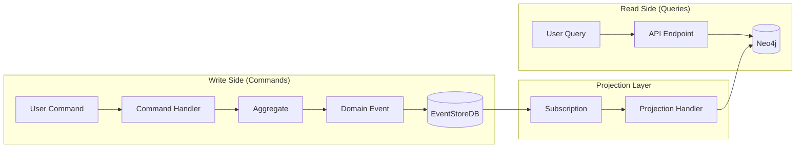
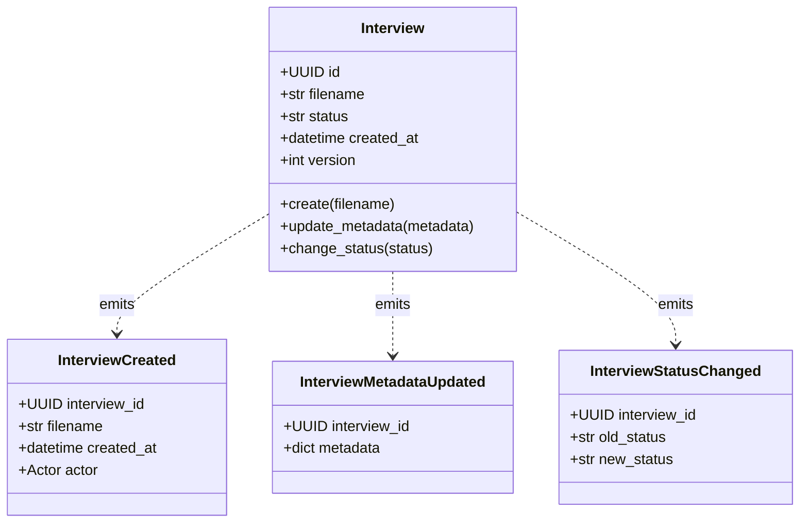
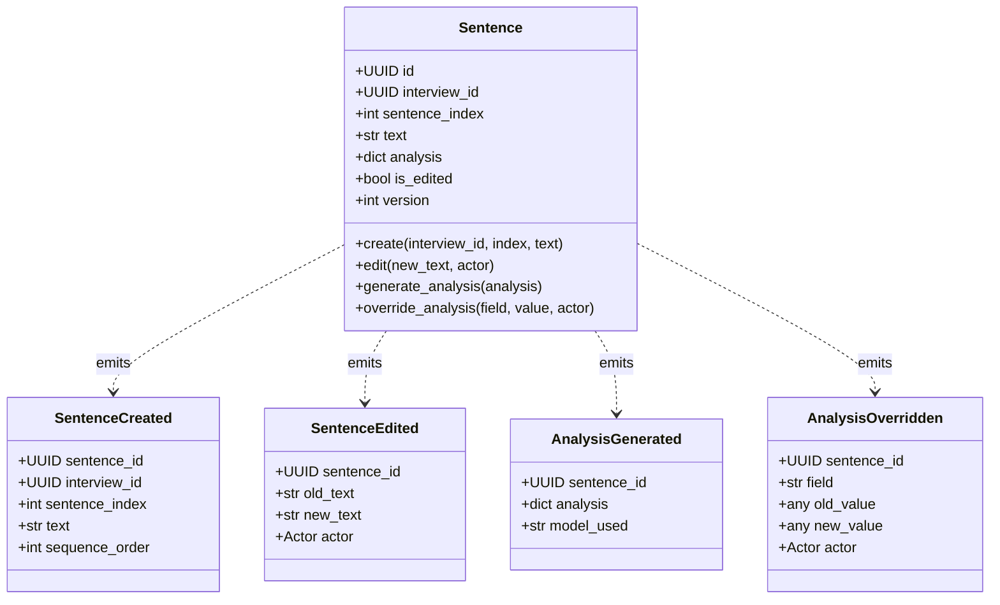
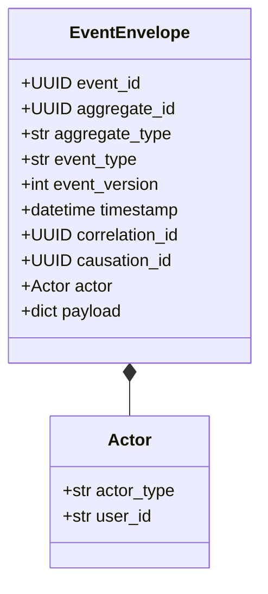
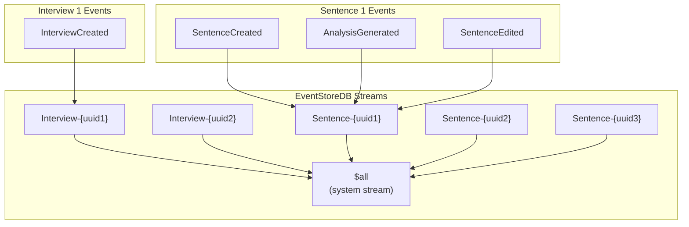
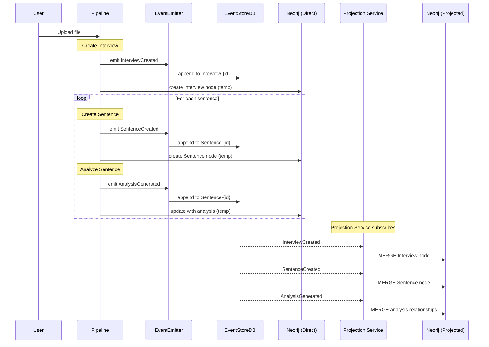
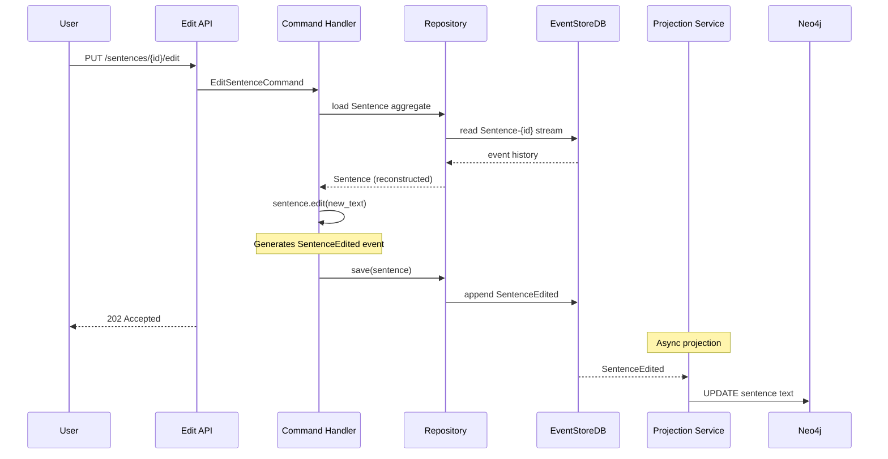
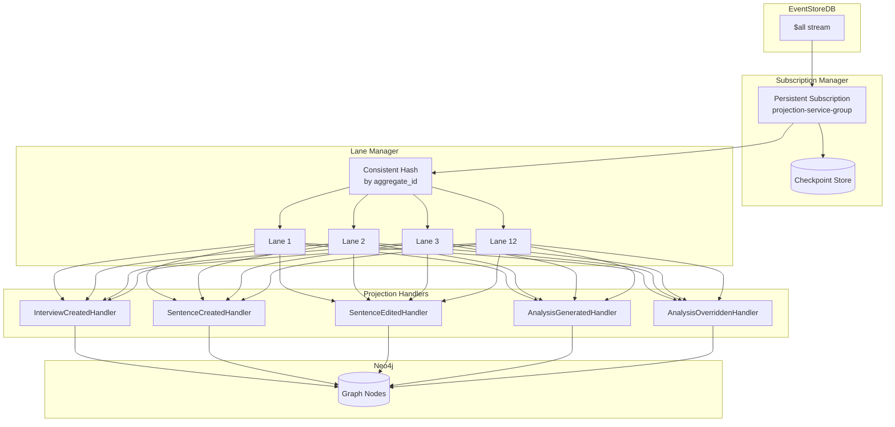
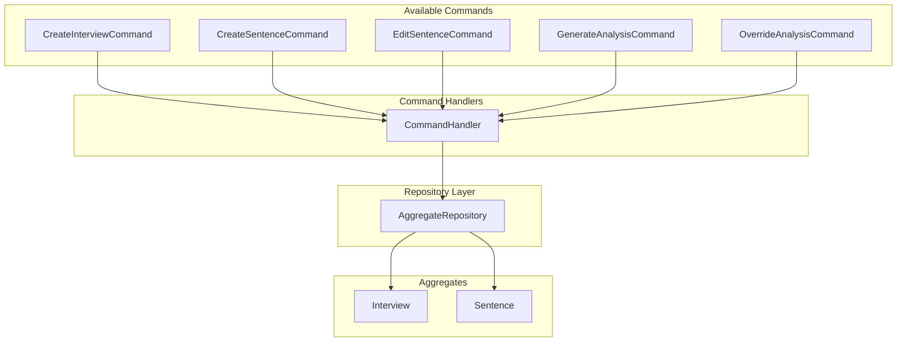
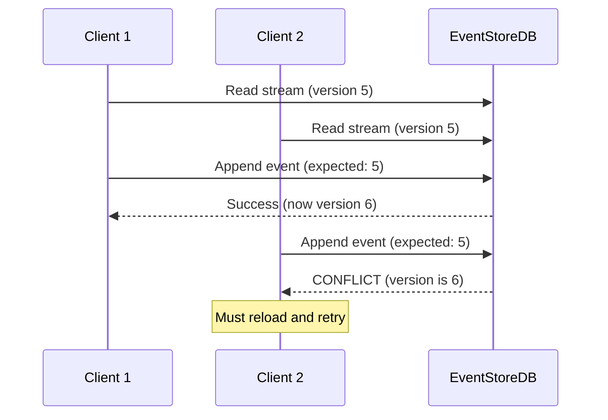

# Event Sourcing Architecture

> **Last Updated:** 2026-01-18

## Overview

The Interview Analyzer uses an event-sourced architecture with CQRS (Command Query Responsibility Segregation). EventStoreDB is the single source of truth, with Neo4j serving as a projected read model.

## CQRS Pattern



## Aggregate Model

### Interview Aggregate



### Sentence Aggregate



## Event Envelope

All events are wrapped in an `EventEnvelope` for metadata:



### Event Envelope JSON Example

```json
{
  "event_id": "550e8400-e29b-41d4-a716-446655440000",
  "aggregate_id": "660e8400-e29b-41d4-a716-446655440001",
  "aggregate_type": "Sentence",
  "event_type": "SentenceCreated",
  "event_version": 1,
  "timestamp": "2026-01-18T12:00:00Z",
  "correlation_id": "770e8400-e29b-41d4-a716-446655440002",
  "causation_id": "880e8400-e29b-41d4-a716-446655440003",
  "actor": {
    "actor_type": "system",
    "user_id": "pipeline"
  },
  "payload": {
    "sentence_id": "660e8400-e29b-41d4-a716-446655440001",
    "interview_id": "990e8400-e29b-41d4-a716-446655440004",
    "sentence_index": 1,
    "text": "The product launch was successful.",
    "sequence_order": 1
  }
}
```

## Event Streams



## Event Flow: File Processing



## Event Flow: User Edit



## Projection Service Architecture



### Lane Processing

- **12 parallel lanes** for horizontal scaling
- **Consistent hashing** ensures same aggregate always goes to same lane
- **In-order processing** within each lane
- **Checkpoint management** for resume capability

### Idempotency

Projection handlers use `event_version` to prevent duplicate processing:

```cypher
MERGE (s:Sentence {sentence_id: $sentence_id})
ON CREATE SET s.event_version = $event_version, s.text = $text
ON MATCH SET s.text = CASE
    WHEN s.event_version IS NULL OR s.event_version < $event_version
    THEN $text ELSE s.text END,
    s.event_version = CASE
    WHEN s.event_version IS NULL OR s.event_version < $event_version
    THEN $event_version ELSE s.event_version END
```

## Command Handlers



## Deterministic UUIDs

Sentence IDs are generated deterministically using `uuid5` for idempotency:

```python
sentence_uuid = uuid5(
    NAMESPACE_DNS,
    f"{interview_id}:{sentence_index}"
)
```

This ensures:
- Same sentence always gets same UUID
- Replay safety (events can be reprocessed)
- Idempotent operations across retries

## Optimistic Concurrency

EventStoreDB enforces event ordering via expected version:


