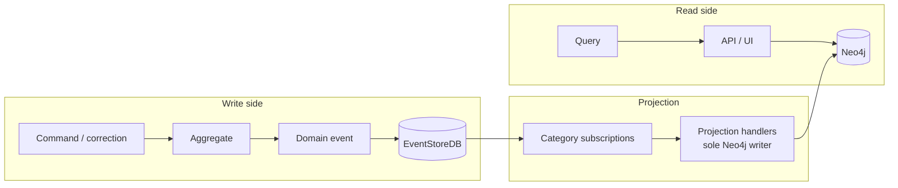
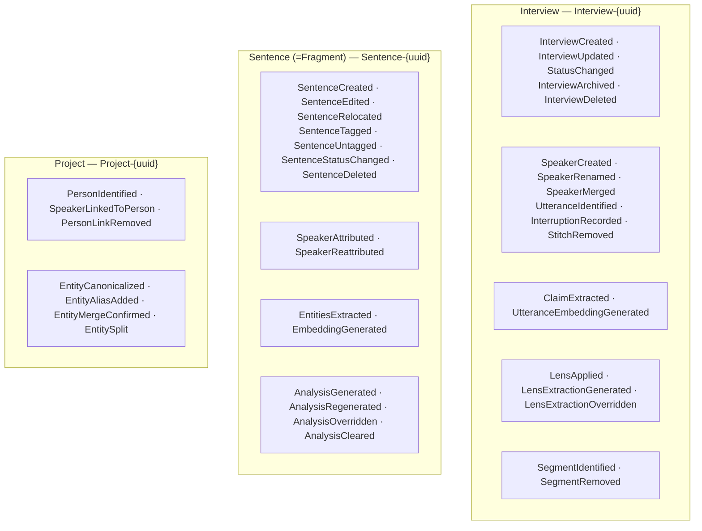
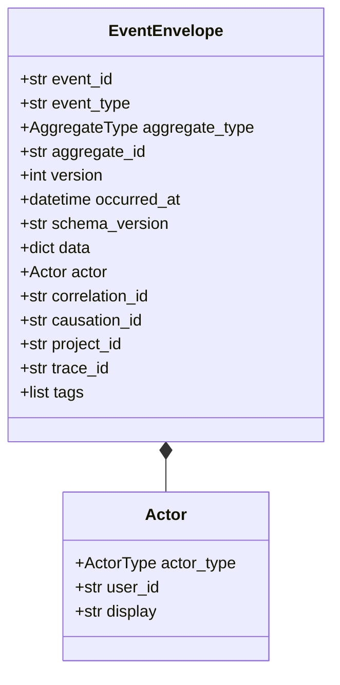
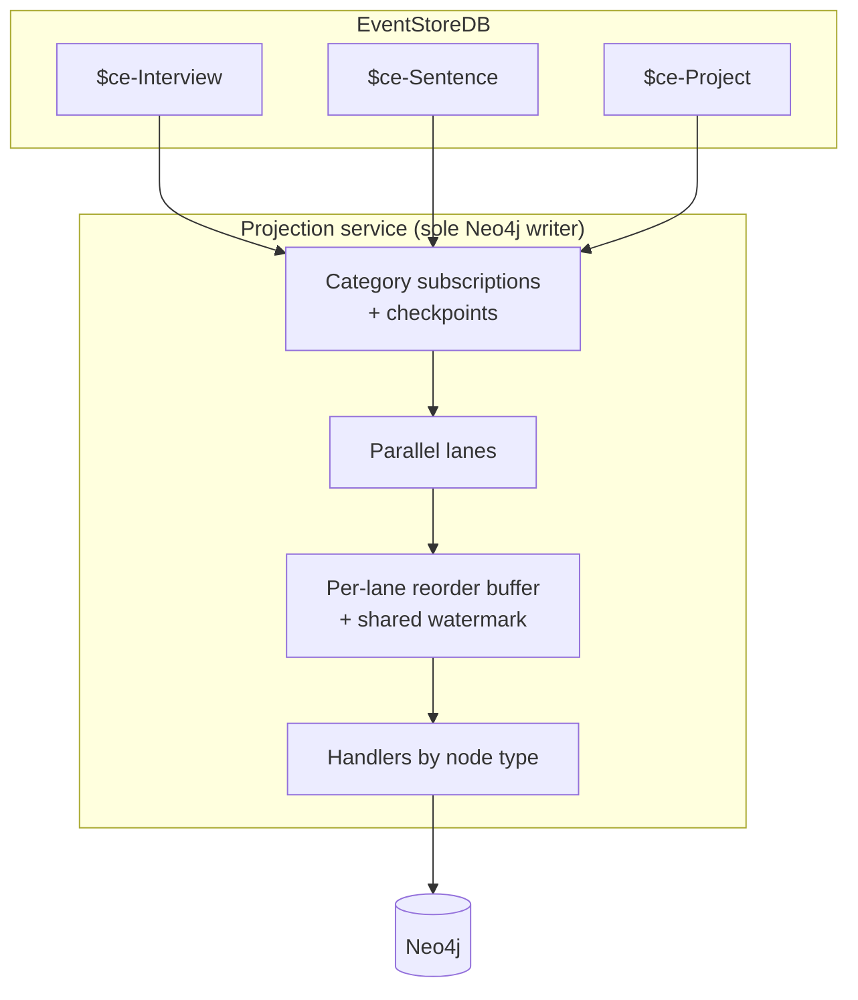
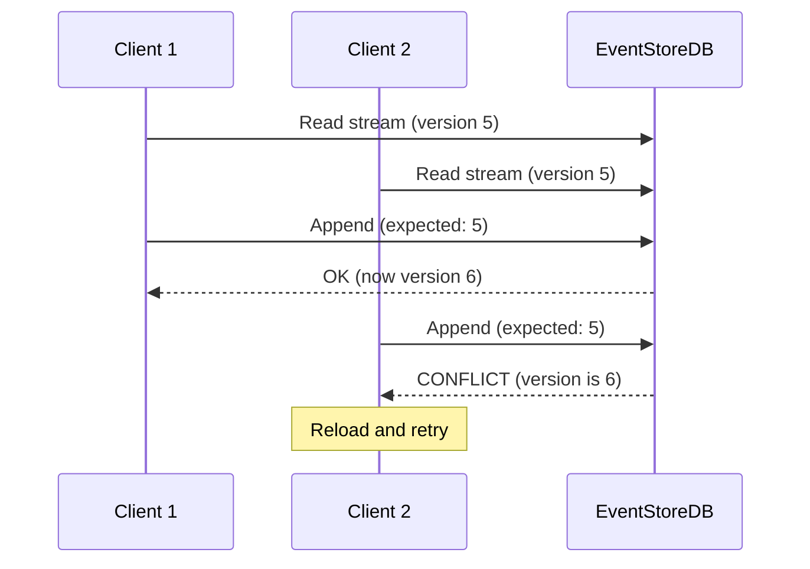

# Event Sourcing Architecture

> **Last Updated:** 2026-07-25

The Interview Analyzer is event-sourced with CQRS. EventStoreDB is the single
source of truth; Neo4j is a projected read model that can be rebuilt from the
event log at any time.

## CQRS


```mermaid
flowchart LR
    subgraph Write["Write side"]
        cmd[Command / correction]
        agg[Aggregate]
        event[Domain event]
        esdb[(EventStoreDB)]
        cmd --> agg --> event --> esdb
    end

    subgraph Read["Read side"]
        query[Query]
        api[API / UI]
        neo4j[(Neo4j)]
        query --> api --> neo4j
    end

    subgraph Projection["Projection"]
        sub[Category subscriptions]
        proj[Projection handlers<br/>sole Neo4j writer]
        esdb --> sub --> proj --> neo4j
    end
```

## The three aggregates

Each aggregate owns a stream family and a set of event types. **The wire format
is frozen:** event type names, the `Sentence` aggregate type, and stream names
never change.


```mermaid
flowchart TB
    subgraph Interview["Interview — Interview-{uuid}"]
        i1[InterviewCreated · InterviewUpdated · StatusChanged<br/>InterviewArchived · InterviewDeleted]
        i2[SpeakerCreated · SpeakerRenamed · SpeakerMerged<br/>UtteranceIdentified · InterruptionRecorded · StitchRemoved]
        i3[ClaimExtracted · UtteranceEmbeddingGenerated]
        i4[LensApplied · LensExtractionGenerated · LensExtractionOverridden]
        i5[SegmentIdentified · SegmentRemoved]
    end

    subgraph Sentence["Sentence (=Fragment) — Sentence-{uuid}"]
        s1[SentenceCreated · SentenceEdited · SentenceRelocated<br/>SentenceTagged · SentenceUntagged · SentenceStatusChanged · SentenceDeleted]
        s2[SpeakerAttributed · SpeakerReattributed]
        s3[EntitiesExtracted · EmbeddingGenerated]
        s4[AnalysisGenerated · AnalysisRegenerated · AnalysisOverridden · AnalysisCleared]
    end

    subgraph Project["Project — Project-{uuid}"]
        p1[PersonIdentified · SpeakerLinkedToPerson · PersonLinkRemoved]
        p2[EntityCanonicalized · EntityAliasAdded · EntityMergeConfirmed · EntitySplit]
    end
```

- **Interview** owns everything scoped to one interview: lifecycle, speakers,
  the stitched utterance overlay, interview-level enrichment (claims,
  utterance embeddings), lenses, and segments.
- **Sentence** is the per-fragment aggregate (the node projects as `:Fragment`;
  the `:Sentence` label was dropped in M4.8, but the aggregate type and
  `Sentence-{uuid}` stream name stay frozen). It owns fragment text edits and
  per-fragment analysis.
- **Project** owns cross-interview identity: canonical persons (and speaker
  links) and entity canonicalization.

Definitions live in `src/events/interview_events.py`,
`src/events/sentence_events.py`, `src/events/project_events.py`;
`src/events/aggregates.py` holds the aggregate roots.

## Event envelope

Every event is wrapped in an `EventEnvelope` (`src/events/envelope.py`):


```mermaid
classDiagram
    class EventEnvelope {
        +str event_id
        +str event_type
        +AggregateType aggregate_type
        +str aggregate_id
        +int version
        +datetime occurred_at
        +str schema_version
        +dict data
        +Actor actor
        +str correlation_id
        +str causation_id
        +str project_id
        +str trace_id
        +list tags
    }
    class Actor {
        +ActorType actor_type
        +str user_id
        +str display
    }
    EventEnvelope *-- Actor
```

`project_id` is an optional envelope field (also written to ESDB event
metadata). It's additive — e.g. M5.1b stamps it onto Interview-stream lens
events so the SSE bridge can route them to the gallery without a DB lookup.
`actor.actor_type` (human / system / ai) is what makes edit observability
possible: every event records who or what produced it.

## Streams and subscriptions

Events are appended to per-aggregate streams (`Interview-{uuid}`,
`Sentence-{uuid}`, `Project-{uuid}`). Consumers subscribe to the **category
streams** — `$ce-Interview`, `$ce-Sentence`, `$ce-Project` — not `$all`. The
projection service runs one subscription per category (each with an event
allowlist in `src/projections/config.py`); the SSE watcher runs its own
ephemeral catch-up subscriptions on the same categories.

## Projection service & ordering (M4.9)


```mermaid
flowchart TD
    subgraph ESDB["EventStoreDB"]
        ci["$ce-Interview"]
        cs["$ce-Sentence"]
        cp["$ce-Project"]
    end

    subgraph Proj["Projection service (sole Neo4j writer)"]
        subs[Category subscriptions<br/>+ checkpoints]
        lanes[Parallel lanes]
        buf[Per-lane reorder buffer<br/>+ shared watermark]
        handlers[Handlers by node type]
    end

    n4[(Neo4j)]

    ci & cs & cp --> subs --> lanes --> buf --> handlers --> n4
```

Events are processed across parallel lanes for throughput, but **released to
Neo4j in commit-position (causal) order** per lane via a reorder buffer with a
shared watermark and a bounded max-hold. This guarantees a dependent event never
projects before its referent. An event whose referent still isn't present is
**parked** with `StreamState.ANY` (not dropped) and can be redriven later
(`python -m src.projections.redrive`). Handlers live in
`src/projections/handlers/`, one family per node type.

### Idempotency

Handlers are version-gated so replay is safe (events can be reprocessed):

```cypher
MERGE (f:Fragment {sentence_id: $sentence_id})
ON CREATE SET f.event_version = $event_version, f.text = $text
ON MATCH SET
    f.text = CASE WHEN f.event_version < $event_version THEN $text ELSE f.text END,
    f.event_version = CASE WHEN f.event_version < $event_version
                           THEN $event_version ELSE f.event_version END
```

### Deterministic IDs

Fragment IDs are `uuid5`-derived so the same fragment always gets the same UUID —
replay-safe and idempotent across retries:

```python
sentence_uuid = uuid5(NAMESPACE_DNS, f"{interview_id}:{sentence_index}")
```

## Optimistic concurrency

EventStoreDB enforces ordering via expected version; a conflicting append forces
a reload-and-retry:


```mermaid
sequenceDiagram
    participant C1 as Client 1
    participant C2 as Client 2
    participant ES as EventStoreDB

    C1->>ES: Read stream (version 5)
    C2->>ES: Read stream (version 5)
    C1->>ES: Append (expected: 5)
    ES-->>C1: OK (now version 6)
    C2->>ES: Append (expected: 5)
    ES-->>C2: CONFLICT (version is 6)
    Note over C2: Reload and retry
```

## Live feed (SSE)

An in-process `EsdbWatcher` (`src/ui/notifications.py`) runs catch-up
subscriptions on the category streams and translates each event, via
`scope_notifications`, into a thin surface tag the browser understands:
`{surface, interview_id?, project_id?}` where `surface ∈ {transcript,
interviews, project, resync}`. It never leaks event types or stream names to the
client. The SSE route (`GET /ui/streams/events`) delivers these; the UI reacts
by invalidating the matching read queries. This is a read-side bridge only — it
never writes Neo4j, so the projection delivery path is untouched.
