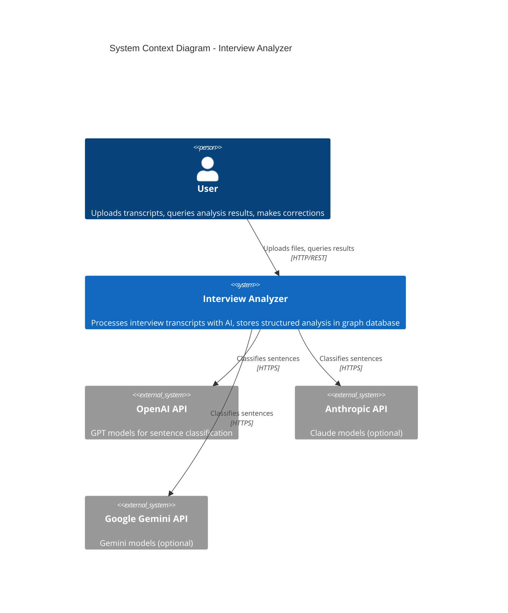
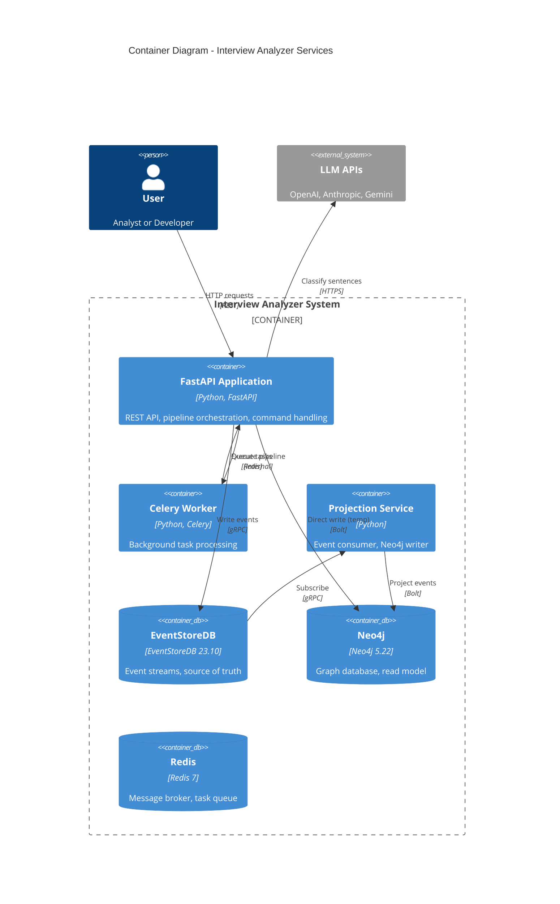
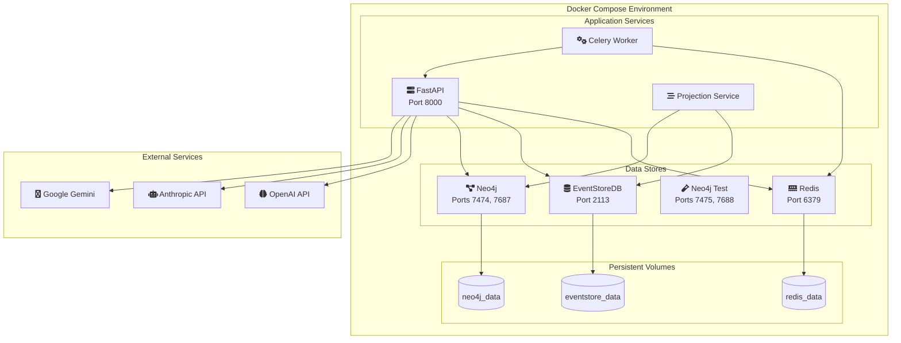
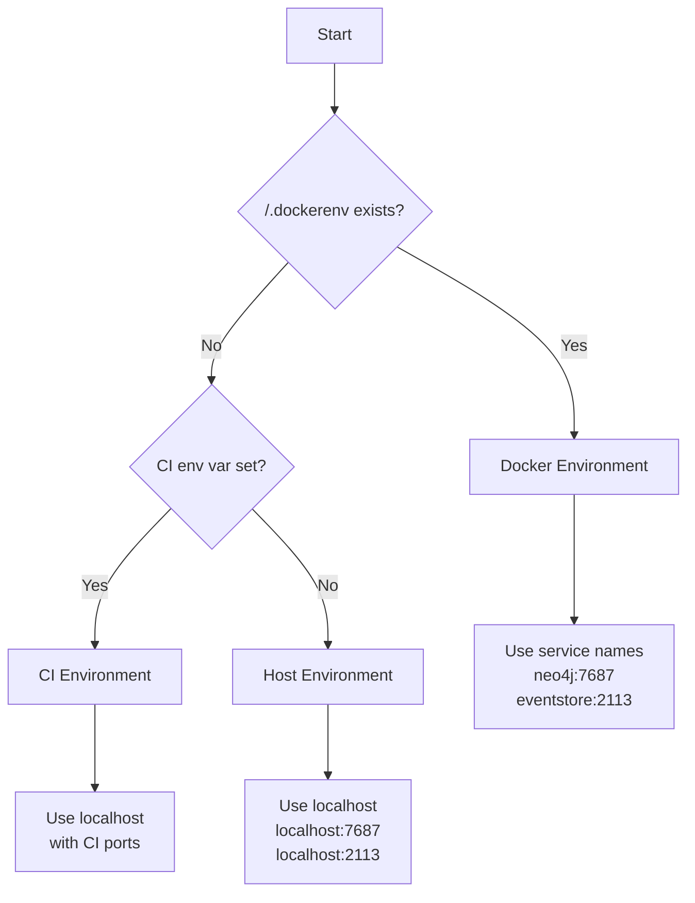

# System Overview

> **Last Updated:** 2026-01-18

## System Context

The Interview Analyzer is an event-sourced application that processes interview transcripts using AI and stores results in a graph database.

## Container Diagram

## Service Descriptions

### FastAPI Application (Port 8000)

**Responsibilities:**
- REST API endpoints for file operations and analysis
- Pipeline orchestration for transcript processing
- Command handling for user edits
- Event emission to EventStoreDB

**Key Endpoints:**
| Endpoint | Method | Description |
|----------|--------|-------------|
| `/` | GET | Health check |
| `/files/` | GET | List analysis files |
| `/files/{filename}` | GET | Get analysis content |
| `/analysis/` | POST | Trigger background analysis |
| `/edits/sentences/{id}/{index}/edit` | POST | Edit sentence text |
| `/edits/sentences/{id}/{index}/analysis/override` | POST | Override AI analysis |

### Celery Worker

**Responsibilities:**
- Execute long-running pipeline tasks
- Process files asynchronously
- Prevent API timeouts

**Configuration:**
- Broker: Redis at `redis:6379`
- Entry point: `celery -A src.celery_app worker`

### Projection Service

**Responsibilities:**
- Subscribe to EventStoreDB `$all` stream
- Process events in order
- Update Neo4j graph (create nodes, relationships)
- Handle idempotency via event versioning

**Configuration:**
- 12 parallel processing lanes
- Checkpoint management for resume
- Entry point: `python -m src.run_projection_service`

### EventStoreDB (Ports 2113, 1113)

**Responsibilities:**
- Store all domain events (source of truth)
- Provide event streams for aggregates
- Enable event replay and audit trail
- Support persistent subscriptions

**Event Streams:**
- `Interview-{uuid}` - Interview aggregate events
- `Sentence-{uuid}` - Sentence aggregate events

### Neo4j (Ports 7474, 7687)

**Responsibilities:**
- Store sentence analysis as graph nodes
- Maintain relationships (topics, keywords, etc.)
- Enable complex graph queries
- Serve as CQRS read model

**Authentication:**
- Username: `neo4j`
- Password: From `.env` file

### Redis (Port 6379)

**Responsibilities:**
- Message broker for Celery
- Task result backend
- Pub/sub for worker communication

## Deployment View

## Environment Detection

The system auto-detects its runtime environment:

