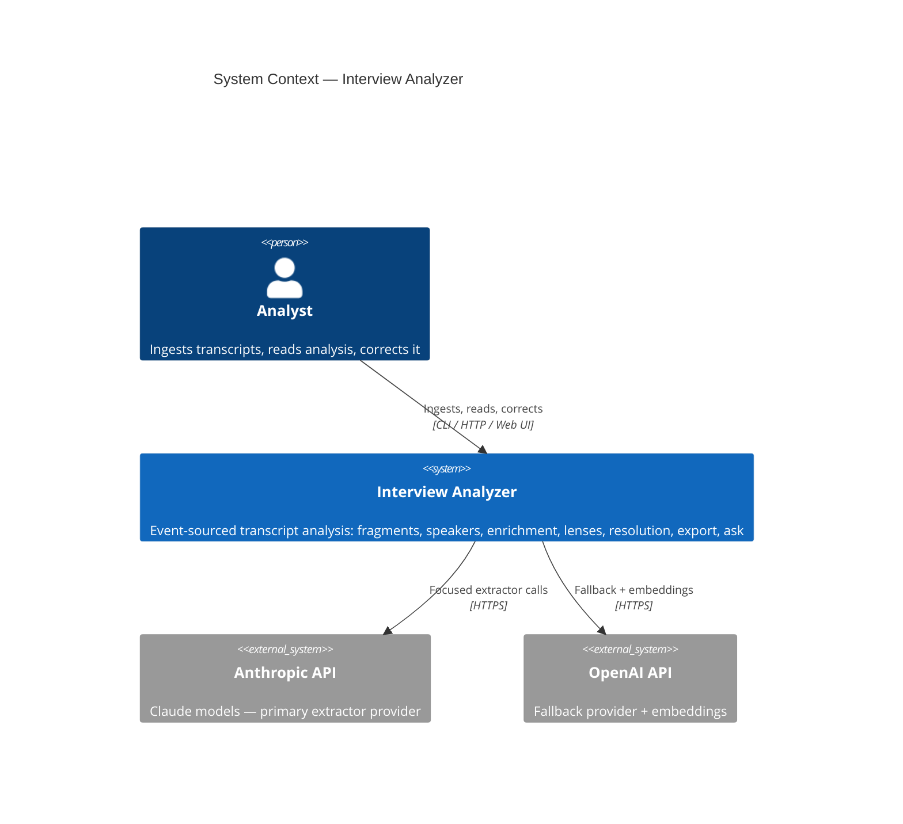
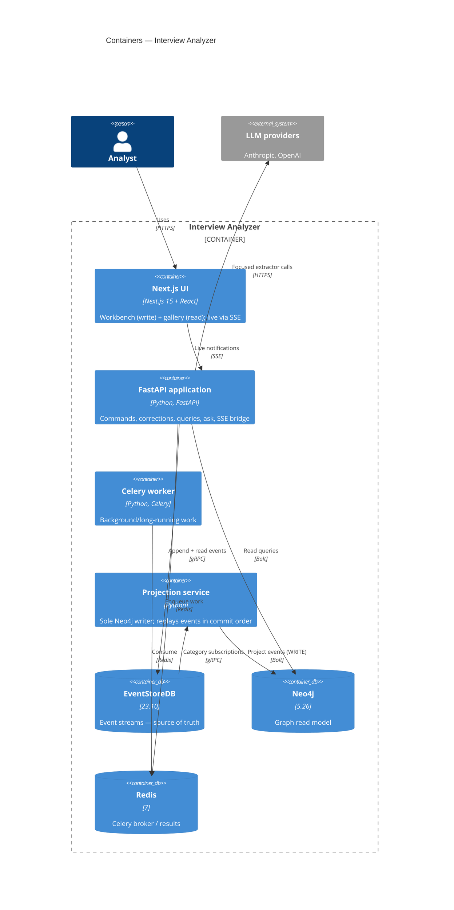
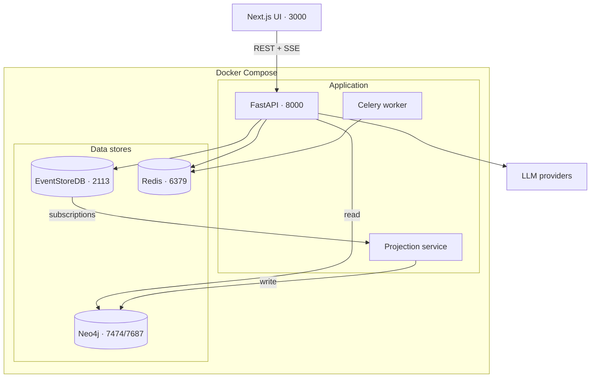
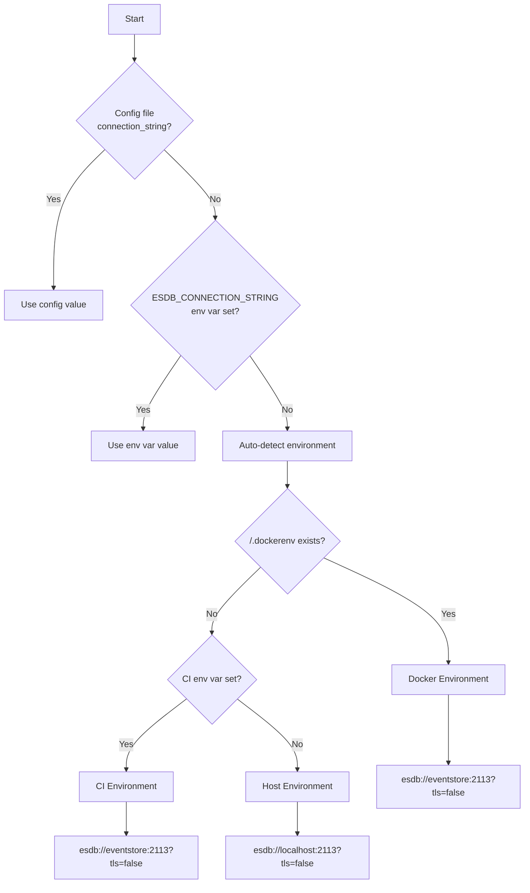

# System Overview

> **Last Updated:** 2026-07-25

## System context

The Interview Analyzer is an event-sourced application that turns interview
transcripts into a queryable knowledge graph and serves it through a two-surface
web UI. Humans correct what the AI produces; every correction is an event.

```mermaid
C4Context
    title System Context — Interview Analyzer

    Person(analyst, "Analyst", "Ingests transcripts, reads analysis, corrects it")

    System(analyzer, "Interview Analyzer", "Event-sourced transcript analysis: fragments, speakers, enrichment, lenses, resolution, export, ask")

    System_Ext(anthropic, "Anthropic API", "Claude models — primary extractor provider")
    System_Ext(openai, "OpenAI API", "Fallback provider + embeddings")

    Rel(analyst, analyzer, "Ingests, reads, corrects", "CLI / HTTP / Web UI")
    Rel(analyzer, anthropic, "Focused extractor calls", "HTTPS")
    Rel(analyzer, openai, "Fallback + embeddings", "HTTPS")
```

## Container diagram

```mermaid
C4Container
    title Containers — Interview Analyzer

    Person(analyst, "Analyst")

    Container_Boundary(app, "Interview Analyzer") {
        Container(ui, "Next.js UI", "Next.js 15 + React", "Workbench (write) + gallery (read); live via SSE")
        Container(api, "FastAPI application", "Python, FastAPI", "Commands, corrections, queries, ask, SSE bridge")
        Container(worker, "Celery worker", "Python, Celery", "Background/long-running work")
        Container(projection, "Projection service", "Python", "Sole Neo4j writer; replays events in commit order")

        ContainerDb(eventstore, "EventStoreDB", "23.10", "Event streams — source of truth")
        ContainerDb(neo4j, "Neo4j", "5.26", "Graph read model")
        ContainerDb(redis, "Redis", "7", "Celery broker / results")
    }

    System_Ext(llm, "LLM providers", "Anthropic, OpenAI")

    Rel(analyst, ui, "Uses", "HTTPS")
    Rel(ui, api, "Reads + corrections", "REST (same-origin rewrite)")
    Rel(ui, api, "Live notifications", "SSE")
    Rel(api, eventstore, "Append + read events", "gRPC")
    Rel(api, neo4j, "Read queries", "Bolt")
    Rel(api, llm, "Focused extractor calls", "HTTPS")
    Rel(api, redis, "Enqueue work", "Redis")

    Rel(eventstore, projection, "Category subscriptions", "gRPC")
    Rel(projection, neo4j, "Project events (WRITE)", "Bolt")
    Rel(worker, redis, "Consume", "Redis")
```

> **Note:** the API reads Neo4j but never writes it. The projection service is
> the only writer. (The M2.2 dual-write path was removed in M3.0.)

## Service descriptions

### FastAPI application (port 8000)

- Command handling and corrections (edits, speaker rename/reattribute, segment
  removal, lens overrides, resolution merge/split/link/alias) — each emits
  events to EventStoreDB.
- Read queries against Neo4j (interviews, transcript, personas, persons,
  worklist, lens items) — the `/ui/*` and query routers.
- Ask-the-corpus (`/ask/{project_id}`) — GraphRAG hybrid retrieval + cited
  synthesis.
- The SSE live-feed bridge (`GET /ui/streams/events`): an in-process
  `EsdbWatcher` runs catch-up subscriptions on the category streams and pushes
  thin, surface-tagged notifications to browsers (see `src/ui/notifications.py`).

Routers live in `src/api/routers/`: `analysis`, `ask`, `edits`, `exports`,
`files`, `lenses`, `queries`, `resolution`, `segments`, `speakers`, `ui`. Full,
always-current API docs are at `/docs`.

### Projection service

The **sole writer to Neo4j**. Entry point `python -m src.run_projection_service`.

- Runs three category subscriptions — `$ce-Interview`, `$ce-Sentence`,
  `$ce-Project` — each with an event allowlist (`src/projections/config.py`).
- Processes events across parallel lanes but releases them to Neo4j in each
  stream's **commit-position (causal) order** via a per-lane reorder buffer, with
  a shared watermark and a bounded hold (M4.9). Events whose referents aren't
  ready yet are parked (`StreamState.ANY`) and can be redriven
  (`python -m src.projections.redrive`).
- Creates its Neo4j schema (indexes/constraints) at startup and fails fast if
  Neo4j is unreachable (`src/projections/ensure_schema.py`).
- Handlers per node type live in `src/projections/handlers/`.

### EventStoreDB (ports 2113, 1113)

Append-only source of truth. Streams per aggregate:

- `Interview-{uuid}` — Interview aggregate (structure, enrichment, lenses, segments)
- `Sentence-{uuid}` — Sentence/Fragment aggregate (per-fragment analysis)
- `Project-{uuid}` — Project aggregate (persons, entity canonicalization)

Category streams (`$ce-Interview`, etc.) are what the projection and the SSE
watcher subscribe to. The wire format is frozen: event names, the `Sentence`
aggregate type, and stream names never change.

### Neo4j (ports 7474, 7687)

The CQRS read model — fragments, speakers, utterances, claims, entities, lens
items, persons, segments, and their relationships (see
[database-schema.md](./database-schema.md)). Rebuildable from the event log.
Auth: `neo4j` / password from `.env`.

### Celery worker + Redis (port 6379)

Redis is the Celery broker/result backend; the worker handles background work.
Entry point `celery -A src.celery_app worker`.

## Deployment view

```mermaid
flowchart TB
    subgraph Docker["Docker Compose"]
        subgraph App["Application"]
            api[FastAPI · 8000]
            worker[Celery worker]
            projection[Projection service]
        end
        subgraph Data["Data stores"]
            eventstore[(EventStoreDB · 2113)]
            neo4j[(Neo4j · 7474/7687)]
            redis[(Redis · 6379)]
        end
    end
    ui[Next.js UI · 3000]
    llm[LLM providers]

    ui -->|REST + SSE| api
    api --> eventstore
    api -->|read| neo4j
    api --> redis
    api --> llm
    worker --> redis
    eventstore -->|subscriptions| projection
    projection -->|write| neo4j
```

The frontend dev server proxies same-origin `/api/*` to the API; the SSE stream
is served through a Next.js route handler instead of the proxy (the proxy
buffers streaming responses).

## Environment detection

The system auto-detects its runtime environment for EventStoreDB connections:

```mermaid
flowchart TD
    Start[Start] --> CheckConfig{Config file<br/>connection_string?}
    CheckConfig -->|Yes| UseConfig["Use config value"]
    CheckConfig -->|No| CheckEnv{ESDB_CONNECTION_STRING<br/>env var set?}
    CheckEnv -->|Yes| UseEnvVar["Use env var value"]
    CheckEnv -->|No| Detect[Auto-detect environment]

    Detect --> CheckDocker{/.dockerenv exists?}
    CheckDocker -->|Yes| Docker[Docker Environment]
    CheckDocker -->|No| CheckCI{CI env var set?}
    CheckCI -->|Yes| CI[CI Environment]
    CheckCI -->|No| Host[Host Environment]

    Docker --> DockerConfig["esdb://eventstore:2113?tls=false"]
    CI --> CIConfig["esdb://eventstore:2113?tls=false"]
    Host --> HostConfig["esdb://localhost:2113?tls=false"]
```

**Priority order:**
1. Config file `event_sourcing.connection_string` (highest)
2. `ESDB_CONNECTION_STRING` environment variable
3. Auto-detected from the runtime environment (lowest)

**Implementation:** `src/events/store.py::get_event_store_client()`.
