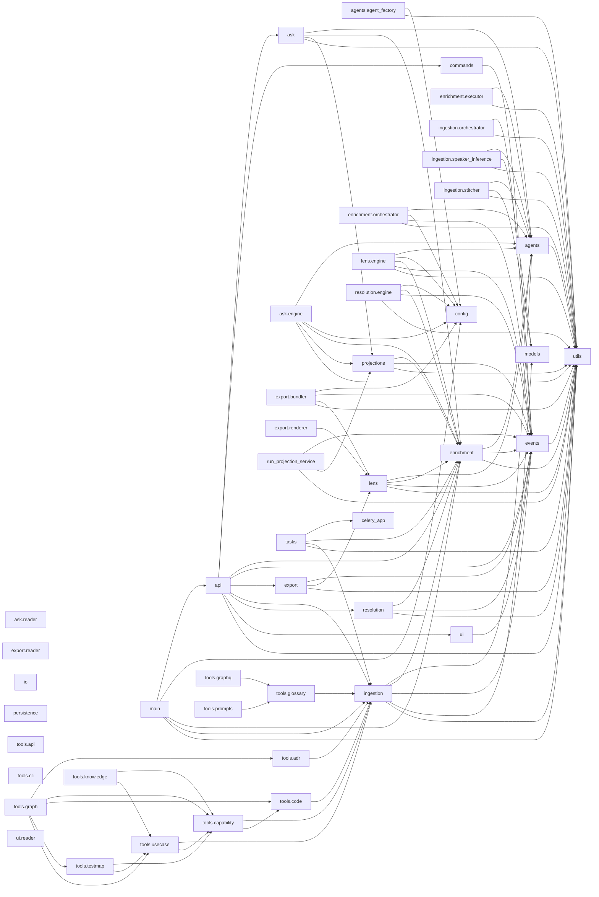

# Dependency / pipeline map

```mermaid
graph LR
    agents --> utils
    agents.agent_factory --> config
    agents.agent_factory --> utils
    api --> ask
    api --> commands
    api --> enrichment
    api --> events
    api --> export
    api --> ingestion
    api --> resolution
    api --> ui
    api --> utils
    ask --> agents
    ask --> enrichment
    ask --> projections
    ask --> utils
    ask.engine --> agents
    ask.engine --> config
    ask.engine --> enrichment
    ask.engine --> projections
    ask.engine --> utils
    ask.reader
    celery_app
    commands --> events
    config
    enrichment --> agents
    enrichment --> events
    enrichment --> utils
    enrichment.executor --> agents
    enrichment.executor --> utils
    enrichment.orchestrator --> agents
    enrichment.orchestrator --> config
    enrichment.orchestrator --> events
    enrichment.orchestrator --> utils
    events --> utils
    export --> events
    export --> lens
    export --> utils
    export.bundler --> config
    export.bundler --> events
    export.bundler --> lens
    export.bundler --> utils
    export.reader
    export.renderer --> lens
    ingestion --> agents
    ingestion --> enrichment
    ingestion --> events
    ingestion --> models
    ingestion --> utils
    ingestion.orchestrator --> events
    ingestion.orchestrator --> utils
    ingestion.speaker_inference --> agents
    ingestion.speaker_inference --> models
    ingestion.speaker_inference --> utils
    ingestion.stitcher --> agents
    ingestion.stitcher --> models
    ingestion.stitcher --> utils
    io
    lens --> agents
    lens --> enrichment
    lens --> events
    lens --> utils
    lens.engine --> agents
    lens.engine --> config
    lens.engine --> enrichment
    lens.engine --> events
    lens.engine --> utils
    main --> api
    main --> config
    main --> enrichment
    main --> ingestion
    main --> utils
    models
    persistence
    projections --> enrichment
    projections --> events
    projections --> utils
    resolution --> enrichment
    resolution --> events
    resolution --> utils
    resolution.engine --> config
    resolution.engine --> enrichment
    resolution.engine --> events
    resolution.engine --> utils
    run_projection_service --> events
    run_projection_service --> projections
    run_projection_service --> utils
    tasks --> celery_app
    tasks --> enrichment
    tasks --> ingestion
    tasks --> utils
    tools.adr --> ingestion
    tools.api
    tools.capability --> ingestion
    tools.capability --> tools.code
    tools.cli
    tools.code --> ingestion
    tools.glossary --> ingestion
    tools.graph --> tools.adr
    tools.graph --> tools.capability
    tools.graph --> tools.code
    tools.graph --> tools.testmap
    tools.graph --> tools.usecase
    tools.graphq --> tools.glossary
    tools.knowledge --> tools.capability
    tools.knowledge --> tools.usecase
    tools.prompts --> tools.glossary
    tools.testmap --> tools.capability
    tools.testmap --> tools.usecase
    tools.usecase --> ingestion
    tools.usecase --> tools.capability
    ui --> events
    ui.reader
    utils
```
