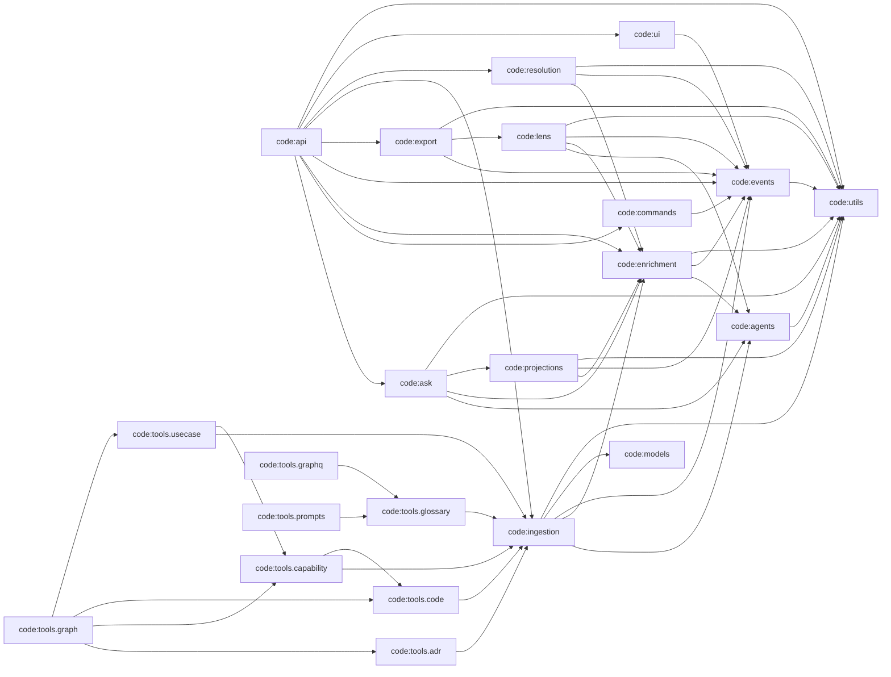
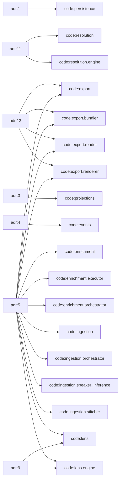

## implements

```mermaid
graph LR
    n_capabilities_access_analysis_output_files["capabilities:access-analysis-output-files"] --> n_code_api["code:api"]
    n_capabilities_ask_the_corpus["capabilities:ask-the-corpus"] --> n_code_ask["code:ask"]
    n_capabilities_ask_the_corpus["capabilities:ask-the-corpus"] --> n_code_ask_engine["code:ask.engine"]
    n_capabilities_ask_the_corpus["capabilities:ask-the-corpus"] --> n_code_ask_reader["code:ask.reader"]
    n_capabilities_assemble_bundle["capabilities:assemble-bundle"] --> n_code_export_bundler["code:export.bundler"]
    n_capabilities_assemble_bundle["capabilities:assemble-bundle"] --> n_code_export_reader["code:export.reader"]
    n_capabilities_canonicalize_entities["capabilities:canonicalize-entities"] --> n_code_resolution_engine["code:resolution.engine"]
    n_capabilities_catalog_the_api_surface["capabilities:catalog-the-api-surface"] --> n_code_tools_api["code:tools.api"]
    n_capabilities_catalog_the_cli_surface["capabilities:catalog-the-cli-surface"] --> n_code_tools_cli["code:tools.cli"]
    n_capabilities_catalog_the_graph_queries["capabilities:catalog-the-graph-queries"] --> n_code_tools_graphq["code:tools.graphq"]
    n_capabilities_catalog_the_prompt_registry["capabilities:catalog-the-prompt-registry"] --> n_code_tools_prompts["code:tools.prompts"]
    n_capabilities_chat_failover["capabilities:chat-failover"] --> n_code_agents["code:agents"]
    n_capabilities_cited_synthesis["capabilities:cited-synthesis"] --> n_code_ask_engine["code:ask.engine"]
    n_capabilities_classify_dimensions["capabilities:classify-dimensions"] --> n_code_agents["code:agents"]
    n_capabilities_classify_dimensions["capabilities:classify-dimensions"] --> n_code_enrichment_executor["code:enrichment.executor"]
    n_capabilities_correct_resolution["capabilities:correct-resolution"] --> n_code_api["code:api"]
    n_capabilities_correct_resolution["capabilities:correct-resolution"] --> n_code_commands["code:commands"]
    n_capabilities_correct_resolution["capabilities:correct-resolution"] --> n_code_events["code:events"]
    n_capabilities_correct_the_analysis["capabilities:correct-the-analysis"] --> n_code_api["code:api"]
    n_capabilities_correct_the_analysis["capabilities:correct-the-analysis"] --> n_code_commands["code:commands"]
    n_capabilities_correct_the_analysis["capabilities:correct-the-analysis"] --> n_code_events["code:events"]
    n_capabilities_disclose_knowledge_and_check_specs["capabilities:disclose-knowledge-and-check-specs"] --> n_code_tools_knowledge["code:tools.knowledge"]
    n_capabilities_edit_text["capabilities:edit-text"] --> n_code_api["code:api"]
    n_capabilities_edit_text["capabilities:edit-text"] --> n_code_commands["code:commands"]
    n_capabilities_edit_text["capabilities:edit-text"] --> n_code_events["code:events"]
    n_capabilities_enrich_fragments["capabilities:enrich-fragments"] --> n_code_agents["code:agents"]
    n_capabilities_enrich_fragments["capabilities:enrich-fragments"] --> n_code_enrichment["code:enrichment"]
    n_capabilities_enrich_fragments["capabilities:enrich-fragments"] --> n_code_enrichment_executor["code:enrichment.executor"]
    n_capabilities_enrich_fragments["capabilities:enrich-fragments"] --> n_code_enrichment_orchestrator["code:enrichment.orchestrator"]
    n_capabilities_enrich_fragments["capabilities:enrich-fragments"] --> n_code_models["code:models"]
    n_capabilities_export_a_portable_bundle["capabilities:export-a-portable-bundle"] --> n_code_export["code:export"]
    n_capabilities_export_a_portable_bundle["capabilities:export-a-portable-bundle"] --> n_code_export_bundler["code:export.bundler"]
    n_capabilities_export_a_portable_bundle["capabilities:export-a-portable-bundle"] --> n_code_export_reader["code:export.reader"]
    n_capabilities_export_a_portable_bundle["capabilities:export-a-portable-bundle"] --> n_code_export_renderer["code:export.renderer"]
    n_capabilities_extract_claims["capabilities:extract-claims"] --> n_code_agents["code:agents"]
    n_capabilities_extract_claims["capabilities:extract-claims"] --> n_code_enrichment_executor["code:enrichment.executor"]
    n_capabilities_extract_insights_via_lenses["capabilities:extract-insights-via-lenses"] --> n_code_agents["code:agents"]
    n_capabilities_extract_insights_via_lenses["capabilities:extract-insights-via-lenses"] --> n_code_lens["code:lens"]
    n_capabilities_extract_insights_via_lenses["capabilities:extract-insights-via-lenses"] --> n_code_lens_engine["code:lens.engine"]
    n_capabilities_gallery_read["capabilities:gallery-read"] --> n_code_ui_reader["code:ui.reader"]
    n_capabilities_govern_architectural_decisions["capabilities:govern-architectural-decisions"] --> n_code_tools_adr["code:tools.adr"]
    n_capabilities_hybrid_retrieval["capabilities:hybrid-retrieval"] --> n_code_ask_engine["code:ask.engine"]
    n_capabilities_hybrid_retrieval["capabilities:hybrid-retrieval"] --> n_code_ask_reader["code:ask.reader"]
    n_capabilities_infer_speakers["capabilities:infer-speakers"] --> n_code_agents["code:agents"]
    n_capabilities_infer_speakers["capabilities:infer-speakers"] --> n_code_ingestion_speaker_inference["code:ingestion.speaker_inference"]
    n_capabilities_ingest_transcripts["capabilities:ingest-transcripts"] --> n_code_agents["code:agents"]
    n_capabilities_ingest_transcripts["capabilities:ingest-transcripts"] --> n_code_ingestion["code:ingestion"]
    n_capabilities_ingest_transcripts["capabilities:ingest-transcripts"] --> n_code_ingestion_orchestrator["code:ingestion.orchestrator"]
    n_capabilities_ingest_transcripts["capabilities:ingest-transcripts"] --> n_code_ingestion_speaker_inference["code:ingestion.speaker_inference"]
    n_capabilities_ingest_transcripts["capabilities:ingest-transcripts"] --> n_code_ingestion_stitcher["code:ingestion.stitcher"]
    n_capabilities_link_the_domains["capabilities:link-the-domains"] --> n_code_tools_graph["code:tools.graph"]
    n_capabilities_live_notifications["capabilities:live-notifications"] --> n_code_ui["code:ui"]
    n_capabilities_maintain_event_source_of_truth["capabilities:maintain-event-source-of-truth"] --> n_code_commands["code:commands"]
    n_capabilities_maintain_event_source_of_truth["capabilities:maintain-event-source-of-truth"] --> n_code_events["code:events"]
    n_capabilities_maintain_the_glossary["capabilities:maintain-the-glossary"] --> n_code_tools_glossary["code:tools.glossary"]
    n_capabilities_map_capabilities["capabilities:map-capabilities"] --> n_code_tools_capability["code:tools.capability"]
    n_capabilities_map_the_code["capabilities:map-the-code"] --> n_code_tools_code["code:tools.code"]
    n_capabilities_map_use_cases["capabilities:map-use-cases"] --> n_code_tools_usecase["code:tools.usecase"]
    n_capabilities_merge_split_link_alias["capabilities:merge-split-link-alias"] --> n_code_resolution_engine["code:resolution.engine"]
    n_capabilities_override_lens_items["capabilities:override-lens-items"] --> n_code_api["code:api"]
    n_capabilities_override_lens_items["capabilities:override-lens-items"] --> n_code_commands["code:commands"]
    n_capabilities_override_lens_items["capabilities:override-lens-items"] --> n_code_events["code:events"]
    n_capabilities_parse_fragments["capabilities:parse-fragments"] --> n_code_ingestion_orchestrator["code:ingestion.orchestrator"]
    n_capabilities_per_lens_extractors["capabilities:per-lens-extractors"] --> n_code_agents["code:agents"]
    n_capabilities_per_lens_extractors["capabilities:per-lens-extractors"] --> n_code_lens_engine["code:lens.engine"]
    n_capabilities_pinned_embeddings["capabilities:pinned-embeddings"] --> n_code_enrichment["code:enrichment"]
    n_capabilities_project_events_to_graph["capabilities:project-events-to-graph"] --> n_code_projections["code:projections"]
    n_capabilities_provider_strategy_and_focused_calls["capabilities:provider-strategy-and-focused-calls"] --> n_code_agents["code:agents"]
    n_capabilities_remove_segments["capabilities:remove-segments"] --> n_code_api["code:api"]
    n_capabilities_remove_segments["capabilities:remove-segments"] --> n_code_commands["code:commands"]
    n_capabilities_remove_segments["capabilities:remove-segments"] --> n_code_events["code:events"]
    n_capabilities_rename_reattribute_speakers["capabilities:rename-reattribute-speakers"] --> n_code_api["code:api"]
    n_capabilities_rename_reattribute_speakers["capabilities:rename-reattribute-speakers"] --> n_code_commands["code:commands"]
    n_capabilities_rename_reattribute_speakers["capabilities:rename-reattribute-speakers"] --> n_code_events["code:events"]
    n_capabilities_render_bundle["capabilities:render-bundle"] --> n_code_export_renderer["code:export.renderer"]
    n_capabilities_resolve_entities_and_people["capabilities:resolve-entities-and-people"] --> n_code_resolution["code:resolution"]
    n_capabilities_resolve_entities_and_people["capabilities:resolve-entities-and-people"] --> n_code_resolution_engine["code:resolution.engine"]
    n_capabilities_resolve_persons["capabilities:resolve-persons"] --> n_code_resolution_engine["code:resolution.engine"]
    n_capabilities_run_lens_engine["capabilities:run-lens-engine"] --> n_code_lens_engine["code:lens.engine"]
    n_capabilities_run_read_queries["capabilities:run-read-queries"] --> n_code_api["code:api"]
    n_capabilities_segment_conversation["capabilities:segment-conversation"] --> n_code_ingestion["code:ingestion"]
    n_capabilities_serve_workbench_and_gallery["capabilities:serve-workbench-and-gallery"] --> n_code_api["code:api"]
    n_capabilities_serve_workbench_and_gallery["capabilities:serve-workbench-and-gallery"] --> n_code_ui["code:ui"]
    n_capabilities_serve_workbench_and_gallery["capabilities:serve-workbench-and-gallery"] --> n_code_ui_reader["code:ui.reader"]
    n_capabilities_stitch_utterances["capabilities:stitch-utterances"] --> n_code_agents["code:agents"]
    n_capabilities_stitch_utterances["capabilities:stitch-utterances"] --> n_code_ingestion_stitcher["code:ingestion.stitcher"]
    n_capabilities_tag_topics_keywords["capabilities:tag-topics-keywords"] --> n_code_agents["code:agents"]
    n_capabilities_tag_topics_keywords["capabilities:tag-topics-keywords"] --> n_code_enrichment_executor["code:enrichment.executor"]
    n_capabilities_workbench_write["capabilities:workbench-write"] --> n_code_api["code:api"]
    n_capabilities_workbench_write["capabilities:workbench-write"] --> n_code_commands["code:commands"]
```

## child_of

```mermaid
graph LR
    n_capabilities_assemble_bundle["capabilities:assemble-bundle"] --> n_capabilities_export_a_portable_bundle["capabilities:export-a-portable-bundle"]
    n_capabilities_canonicalize_entities["capabilities:canonicalize-entities"] --> n_capabilities_resolve_entities_and_people["capabilities:resolve-entities-and-people"]
    n_capabilities_catalog_the_api_surface["capabilities:catalog-the-api-surface"] --> n_capabilities_maintain_a_guarded_knowledge_graph["capabilities:maintain-a-guarded-knowledge-graph"]
    n_capabilities_catalog_the_cli_surface["capabilities:catalog-the-cli-surface"] --> n_capabilities_maintain_a_guarded_knowledge_graph["capabilities:maintain-a-guarded-knowledge-graph"]
    n_capabilities_catalog_the_graph_queries["capabilities:catalog-the-graph-queries"] --> n_capabilities_maintain_a_guarded_knowledge_graph["capabilities:maintain-a-guarded-knowledge-graph"]
    n_capabilities_catalog_the_prompt_registry["capabilities:catalog-the-prompt-registry"] --> n_capabilities_maintain_a_guarded_knowledge_graph["capabilities:maintain-a-guarded-knowledge-graph"]
    n_capabilities_chat_failover["capabilities:chat-failover"] --> n_capabilities_provider_strategy_and_focused_calls["capabilities:provider-strategy-and-focused-calls"]
    n_capabilities_cited_synthesis["capabilities:cited-synthesis"] --> n_capabilities_ask_the_corpus["capabilities:ask-the-corpus"]
    n_capabilities_classify_dimensions["capabilities:classify-dimensions"] --> n_capabilities_enrich_fragments["capabilities:enrich-fragments"]
    n_capabilities_correct_resolution["capabilities:correct-resolution"] --> n_capabilities_correct_the_analysis["capabilities:correct-the-analysis"]
    n_capabilities_disclose_knowledge_and_check_specs["capabilities:disclose-knowledge-and-check-specs"] --> n_capabilities_maintain_a_guarded_knowledge_graph["capabilities:maintain-a-guarded-knowledge-graph"]
    n_capabilities_edit_text["capabilities:edit-text"] --> n_capabilities_correct_the_analysis["capabilities:correct-the-analysis"]
    n_capabilities_extract_claims["capabilities:extract-claims"] --> n_capabilities_enrich_fragments["capabilities:enrich-fragments"]
    n_capabilities_gallery_read["capabilities:gallery-read"] --> n_capabilities_serve_workbench_and_gallery["capabilities:serve-workbench-and-gallery"]
    n_capabilities_govern_architectural_decisions["capabilities:govern-architectural-decisions"] --> n_capabilities_maintain_a_guarded_knowledge_graph["capabilities:maintain-a-guarded-knowledge-graph"]
    n_capabilities_hybrid_retrieval["capabilities:hybrid-retrieval"] --> n_capabilities_ask_the_corpus["capabilities:ask-the-corpus"]
    n_capabilities_infer_speakers["capabilities:infer-speakers"] --> n_capabilities_ingest_transcripts["capabilities:ingest-transcripts"]
    n_capabilities_link_the_domains["capabilities:link-the-domains"] --> n_capabilities_maintain_a_guarded_knowledge_graph["capabilities:maintain-a-guarded-knowledge-graph"]
    n_capabilities_live_notifications["capabilities:live-notifications"] --> n_capabilities_serve_workbench_and_gallery["capabilities:serve-workbench-and-gallery"]
    n_capabilities_maintain_the_glossary["capabilities:maintain-the-glossary"] --> n_capabilities_maintain_a_guarded_knowledge_graph["capabilities:maintain-a-guarded-knowledge-graph"]
    n_capabilities_map_capabilities["capabilities:map-capabilities"] --> n_capabilities_maintain_a_guarded_knowledge_graph["capabilities:maintain-a-guarded-knowledge-graph"]
    n_capabilities_map_the_code["capabilities:map-the-code"] --> n_capabilities_maintain_a_guarded_knowledge_graph["capabilities:maintain-a-guarded-knowledge-graph"]
    n_capabilities_map_use_cases["capabilities:map-use-cases"] --> n_capabilities_maintain_a_guarded_knowledge_graph["capabilities:maintain-a-guarded-knowledge-graph"]
    n_capabilities_merge_split_link_alias["capabilities:merge-split-link-alias"] --> n_capabilities_resolve_entities_and_people["capabilities:resolve-entities-and-people"]
    n_capabilities_override_lens_items["capabilities:override-lens-items"] --> n_capabilities_correct_the_analysis["capabilities:correct-the-analysis"]
    n_capabilities_parse_fragments["capabilities:parse-fragments"] --> n_capabilities_ingest_transcripts["capabilities:ingest-transcripts"]
    n_capabilities_per_lens_extractors["capabilities:per-lens-extractors"] --> n_capabilities_extract_insights_via_lenses["capabilities:extract-insights-via-lenses"]
    n_capabilities_pinned_embeddings["capabilities:pinned-embeddings"] --> n_capabilities_provider_strategy_and_focused_calls["capabilities:provider-strategy-and-focused-calls"]
    n_capabilities_remove_segments["capabilities:remove-segments"] --> n_capabilities_correct_the_analysis["capabilities:correct-the-analysis"]
    n_capabilities_rename_reattribute_speakers["capabilities:rename-reattribute-speakers"] --> n_capabilities_correct_the_analysis["capabilities:correct-the-analysis"]
    n_capabilities_render_bundle["capabilities:render-bundle"] --> n_capabilities_export_a_portable_bundle["capabilities:export-a-portable-bundle"]
    n_capabilities_resolve_persons["capabilities:resolve-persons"] --> n_capabilities_resolve_entities_and_people["capabilities:resolve-entities-and-people"]
    n_capabilities_run_lens_engine["capabilities:run-lens-engine"] --> n_capabilities_extract_insights_via_lenses["capabilities:extract-insights-via-lenses"]
    n_capabilities_run_read_queries["capabilities:run-read-queries"] --> n_capabilities_serve_workbench_and_gallery["capabilities:serve-workbench-and-gallery"]
    n_capabilities_segment_conversation["capabilities:segment-conversation"] --> n_capabilities_ingest_transcripts["capabilities:ingest-transcripts"]
    n_capabilities_stitch_utterances["capabilities:stitch-utterances"] --> n_capabilities_ingest_transcripts["capabilities:ingest-transcripts"]
    n_capabilities_tag_topics_keywords["capabilities:tag-topics-keywords"] --> n_capabilities_enrich_fragments["capabilities:enrich-fragments"]
    n_capabilities_workbench_write["capabilities:workbench-write"] --> n_capabilities_serve_workbench_and_gallery["capabilities:serve-workbench-and-gallery"]
```

## depends_on

```mermaid
graph LR
    n_code_agents["code:agents"] --> n_code_utils["code:utils"]
    n_code_api["code:api"] --> n_code_ask["code:ask"]
    n_code_api["code:api"] --> n_code_commands["code:commands"]
    n_code_api["code:api"] --> n_code_enrichment["code:enrichment"]
    n_code_api["code:api"] --> n_code_events["code:events"]
    n_code_api["code:api"] --> n_code_export["code:export"]
    n_code_api["code:api"] --> n_code_ingestion["code:ingestion"]
    n_code_api["code:api"] --> n_code_resolution["code:resolution"]
    n_code_api["code:api"] --> n_code_ui["code:ui"]
    n_code_api["code:api"] --> n_code_utils["code:utils"]
    n_code_ask["code:ask"] --> n_code_agents["code:agents"]
    n_code_ask["code:ask"] --> n_code_enrichment["code:enrichment"]
    n_code_ask["code:ask"] --> n_code_projections["code:projections"]
    n_code_ask["code:ask"] --> n_code_utils["code:utils"]
    n_code_commands["code:commands"] --> n_code_events["code:events"]
    n_code_enrichment["code:enrichment"] --> n_code_agents["code:agents"]
    n_code_enrichment["code:enrichment"] --> n_code_events["code:events"]
    n_code_enrichment["code:enrichment"] --> n_code_utils["code:utils"]
    n_code_events["code:events"] --> n_code_utils["code:utils"]
    n_code_export["code:export"] --> n_code_events["code:events"]
    n_code_export["code:export"] --> n_code_lens["code:lens"]
    n_code_export["code:export"] --> n_code_utils["code:utils"]
    n_code_ingestion["code:ingestion"] --> n_code_agents["code:agents"]
    n_code_ingestion["code:ingestion"] --> n_code_enrichment["code:enrichment"]
    n_code_ingestion["code:ingestion"] --> n_code_events["code:events"]
    n_code_ingestion["code:ingestion"] --> n_code_models["code:models"]
    n_code_ingestion["code:ingestion"] --> n_code_utils["code:utils"]
    n_code_lens["code:lens"] --> n_code_agents["code:agents"]
    n_code_lens["code:lens"] --> n_code_enrichment["code:enrichment"]
    n_code_lens["code:lens"] --> n_code_events["code:events"]
    n_code_lens["code:lens"] --> n_code_utils["code:utils"]
    n_code_projections["code:projections"] --> n_code_enrichment["code:enrichment"]
    n_code_projections["code:projections"] --> n_code_events["code:events"]
    n_code_projections["code:projections"] --> n_code_utils["code:utils"]
    n_code_resolution["code:resolution"] --> n_code_enrichment["code:enrichment"]
    n_code_resolution["code:resolution"] --> n_code_events["code:events"]
    n_code_resolution["code:resolution"] --> n_code_utils["code:utils"]
    n_code_tools_adr["code:tools.adr"] --> n_code_ingestion["code:ingestion"]
    n_code_tools_capability["code:tools.capability"] --> n_code_ingestion["code:ingestion"]
    n_code_tools_capability["code:tools.capability"] --> n_code_tools_code["code:tools.code"]
    n_code_tools_code["code:tools.code"] --> n_code_ingestion["code:ingestion"]
    n_code_tools_glossary["code:tools.glossary"] --> n_code_ingestion["code:ingestion"]
    n_code_tools_graph["code:tools.graph"] --> n_code_tools_adr["code:tools.adr"]
    n_code_tools_graph["code:tools.graph"] --> n_code_tools_capability["code:tools.capability"]
    n_code_tools_graph["code:tools.graph"] --> n_code_tools_code["code:tools.code"]
    n_code_tools_graph["code:tools.graph"] --> n_code_tools_usecase["code:tools.usecase"]
    n_code_tools_graphq["code:tools.graphq"] --> n_code_tools_glossary["code:tools.glossary"]
    n_code_tools_prompts["code:tools.prompts"] --> n_code_tools_glossary["code:tools.glossary"]
    n_code_tools_usecase["code:tools.usecase"] --> n_code_ingestion["code:ingestion"]
    n_code_tools_usecase["code:tools.usecase"] --> n_code_tools_capability["code:tools.capability"]
    n_code_ui["code:ui"] --> n_code_events["code:events"]
```

## governs

```mermaid
graph LR
    n_adr_1["adr:1"] --> n_code_persistence["code:persistence"]
    n_adr_11["adr:11"] --> n_code_resolution["code:resolution"]
    n_adr_11["adr:11"] --> n_code_resolution_engine["code:resolution.engine"]
    n_adr_13["adr:13"] --> n_code_export["code:export"]
    n_adr_13["adr:13"] --> n_code_export_bundler["code:export.bundler"]
    n_adr_13["adr:13"] --> n_code_export_reader["code:export.reader"]
    n_adr_13["adr:13"] --> n_code_export_renderer["code:export.renderer"]
    n_adr_3["adr:3"] --> n_code_projections["code:projections"]
    n_adr_4["adr:4"] --> n_code_events["code:events"]
    n_adr_5["adr:5"] --> n_code_enrichment["code:enrichment"]
    n_adr_5["adr:5"] --> n_code_enrichment_executor["code:enrichment.executor"]
    n_adr_5["adr:5"] --> n_code_enrichment_orchestrator["code:enrichment.orchestrator"]
    n_adr_5["adr:5"] --> n_code_export["code:export"]
    n_adr_5["adr:5"] --> n_code_export_bundler["code:export.bundler"]
    n_adr_5["adr:5"] --> n_code_export_reader["code:export.reader"]
    n_adr_5["adr:5"] --> n_code_export_renderer["code:export.renderer"]
    n_adr_5["adr:5"] --> n_code_ingestion["code:ingestion"]
    n_adr_5["adr:5"] --> n_code_ingestion_orchestrator["code:ingestion.orchestrator"]
    n_adr_5["adr:5"] --> n_code_ingestion_speaker_inference["code:ingestion.speaker_inference"]
    n_adr_5["adr:5"] --> n_code_ingestion_stitcher["code:ingestion.stitcher"]
    n_adr_5["adr:5"] --> n_code_lens["code:lens"]
    n_adr_5["adr:5"] --> n_code_lens_engine["code:lens.engine"]
    n_adr_9["adr:9"] --> n_code_lens["code:lens"]
    n_adr_9["adr:9"] --> n_code_lens_engine["code:lens.engine"]
```

## supersedes

```mermaid
graph LR
    n_adr_14["adr:14"] --> n_adr_8["adr:8"]
```

## fulfilled_by

```mermaid
graph LR
    n_use_cases_catalog_every_live_surface["use-cases:catalog-every-live-surface"] --> n_capabilities_catalog_the_api_surface["capabilities:catalog-the-api-surface"]
    n_use_cases_catalog_every_live_surface["use-cases:catalog-every-live-surface"] --> n_capabilities_catalog_the_cli_surface["capabilities:catalog-the-cli-surface"]
    n_use_cases_catalog_every_live_surface["use-cases:catalog-every-live-surface"] --> n_capabilities_catalog_the_graph_queries["capabilities:catalog-the-graph-queries"]
    n_use_cases_catalog_every_live_surface["use-cases:catalog-every-live-surface"] --> n_capabilities_catalog_the_prompt_registry["capabilities:catalog-the-prompt-registry"]
    n_use_cases_catalog_every_live_surface["use-cases:catalog-every-live-surface"] --> n_capabilities_map_capabilities["capabilities:map-capabilities"]
    n_use_cases_catalog_every_live_surface["use-cases:catalog-every-live-surface"] --> n_capabilities_map_the_code["capabilities:map-the-code"]
    n_use_cases_catalog_every_live_surface["use-cases:catalog-every-live-surface"] --> n_capabilities_map_use_cases["capabilities:map-use-cases"]
    n_use_cases_correct_what_the_system_got_wrong["use-cases:correct-what-the-system-got-wrong"] --> n_capabilities_correct_resolution["capabilities:correct-resolution"]
    n_use_cases_correct_what_the_system_got_wrong["use-cases:correct-what-the-system-got-wrong"] --> n_capabilities_correct_the_analysis["capabilities:correct-the-analysis"]
    n_use_cases_correct_what_the_system_got_wrong["use-cases:correct-what-the-system-got-wrong"] --> n_capabilities_edit_text["capabilities:edit-text"]
    n_use_cases_correct_what_the_system_got_wrong["use-cases:correct-what-the-system-got-wrong"] --> n_capabilities_override_lens_items["capabilities:override-lens-items"]
    n_use_cases_correct_what_the_system_got_wrong["use-cases:correct-what-the-system-got-wrong"] --> n_capabilities_remove_segments["capabilities:remove-segments"]
    n_use_cases_correct_what_the_system_got_wrong["use-cases:correct-what-the-system-got-wrong"] --> n_capabilities_rename_reattribute_speakers["capabilities:rename-reattribute-speakers"]
    n_use_cases_export_my_analysis_to_take_elsewhere["use-cases:export-my-analysis-to-take-elsewhere"] --> n_capabilities_assemble_bundle["capabilities:assemble-bundle"]
    n_use_cases_export_my_analysis_to_take_elsewhere["use-cases:export-my-analysis-to-take-elsewhere"] --> n_capabilities_export_a_portable_bundle["capabilities:export-a-portable-bundle"]
    n_use_cases_export_my_analysis_to_take_elsewhere["use-cases:export-my-analysis-to-take-elsewhere"] --> n_capabilities_render_bundle["capabilities:render-bundle"]
    n_use_cases_get_a_grounded_answer_from_my_corpus["use-cases:get-a-grounded-answer-from-my-corpus"] --> n_capabilities_ask_the_corpus["capabilities:ask-the-corpus"]
    n_use_cases_get_a_grounded_answer_from_my_corpus["use-cases:get-a-grounded-answer-from-my-corpus"] --> n_capabilities_cited_synthesis["capabilities:cited-synthesis"]
    n_use_cases_get_a_grounded_answer_from_my_corpus["use-cases:get-a-grounded-answer-from-my-corpus"] --> n_capabilities_hybrid_retrieval["capabilities:hybrid-retrieval"]
    n_use_cases_govern_decisions_and_hold_specs_honest["use-cases:govern-decisions-and-hold-specs-honest"] --> n_capabilities_disclose_knowledge_and_check_specs["capabilities:disclose-knowledge-and-check-specs"]
    n_use_cases_govern_decisions_and_hold_specs_honest["use-cases:govern-decisions-and-hold-specs-honest"] --> n_capabilities_govern_architectural_decisions["capabilities:govern-architectural-decisions"]
    n_use_cases_govern_decisions_and_hold_specs_honest["use-cases:govern-decisions-and-hold-specs-honest"] --> n_capabilities_link_the_domains["capabilities:link-the-domains"]
    n_use_cases_govern_decisions_and_hold_specs_honest["use-cases:govern-decisions-and-hold-specs-honest"] --> n_capabilities_maintain_the_glossary["capabilities:maintain-the-glossary"]
    n_use_cases_keep_the_codebase_legible["use-cases:keep-the-codebase-legible"] --> n_capabilities_maintain_a_guarded_knowledge_graph["capabilities:maintain-a-guarded-knowledge-graph"]
    n_use_cases_keep_the_workbench_live["use-cases:keep-the-workbench-live"] --> n_capabilities_gallery_read["capabilities:gallery-read"]
    n_use_cases_keep_the_workbench_live["use-cases:keep-the-workbench-live"] --> n_capabilities_live_notifications["capabilities:live-notifications"]
    n_use_cases_keep_the_workbench_live["use-cases:keep-the-workbench-live"] --> n_capabilities_run_read_queries["capabilities:run-read-queries"]
    n_use_cases_keep_the_workbench_live["use-cases:keep-the-workbench-live"] --> n_capabilities_serve_workbench_and_gallery["capabilities:serve-workbench-and-gallery"]
    n_use_cases_keep_the_workbench_live["use-cases:keep-the-workbench-live"] --> n_capabilities_workbench_write["capabilities:workbench-write"]
    n_use_cases_know_who_said_what_across_interviews["use-cases:know-who-said-what-across-interviews"] --> n_capabilities_canonicalize_entities["capabilities:canonicalize-entities"]
    n_use_cases_know_who_said_what_across_interviews["use-cases:know-who-said-what-across-interviews"] --> n_capabilities_merge_split_link_alias["capabilities:merge-split-link-alias"]
    n_use_cases_know_who_said_what_across_interviews["use-cases:know-who-said-what-across-interviews"] --> n_capabilities_resolve_entities_and_people["capabilities:resolve-entities-and-people"]
    n_use_cases_know_who_said_what_across_interviews["use-cases:know-who-said-what-across-interviews"] --> n_capabilities_resolve_persons["capabilities:resolve-persons"]
    n_use_cases_navigate_the_transcript_by_meaning["use-cases:navigate-the-transcript-by-meaning"] --> n_capabilities_classify_dimensions["capabilities:classify-dimensions"]
    n_use_cases_navigate_the_transcript_by_meaning["use-cases:navigate-the-transcript-by-meaning"] --> n_capabilities_enrich_fragments["capabilities:enrich-fragments"]
    n_use_cases_navigate_the_transcript_by_meaning["use-cases:navigate-the-transcript-by-meaning"] --> n_capabilities_extract_claims["capabilities:extract-claims"]
    n_use_cases_navigate_the_transcript_by_meaning["use-cases:navigate-the-transcript-by-meaning"] --> n_capabilities_tag_topics_keywords["capabilities:tag-topics-keywords"]
    n_use_cases_onboard_my_transcripts["use-cases:onboard-my-transcripts"] --> n_capabilities_import_transcripts["capabilities:import-transcripts"]
    n_use_cases_read_analysis_output_without_the_ui["use-cases:read-analysis-output-without-the-ui"] --> n_capabilities_access_analysis_output_files["capabilities:access-analysis-output-files"]
    n_use_cases_structure_the_raw_transcript["use-cases:structure-the-raw-transcript"] --> n_capabilities_infer_speakers["capabilities:infer-speakers"]
    n_use_cases_structure_the_raw_transcript["use-cases:structure-the-raw-transcript"] --> n_capabilities_ingest_transcripts["capabilities:ingest-transcripts"]
    n_use_cases_structure_the_raw_transcript["use-cases:structure-the-raw-transcript"] --> n_capabilities_parse_fragments["capabilities:parse-fragments"]
    n_use_cases_structure_the_raw_transcript["use-cases:structure-the-raw-transcript"] --> n_capabilities_segment_conversation["capabilities:segment-conversation"]
    n_use_cases_structure_the_raw_transcript["use-cases:structure-the-raw-transcript"] --> n_capabilities_stitch_utterances["capabilities:stitch-utterances"]
    n_use_cases_surface_the_signal["use-cases:surface-the-signal"] --> n_capabilities_extract_insights_via_lenses["capabilities:extract-insights-via-lenses"]
    n_use_cases_survive_a_provider_outage["use-cases:survive-a-provider-outage"] --> n_capabilities_chat_failover["capabilities:chat-failover"]
    n_use_cases_survive_a_provider_outage["use-cases:survive-a-provider-outage"] --> n_capabilities_pinned_embeddings["capabilities:pinned-embeddings"]
    n_use_cases_survive_a_provider_outage["use-cases:survive-a-provider-outage"] --> n_capabilities_provider_strategy_and_focused_calls["capabilities:provider-strategy-and-focused-calls"]
    n_use_cases_tailor_the_reading_to_the_audience["use-cases:tailor-the-reading-to-the-audience"] --> n_capabilities_per_lens_extractors["capabilities:per-lens-extractors"]
    n_use_cases_tailor_the_reading_to_the_audience["use-cases:tailor-the-reading-to-the-audience"] --> n_capabilities_run_lens_engine["capabilities:run-lens-engine"]
    n_use_cases_trust_the_event_record["use-cases:trust-the-event-record"] --> n_capabilities_maintain_event_source_of_truth["capabilities:maintain-event-source-of-truth"]
    n_use_cases_trust_the_event_record["use-cases:trust-the-event-record"] --> n_capabilities_project_events_to_graph["capabilities:project-events-to-graph"]
```
