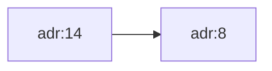

```mermaid
graph LR
    n_graph_queries_reader_analysis_rows["graph-queries:reader.analysis_rows"] --> n_code_export["code:export"]
    n_graph_queries_reader_claim_rows["graph-queries:reader.claim_rows"] --> n_code_export["code:export"]
    n_graph_queries_reader_context_rows["graph-queries:reader.context_rows"] --> n_code_ask["code:ask"]
    n_graph_queries_reader_ensure_fulltext_index["graph-queries:reader.ensure_fulltext_index"] --> n_code_ask["code:ask"]
    n_graph_queries_reader_entity_rows["graph-queries:reader.entity_rows"] --> n_code_export["code:export"]
    n_graph_queries_reader_entity_surface_rows["graph-queries:reader.entity_surface_rows"] --> n_code_resolution["code:resolution"]
    n_graph_queries_reader_fulltext_rows["graph-queries:reader.fulltext_rows"] --> n_code_ask["code:ask"]
    n_graph_queries_reader_graph_anchor_rows["graph-queries:reader.graph_anchor_rows"] --> n_code_ask["code:ask"]
    n_graph_queries_reader_interview_header_row["graph-queries:reader.interview_header_row"] --> n_code_api["code:api"]
    n_graph_queries_reader_interview_rows["graph-queries:reader.interview_rows"] --> n_code_api["code:api"]
    n_graph_queries_reader_lens_item_rows["graph-queries:reader.lens_item_rows"] --> n_code_api["code:api"]
    n_graph_queries_reader_lens_item_rows["graph-queries:reader.lens_item_rows"] --> n_code_export["code:export"]
    n_graph_queries_reader_name_rows["graph-queries:reader.name_rows"] --> n_code_ask["code:ask"]
    n_graph_queries_reader_person_card_rows["graph-queries:reader.person_card_rows"] --> n_code_api["code:api"]
    n_graph_queries_reader_person_contributes_to_persona["graph-queries:reader.person_contributes_to_persona"] --> n_code_api["code:api"]
    n_graph_queries_reader_person_detail_rows["graph-queries:reader.person_detail_rows"] --> n_code_api["code:api"]
    n_graph_queries_reader_person_display_name_row["graph-queries:reader.person_display_name_row"] --> n_code_api["code:api"]
    n_graph_queries_reader_person_exists["graph-queries:reader.person_exists"] --> n_code_api["code:api"]
    n_graph_queries_reader_person_rows["graph-queries:reader.person_rows"] --> n_code_export["code:export"]
    n_graph_queries_reader_persona_card_rows["graph-queries:reader.persona_card_rows"] --> n_code_api["code:api"]
    n_graph_queries_reader_persona_detail_rows["graph-queries:reader.persona_detail_rows"] --> n_code_api["code:api"]
    n_graph_queries_reader_persona_exists["graph-queries:reader.persona_exists"] --> n_code_api["code:api"]
    n_graph_queries_reader_project_exists["graph-queries:reader.project_exists"] --> n_code_api["code:api"]
    n_graph_queries_reader_project_exists["graph-queries:reader.project_exists"] --> n_code_api["code:api"]
    n_graph_queries_reader_project_exists["graph-queries:reader.project_exists"] --> n_code_ask["code:ask"]
    n_graph_queries_reader_project_exists["graph-queries:reader.project_exists"] --> n_code_ask["code:ask"]
    n_graph_queries_reader_project_rows["graph-queries:reader.project_rows"] --> n_code_api["code:api"]
    n_graph_queries_reader_segment_rows["graph-queries:reader.segment_rows"] --> n_code_api["code:api"]
    n_graph_queries_reader_segment_rows["graph-queries:reader.segment_rows"] --> n_code_export["code:export"]
    n_graph_queries_reader_speaker_rollup_rows["graph-queries:reader.speaker_rollup_rows"] --> n_code_api["code:api"]
    n_graph_queries_reader_speaker_rows["graph-queries:reader.speaker_rows"] --> n_code_export["code:export"]
    n_graph_queries_reader_speaker_rows["graph-queries:reader.speaker_rows"] --> n_code_export["code:export"]
    n_graph_queries_reader_speaker_rows["graph-queries:reader.speaker_rows"] --> n_code_resolution["code:resolution"]
    n_graph_queries_reader_speaker_rows["graph-queries:reader.speaker_rows"] --> n_code_resolution["code:resolution"]
    n_graph_queries_reader_transcript_line_rows["graph-queries:reader.transcript_line_rows"] --> n_code_api["code:api"]
    n_graph_queries_reader_transcript_rows["graph-queries:reader.transcript_rows"] --> n_code_export["code:export"]
    n_graph_queries_reader_vector_fragment_rows["graph-queries:reader.vector_fragment_rows"] --> n_code_ask["code:ask"]
    n_graph_queries_reader_vector_utterance_rows["graph-queries:reader.vector_utterance_rows"] --> n_code_ask["code:ask"]
    n_graph_queries_reader_worklist_rows["graph-queries:reader.worklist_rows"] --> n_code_api["code:api"]
    n_graph_queries_segments_list_segments["graph-queries:segments.list_segments"] --> n_code_api["code:api"]
    n_prompts_ask_prompts_ask_synthesis["prompts:ask_prompts.ask_synthesis"] --> n_code_ask["code:ask"]
    n_prompts_core_extractors_claims["prompts:core_extractors.claims"] --> n_code_enrichment["code:enrichment"]
    n_prompts_core_extractors_domain_keywords["prompts:core_extractors.domain_keywords"] --> n_code_enrichment["code:enrichment"]
    n_prompts_core_extractors_entity_mentions["prompts:core_extractors.entity_mentions"] --> n_code_enrichment["code:enrichment"]
    n_prompts_core_extractors_function_type["prompts:core_extractors.function_type"] --> n_code_enrichment["code:enrichment"]
    n_prompts_core_extractors_overall_keywords["prompts:core_extractors.overall_keywords"] --> n_code_enrichment["code:enrichment"]
    n_prompts_core_extractors_purpose["prompts:core_extractors.purpose"] --> n_code_enrichment["code:enrichment"]
    n_prompts_core_extractors_structure_type["prompts:core_extractors.structure_type"] --> n_code_enrichment["code:enrichment"]
    n_prompts_core_extractors_topic_level_1["prompts:core_extractors.topic_level_1"] --> n_code_enrichment["code:enrichment"]
    n_prompts_core_extractors_topic_level_3["prompts:core_extractors.topic_level_3"] --> n_code_enrichment["code:enrichment"]
    n_prompts_core_extractors_topic_segments["prompts:core_extractors.topic_segments"] --> n_code_enrichment["code:enrichment"]
    n_prompts_ingestion_prompts_speaker_window["prompts:ingestion_prompts.speaker_window"] --> n_code_ingestion["code:ingestion"]
    n_prompts_ingestion_prompts_stitch_window["prompts:ingestion_prompts.stitch_window"] --> n_code_ingestion["code:ingestion"]
    n_prompts_lens_meeting_minutes_action_items["prompts:lens_meeting_minutes.action_items"] --> n_code_lens["code:lens"]
    n_prompts_lens_meeting_minutes_decisions["prompts:lens_meeting_minutes.decisions"] --> n_code_lens["code:lens"]
    n_prompts_lens_meeting_minutes_followups["prompts:lens_meeting_minutes.followups"] --> n_code_lens["code:lens"]
    n_prompts_lens_meeting_minutes_objectives["prompts:lens_meeting_minutes.objectives"] --> n_code_lens["code:lens"]
    n_prompts_lens_persona_goals["prompts:lens_persona.goals"] --> n_code_lens["code:lens"]
    n_prompts_lens_persona_notable_quotes["prompts:lens_persona.notable_quotes"] --> n_code_lens["code:lens"]
    n_prompts_lens_persona_pain_points["prompts:lens_persona.pain_points"] --> n_code_lens["code:lens"]
    n_prompts_lens_persona_traits["prompts:lens_persona.traits"] --> n_code_lens["code:lens"]
```

## implements

```mermaid
graph LR
    n_capabilities_access_analysis_output_files["capabilities:access-analysis-output-files"] --> n_code_api["code:api"]
    n_capabilities_ask_the_corpus["capabilities:ask-the-corpus"] --> n_code_ask["code:ask"]
    n_capabilities_ask_the_corpus["capabilities:ask-the-corpus"] --> n_code_ask_engine["code:ask.engine"]
    n_capabilities_ask_the_corpus["capabilities:ask-the-corpus"] --> n_code_ask_reader["code:ask.reader"]
    n_capabilities_assemble_bundle["capabilities:assemble-bundle"] --> n_code_export_bundler["code:export.bundler"]
    n_capabilities_assemble_bundle["capabilities:assemble-bundle"] --> n_code_export_reader["code:export.reader"]
    n_capabilities_canonicalize_entities["capabilities:canonicalize-entities"] --> n_code_resolution_engine["code:resolution.engine"]
    n_capabilities_catalog_the_api_surface["capabilities:catalog-the-api-surface"] --> n_code_tools_api["code:tools.api"]
    n_capabilities_catalog_the_cli_surface["capabilities:catalog-the-cli-surface"] --> n_code_tools_cli["code:tools.cli"]
    n_capabilities_catalog_the_graph_queries["capabilities:catalog-the-graph-queries"] --> n_code_tools_graphq["code:tools.graphq"]
    n_capabilities_catalog_the_prompt_registry["capabilities:catalog-the-prompt-registry"] --> n_code_tools_prompts["code:tools.prompts"]
    n_capabilities_chat_failover["capabilities:chat-failover"] --> n_code_agents["code:agents"]
    n_capabilities_chat_failover["capabilities:chat-failover"] --> n_code_config["code:config"]
    n_capabilities_cited_synthesis["capabilities:cited-synthesis"] --> n_code_ask_engine["code:ask.engine"]
    n_capabilities_classify_dimensions["capabilities:classify-dimensions"] --> n_code_agents["code:agents"]
    n_capabilities_classify_dimensions["capabilities:classify-dimensions"] --> n_code_enrichment_executor["code:enrichment.executor"]
    n_capabilities_correct_resolution["capabilities:correct-resolution"] --> n_code_api["code:api"]
    n_capabilities_correct_resolution["capabilities:correct-resolution"] --> n_code_commands["code:commands"]
    n_capabilities_correct_resolution["capabilities:correct-resolution"] --> n_code_events["code:events"]
    n_capabilities_correct_the_analysis["capabilities:correct-the-analysis"] --> n_code_api["code:api"]
    n_capabilities_correct_the_analysis["capabilities:correct-the-analysis"] --> n_code_commands["code:commands"]
    n_capabilities_correct_the_analysis["capabilities:correct-the-analysis"] --> n_code_events["code:events"]
    n_capabilities_disclose_knowledge_and_check_specs["capabilities:disclose-knowledge-and-check-specs"] --> n_code_tools_knowledge["code:tools.knowledge"]
    n_capabilities_discover_the_corpus["capabilities:discover-the-corpus"] --> n_code_tools_corpus["code:tools.corpus"]
    n_capabilities_edit_text["capabilities:edit-text"] --> n_code_api["code:api"]
    n_capabilities_edit_text["capabilities:edit-text"] --> n_code_commands["code:commands"]
    n_capabilities_edit_text["capabilities:edit-text"] --> n_code_events["code:events"]
    n_capabilities_embed_fragments["capabilities:embed-fragments"] --> n_code_enrichment["code:enrichment"]
    n_capabilities_embed_fragments["capabilities:embed-fragments"] --> n_code_projections["code:projections"]
    n_capabilities_enrich_fragments["capabilities:enrich-fragments"] --> n_code_agents["code:agents"]
    n_capabilities_enrich_fragments["capabilities:enrich-fragments"] --> n_code_celery_app["code:celery_app"]
    n_capabilities_enrich_fragments["capabilities:enrich-fragments"] --> n_code_enrichment["code:enrichment"]
    n_capabilities_enrich_fragments["capabilities:enrich-fragments"] --> n_code_enrichment_executor["code:enrichment.executor"]
    n_capabilities_enrich_fragments["capabilities:enrich-fragments"] --> n_code_enrichment_orchestrator["code:enrichment.orchestrator"]
    n_capabilities_enrich_fragments["capabilities:enrich-fragments"] --> n_code_models["code:models"]
    n_capabilities_enrich_fragments["capabilities:enrich-fragments"] --> n_code_tasks["code:tasks"]
    n_capabilities_export_a_portable_bundle["capabilities:export-a-portable-bundle"] --> n_code_export["code:export"]
    n_capabilities_export_a_portable_bundle["capabilities:export-a-portable-bundle"] --> n_code_export_bundler["code:export.bundler"]
    n_capabilities_export_a_portable_bundle["capabilities:export-a-portable-bundle"] --> n_code_export_reader["code:export.reader"]
    n_capabilities_export_a_portable_bundle["capabilities:export-a-portable-bundle"] --> n_code_export_renderer["code:export.renderer"]
    n_capabilities_extract_claims["capabilities:extract-claims"] --> n_code_agents["code:agents"]
    n_capabilities_extract_claims["capabilities:extract-claims"] --> n_code_enrichment_executor["code:enrichment.executor"]
    n_capabilities_extract_insights_via_lenses["capabilities:extract-insights-via-lenses"] --> n_code_agents["code:agents"]
    n_capabilities_extract_insights_via_lenses["capabilities:extract-insights-via-lenses"] --> n_code_lens["code:lens"]
    n_capabilities_extract_insights_via_lenses["capabilities:extract-insights-via-lenses"] --> n_code_lens_engine["code:lens.engine"]
    n_capabilities_gallery_read["capabilities:gallery-read"] --> n_code_ui_reader["code:ui.reader"]
    n_capabilities_govern_architectural_decisions["capabilities:govern-architectural-decisions"] --> n_code_tools_adr["code:tools.adr"]
    n_capabilities_hybrid_retrieval["capabilities:hybrid-retrieval"] --> n_code_ask_engine["code:ask.engine"]
    n_capabilities_hybrid_retrieval["capabilities:hybrid-retrieval"] --> n_code_ask_reader["code:ask.reader"]
    n_capabilities_infer_speakers["capabilities:infer-speakers"] --> n_code_agents["code:agents"]
    n_capabilities_infer_speakers["capabilities:infer-speakers"] --> n_code_ingestion_speaker_inference["code:ingestion.speaker_inference"]
    n_capabilities_ingest_transcripts["capabilities:ingest-transcripts"] --> n_code_agents["code:agents"]
    n_capabilities_ingest_transcripts["capabilities:ingest-transcripts"] --> n_code_celery_app["code:celery_app"]
    n_capabilities_ingest_transcripts["capabilities:ingest-transcripts"] --> n_code_ingestion["code:ingestion"]
    n_capabilities_ingest_transcripts["capabilities:ingest-transcripts"] --> n_code_ingestion_orchestrator["code:ingestion.orchestrator"]
    n_capabilities_ingest_transcripts["capabilities:ingest-transcripts"] --> n_code_ingestion_speaker_inference["code:ingestion.speaker_inference"]
    n_capabilities_ingest_transcripts["capabilities:ingest-transcripts"] --> n_code_ingestion_stitcher["code:ingestion.stitcher"]
    n_capabilities_ingest_transcripts["capabilities:ingest-transcripts"] --> n_code_tasks["code:tasks"]
    n_capabilities_link_the_domains["capabilities:link-the-domains"] --> n_code_tools_graph["code:tools.graph"]
    n_capabilities_live_notifications["capabilities:live-notifications"] --> n_code_ui["code:ui"]
    n_capabilities_maintain_event_source_of_truth["capabilities:maintain-event-source-of-truth"] --> n_code_commands["code:commands"]
    n_capabilities_maintain_event_source_of_truth["capabilities:maintain-event-source-of-truth"] --> n_code_events["code:events"]
    n_capabilities_maintain_the_glossary["capabilities:maintain-the-glossary"] --> n_code_tools_glossary["code:tools.glossary"]
    n_capabilities_map_capabilities["capabilities:map-capabilities"] --> n_code_tools_capability["code:tools.capability"]
    n_capabilities_map_the_code["capabilities:map-the-code"] --> n_code_tools_code["code:tools.code"]
    n_capabilities_map_the_tests["capabilities:map-the-tests"] --> n_code_tools_testmap["code:tools.testmap"]
    n_capabilities_map_use_cases["capabilities:map-use-cases"] --> n_code_tools_usecase["code:tools.usecase"]
    n_capabilities_merge_split_link_alias["capabilities:merge-split-link-alias"] --> n_code_resolution_engine["code:resolution.engine"]
    n_capabilities_override_lens_items["capabilities:override-lens-items"] --> n_code_api["code:api"]
    n_capabilities_override_lens_items["capabilities:override-lens-items"] --> n_code_commands["code:commands"]
    n_capabilities_override_lens_items["capabilities:override-lens-items"] --> n_code_events["code:events"]
    n_capabilities_parse_fragments["capabilities:parse-fragments"] --> n_code_ingestion_orchestrator["code:ingestion.orchestrator"]
    n_capabilities_per_lens_extractors["capabilities:per-lens-extractors"] --> n_code_agents["code:agents"]
    n_capabilities_per_lens_extractors["capabilities:per-lens-extractors"] --> n_code_config["code:config"]
    n_capabilities_per_lens_extractors["capabilities:per-lens-extractors"] --> n_code_lens_engine["code:lens.engine"]
    n_capabilities_pinned_embeddings["capabilities:pinned-embeddings"] --> n_code_config["code:config"]
    n_capabilities_pinned_embeddings["capabilities:pinned-embeddings"] --> n_code_enrichment["code:enrichment"]
    n_capabilities_project_events_to_graph["capabilities:project-events-to-graph"] --> n_code_projections["code:projections"]
    n_capabilities_project_events_to_graph["capabilities:project-events-to-graph"] --> n_code_run_projection_service["code:run_projection_service"]
    n_capabilities_provider_strategy_and_focused_calls["capabilities:provider-strategy-and-focused-calls"] --> n_code_agents["code:agents"]
    n_capabilities_provider_strategy_and_focused_calls["capabilities:provider-strategy-and-focused-calls"] --> n_code_config["code:config"]
    n_capabilities_remove_segments["capabilities:remove-segments"] --> n_code_api["code:api"]
    n_capabilities_remove_segments["capabilities:remove-segments"] --> n_code_commands["code:commands"]
    n_capabilities_remove_segments["capabilities:remove-segments"] --> n_code_events["code:events"]
    n_capabilities_rename_reattribute_speakers["capabilities:rename-reattribute-speakers"] --> n_code_api["code:api"]
    n_capabilities_rename_reattribute_speakers["capabilities:rename-reattribute-speakers"] --> n_code_commands["code:commands"]
    n_capabilities_rename_reattribute_speakers["capabilities:rename-reattribute-speakers"] --> n_code_events["code:events"]
    n_capabilities_render_bundle["capabilities:render-bundle"] --> n_code_export_renderer["code:export.renderer"]
    n_capabilities_resolve_entities_and_people["capabilities:resolve-entities-and-people"] --> n_code_resolution["code:resolution"]
    n_capabilities_resolve_entities_and_people["capabilities:resolve-entities-and-people"] --> n_code_resolution_engine["code:resolution.engine"]
    n_capabilities_resolve_persons["capabilities:resolve-persons"] --> n_code_resolution_engine["code:resolution.engine"]
    n_capabilities_run_lens_engine["capabilities:run-lens-engine"] --> n_code_lens_engine["code:lens.engine"]
    n_capabilities_run_read_queries["capabilities:run-read-queries"] --> n_code_api["code:api"]
    n_capabilities_segment_conversation["capabilities:segment-conversation"] --> n_code_ingestion["code:ingestion"]
    n_capabilities_serve_workbench_and_gallery["capabilities:serve-workbench-and-gallery"] --> n_code_api["code:api"]
    n_capabilities_serve_workbench_and_gallery["capabilities:serve-workbench-and-gallery"] --> n_code_main["code:main"]
    n_capabilities_serve_workbench_and_gallery["capabilities:serve-workbench-and-gallery"] --> n_code_ui["code:ui"]
    n_capabilities_serve_workbench_and_gallery["capabilities:serve-workbench-and-gallery"] --> n_code_ui_reader["code:ui.reader"]
    n_capabilities_stitch_utterances["capabilities:stitch-utterances"] --> n_code_agents["code:agents"]
    n_capabilities_stitch_utterances["capabilities:stitch-utterances"] --> n_code_ingestion_stitcher["code:ingestion.stitcher"]
    n_capabilities_tag_topics_keywords["capabilities:tag-topics-keywords"] --> n_code_agents["code:agents"]
    n_capabilities_tag_topics_keywords["capabilities:tag-topics-keywords"] --> n_code_enrichment_executor["code:enrichment.executor"]
    n_capabilities_walk_the_graph_for_context["capabilities:walk-the-graph-for-context"] --> n_code_tools_graph_neighbors["code:tools.graph.neighbors"]
    n_capabilities_walk_the_graph_for_context["capabilities:walk-the-graph-for-context"] --> n_code_tools_graph_traverse["code:tools.graph.traverse"]
    n_capabilities_workbench_write["capabilities:workbench-write"] --> n_code_api["code:api"]
    n_capabilities_workbench_write["capabilities:workbench-write"] --> n_code_commands["code:commands"]
```



## child_of

```mermaid
graph LR
    n_capabilities_assemble_bundle["capabilities:assemble-bundle"] --> n_capabilities_export_a_portable_bundle["capabilities:export-a-portable-bundle"]
    n_capabilities_canonicalize_entities["capabilities:canonicalize-entities"] --> n_capabilities_resolve_entities_and_people["capabilities:resolve-entities-and-people"]
    n_capabilities_catalog_the_api_surface["capabilities:catalog-the-api-surface"] --> n_capabilities_maintain_a_guarded_knowledge_graph["capabilities:maintain-a-guarded-knowledge-graph"]
    n_capabilities_catalog_the_cli_surface["capabilities:catalog-the-cli-surface"] --> n_capabilities_maintain_a_guarded_knowledge_graph["capabilities:maintain-a-guarded-knowledge-graph"]
    n_capabilities_catalog_the_graph_queries["capabilities:catalog-the-graph-queries"] --> n_capabilities_maintain_a_guarded_knowledge_graph["capabilities:maintain-a-guarded-knowledge-graph"]
    n_capabilities_catalog_the_prompt_registry["capabilities:catalog-the-prompt-registry"] --> n_capabilities_maintain_a_guarded_knowledge_graph["capabilities:maintain-a-guarded-knowledge-graph"]
    n_capabilities_chat_failover["capabilities:chat-failover"] --> n_capabilities_provider_strategy_and_focused_calls["capabilities:provider-strategy-and-focused-calls"]
    n_capabilities_cited_synthesis["capabilities:cited-synthesis"] --> n_capabilities_ask_the_corpus["capabilities:ask-the-corpus"]
    n_capabilities_classify_dimensions["capabilities:classify-dimensions"] --> n_capabilities_enrich_fragments["capabilities:enrich-fragments"]
    n_capabilities_correct_resolution["capabilities:correct-resolution"] --> n_capabilities_correct_the_analysis["capabilities:correct-the-analysis"]
    n_capabilities_disclose_knowledge_and_check_specs["capabilities:disclose-knowledge-and-check-specs"] --> n_capabilities_maintain_a_guarded_knowledge_graph["capabilities:maintain-a-guarded-knowledge-graph"]
    n_capabilities_discover_the_corpus["capabilities:discover-the-corpus"] --> n_capabilities_maintain_a_guarded_knowledge_graph["capabilities:maintain-a-guarded-knowledge-graph"]
    n_capabilities_edit_text["capabilities:edit-text"] --> n_capabilities_correct_the_analysis["capabilities:correct-the-analysis"]
    n_capabilities_extract_claims["capabilities:extract-claims"] --> n_capabilities_enrich_fragments["capabilities:enrich-fragments"]
    n_capabilities_gallery_read["capabilities:gallery-read"] --> n_capabilities_serve_workbench_and_gallery["capabilities:serve-workbench-and-gallery"]
    n_capabilities_govern_architectural_decisions["capabilities:govern-architectural-decisions"] --> n_capabilities_maintain_a_guarded_knowledge_graph["capabilities:maintain-a-guarded-knowledge-graph"]
    n_capabilities_hybrid_retrieval["capabilities:hybrid-retrieval"] --> n_capabilities_ask_the_corpus["capabilities:ask-the-corpus"]
    n_capabilities_infer_speakers["capabilities:infer-speakers"] --> n_capabilities_ingest_transcripts["capabilities:ingest-transcripts"]
    n_capabilities_link_the_domains["capabilities:link-the-domains"] --> n_capabilities_maintain_a_guarded_knowledge_graph["capabilities:maintain-a-guarded-knowledge-graph"]
    n_capabilities_live_notifications["capabilities:live-notifications"] --> n_capabilities_serve_workbench_and_gallery["capabilities:serve-workbench-and-gallery"]
    n_capabilities_maintain_the_glossary["capabilities:maintain-the-glossary"] --> n_capabilities_maintain_a_guarded_knowledge_graph["capabilities:maintain-a-guarded-knowledge-graph"]
    n_capabilities_map_capabilities["capabilities:map-capabilities"] --> n_capabilities_maintain_a_guarded_knowledge_graph["capabilities:maintain-a-guarded-knowledge-graph"]
    n_capabilities_map_the_code["capabilities:map-the-code"] --> n_capabilities_maintain_a_guarded_knowledge_graph["capabilities:maintain-a-guarded-knowledge-graph"]
    n_capabilities_map_the_tests["capabilities:map-the-tests"] --> n_capabilities_maintain_a_guarded_knowledge_graph["capabilities:maintain-a-guarded-knowledge-graph"]
    n_capabilities_map_use_cases["capabilities:map-use-cases"] --> n_capabilities_maintain_a_guarded_knowledge_graph["capabilities:maintain-a-guarded-knowledge-graph"]
    n_capabilities_merge_split_link_alias["capabilities:merge-split-link-alias"] --> n_capabilities_resolve_entities_and_people["capabilities:resolve-entities-and-people"]
    n_capabilities_override_lens_items["capabilities:override-lens-items"] --> n_capabilities_correct_the_analysis["capabilities:correct-the-analysis"]
    n_capabilities_parse_fragments["capabilities:parse-fragments"] --> n_capabilities_ingest_transcripts["capabilities:ingest-transcripts"]
    n_capabilities_per_lens_extractors["capabilities:per-lens-extractors"] --> n_capabilities_extract_insights_via_lenses["capabilities:extract-insights-via-lenses"]
    n_capabilities_pinned_embeddings["capabilities:pinned-embeddings"] --> n_capabilities_embed_fragments["capabilities:embed-fragments"]
    n_capabilities_remove_segments["capabilities:remove-segments"] --> n_capabilities_correct_the_analysis["capabilities:correct-the-analysis"]
    n_capabilities_rename_reattribute_speakers["capabilities:rename-reattribute-speakers"] --> n_capabilities_correct_the_analysis["capabilities:correct-the-analysis"]
    n_capabilities_render_bundle["capabilities:render-bundle"] --> n_capabilities_export_a_portable_bundle["capabilities:export-a-portable-bundle"]
    n_capabilities_resolve_persons["capabilities:resolve-persons"] --> n_capabilities_resolve_entities_and_people["capabilities:resolve-entities-and-people"]
    n_capabilities_run_lens_engine["capabilities:run-lens-engine"] --> n_capabilities_extract_insights_via_lenses["capabilities:extract-insights-via-lenses"]
    n_capabilities_run_read_queries["capabilities:run-read-queries"] --> n_capabilities_serve_workbench_and_gallery["capabilities:serve-workbench-and-gallery"]
    n_capabilities_segment_conversation["capabilities:segment-conversation"] --> n_capabilities_ingest_transcripts["capabilities:ingest-transcripts"]
    n_capabilities_stitch_utterances["capabilities:stitch-utterances"] --> n_capabilities_ingest_transcripts["capabilities:ingest-transcripts"]
    n_capabilities_tag_topics_keywords["capabilities:tag-topics-keywords"] --> n_capabilities_enrich_fragments["capabilities:enrich-fragments"]
    n_capabilities_walk_the_graph_for_context["capabilities:walk-the-graph-for-context"] --> n_capabilities_maintain_a_guarded_knowledge_graph["capabilities:maintain-a-guarded-knowledge-graph"]
    n_capabilities_workbench_write["capabilities:workbench-write"] --> n_capabilities_serve_workbench_and_gallery["capabilities:serve-workbench-and-gallery"]
```



## depends_on

```mermaid
graph LR
    n_code_agents_agent_factory["code:agents.agent_factory"] --> n_code_config["code:config"]
    n_code_agents_agent_factory["code:agents.agent_factory"] --> n_code_utils_logger["code:utils.logger"]
    n_code_agents_anthropic_agent["code:agents.anthropic_agent"] --> n_code_agents_agent_factory["code:agents.agent_factory"]
    n_code_agents_anthropic_agent["code:agents.anthropic_agent"] --> n_code_config["code:config"]
    n_code_agents_anthropic_agent["code:agents.anthropic_agent"] --> n_code_utils_logger["code:utils.logger"]
    n_code_agents_anthropic_agent["code:agents.anthropic_agent"] --> n_code_utils_metrics["code:utils.metrics"]
    n_code_agents_claude_code_agent["code:agents.claude_code_agent"] --> n_code_config["code:config"]
    n_code_agents_claude_code_agent["code:agents.claude_code_agent"] --> n_code_utils_logger["code:utils.logger"]
    n_code_agents_failover_agent["code:agents.failover_agent"] --> n_code_agents_agent_factory["code:agents.agent_factory"]
    n_code_agents_failover_agent["code:agents.failover_agent"] --> n_code_config["code:config"]
    n_code_agents_failover_agent["code:agents.failover_agent"] --> n_code_utils_logger["code:utils.logger"]
    n_code_agents_openai_agent["code:agents.openai_agent"] --> n_code_agents_agent_factory["code:agents.agent_factory"]
    n_code_agents_openai_agent["code:agents.openai_agent"] --> n_code_config["code:config"]
    n_code_agents_openai_agent["code:agents.openai_agent"] --> n_code_utils_logger["code:utils.logger"]
    n_code_agents_openai_agent["code:agents.openai_agent"] --> n_code_utils_metrics["code:utils.metrics"]
    n_code_api_routers_analysis["code:api.routers.analysis"] --> n_code_api_schemas["code:api.schemas"]
    n_code_api_routers_analysis["code:api.routers.analysis"] --> n_code_config["code:config"]
    n_code_api_routers_analysis["code:api.routers.analysis"] --> n_code_enrichment_orchestrator["code:enrichment.orchestrator"]
    n_code_api_routers_analysis["code:api.routers.analysis"] --> n_code_ingestion_orchestrator["code:ingestion.orchestrator"]
    n_code_api_routers_analysis["code:api.routers.analysis"] --> n_code_utils_logger["code:utils.logger"]
    n_code_api_routers_ask["code:api.routers.ask"] --> n_code_ask_engine["code:ask.engine"]
    n_code_api_routers_edits["code:api.routers.edits"] --> n_code_commands_handlers["code:commands.handlers"]
    n_code_api_routers_edits["code:api.routers.edits"] --> n_code_commands_sentence_commands["code:commands.sentence_commands"]
    n_code_api_routers_edits["code:api.routers.edits"] --> n_code_config["code:config"]
    n_code_api_routers_edits["code:api.routers.edits"] --> n_code_events_envelope["code:events.envelope"]
    n_code_api_routers_edits["code:api.routers.edits"] --> n_code_events_repository["code:events.repository"]
    n_code_api_routers_edits["code:api.routers.edits"] --> n_code_events_store["code:events.store"]
    n_code_api_routers_edits["code:api.routers.edits"] --> n_code_utils_environment["code:utils.environment"]
    n_code_api_routers_edits["code:api.routers.edits"] --> n_code_utils_logger["code:utils.logger"]
    n_code_api_routers_exports["code:api.routers.exports"] --> n_code_export_bundler["code:export.bundler"]
    n_code_api_routers_exports["code:api.routers.exports"] --> n_code_utils_logger["code:utils.logger"]
    n_code_api_routers_files["code:api.routers.files"] --> n_code_api_schemas["code:api.schemas"]
    n_code_api_routers_files["code:api.routers.files"] --> n_code_config["code:config"]
    n_code_api_routers_files["code:api.routers.files"] --> n_code_utils_logger["code:utils.logger"]
    n_code_api_routers_lenses["code:api.routers.lenses"] --> n_code_events_aggregates["code:events.aggregates"]
    n_code_api_routers_lenses["code:api.routers.lenses"] --> n_code_events_envelope["code:events.envelope"]
    n_code_api_routers_lenses["code:api.routers.lenses"] --> n_code_events_repository["code:events.repository"]
    n_code_api_routers_lenses["code:api.routers.lenses"] --> n_code_utils_logger["code:utils.logger"]
    n_code_api_routers_queries["code:api.routers.queries"] --> n_code_config["code:config"]
    n_code_api_routers_queries["code:api.routers.queries"] --> n_code_enrichment_embedder["code:enrichment.embedder"]
    n_code_api_routers_queries["code:api.routers.queries"] --> n_code_events_project_events["code:events.project_events"]
    n_code_api_routers_queries["code:api.routers.queries"] --> n_code_events_repository["code:events.repository"]
    n_code_api_routers_queries["code:api.routers.queries"] --> n_code_export["code:export"]
    n_code_api_routers_queries["code:api.routers.queries"] --> n_code_export_renderer["code:export.renderer"]
    n_code_api_routers_queries["code:api.routers.queries"] --> n_code_resolution_suggestions["code:resolution.suggestions"]
    n_code_api_routers_queries["code:api.routers.queries"] --> n_code_utils_neo4j_driver["code:utils.neo4j_driver"]
    n_code_api_routers_resolution["code:api.routers.resolution"] --> n_code_events_envelope["code:events.envelope"]
    n_code_api_routers_resolution["code:api.routers.resolution"] --> n_code_events_project_events["code:events.project_events"]
    n_code_api_routers_resolution["code:api.routers.resolution"] --> n_code_events_repository["code:events.repository"]
    n_code_api_routers_resolution["code:api.routers.resolution"] --> n_code_resolution_candidates["code:resolution.candidates"]
    n_code_api_routers_segments["code:api.routers.segments"] --> n_code_events_aggregates["code:events.aggregates"]
    n_code_api_routers_segments["code:api.routers.segments"] --> n_code_events_envelope["code:events.envelope"]
    n_code_api_routers_segments["code:api.routers.segments"] --> n_code_events_repository["code:events.repository"]
    n_code_api_routers_segments["code:api.routers.segments"] --> n_code_export["code:export"]
    n_code_api_routers_segments["code:api.routers.segments"] --> n_code_utils_neo4j_driver["code:utils.neo4j_driver"]
    n_code_api_routers_speakers["code:api.routers.speakers"] --> n_code_events_aggregates["code:events.aggregates"]
    n_code_api_routers_speakers["code:api.routers.speakers"] --> n_code_events_envelope["code:events.envelope"]
    n_code_api_routers_speakers["code:api.routers.speakers"] --> n_code_events_repository["code:events.repository"]
    n_code_api_routers_speakers["code:api.routers.speakers"] --> n_code_utils_logger["code:utils.logger"]
    n_code_api_routers_ui["code:api.routers.ui"] --> n_code_events_project_events["code:events.project_events"]
    n_code_api_routers_ui["code:api.routers.ui"] --> n_code_resolution_candidates["code:resolution.candidates"]
    n_code_api_routers_ui["code:api.routers.ui"] --> n_code_ui["code:ui"]
    n_code_api_routers_ui["code:api.routers.ui"] --> n_code_ui_notifications["code:ui.notifications"]
    n_code_api_routers_ui["code:api.routers.ui"] --> n_code_utils_neo4j_driver["code:utils.neo4j_driver"]
    n_code_ask___main__["code:ask.__main__"] --> n_code_ask_engine["code:ask.engine"]
    n_code_ask_engine["code:ask.engine"] --> n_code_agents_failover_agent["code:agents.failover_agent"]
    n_code_ask_engine["code:ask.engine"] --> n_code_config["code:config"]
    n_code_ask_engine["code:ask.engine"] --> n_code_enrichment_embedder["code:enrichment.embedder"]
    n_code_ask_engine["code:ask.engine"] --> n_code_projections_handlers_embedding_handlers["code:projections.handlers.embedding_handlers"]
    n_code_ask_engine["code:ask.engine"] --> n_code_utils_helpers["code:utils.helpers"]
    n_code_ask_engine["code:ask.engine"] --> n_code_utils_logger["code:utils.logger"]
    n_code_ask_engine["code:ask.engine"] --> n_code_utils_neo4j_driver["code:utils.neo4j_driver"]
    n_code_commands_handlers["code:commands.handlers"] --> n_code_events_aggregates["code:events.aggregates"]
    n_code_commands_handlers["code:commands.handlers"] --> n_code_events_envelope["code:events.envelope"]
    n_code_commands_handlers["code:commands.handlers"] --> n_code_events_interview_events["code:events.interview_events"]
    n_code_commands_handlers["code:commands.handlers"] --> n_code_events_repository["code:events.repository"]
    n_code_commands_handlers["code:commands.handlers"] --> n_code_events_sentence_events["code:events.sentence_events"]
    n_code_commands_handlers["code:commands.handlers"] --> n_code_events_store["code:events.store"]
    n_code_enrichment___main__["code:enrichment.__main__"] --> n_code_enrichment_orchestrator["code:enrichment.orchestrator"]
    n_code_enrichment_embedder["code:enrichment.embedder"] --> n_code_config["code:config"]
    n_code_enrichment_embedder["code:enrichment.embedder"] --> n_code_utils_logger["code:utils.logger"]
    n_code_enrichment_executor["code:enrichment.executor"] --> n_code_agents_failover_agent["code:agents.failover_agent"]
    n_code_enrichment_executor["code:enrichment.executor"] --> n_code_enrichment_graph_context["code:enrichment.graph_context"]
    n_code_enrichment_executor["code:enrichment.executor"] --> n_code_enrichment_models["code:enrichment.models"]
    n_code_enrichment_executor["code:enrichment.executor"] --> n_code_enrichment_syntax_check["code:enrichment.syntax_check"]
    n_code_enrichment_executor["code:enrichment.executor"] --> n_code_utils_logger["code:utils.logger"]
    n_code_enrichment_orchestrator["code:enrichment.orchestrator"] --> n_code_agents_failover_agent["code:agents.failover_agent"]
    n_code_enrichment_orchestrator["code:enrichment.orchestrator"] --> n_code_config["code:config"]
    n_code_enrichment_orchestrator["code:enrichment.orchestrator"] --> n_code_enrichment_embedder["code:enrichment.embedder"]
    n_code_enrichment_orchestrator["code:enrichment.orchestrator"] --> n_code_enrichment_executor["code:enrichment.executor"]
    n_code_enrichment_orchestrator["code:enrichment.orchestrator"] --> n_code_enrichment_graph_context["code:enrichment.graph_context"]
    n_code_enrichment_orchestrator["code:enrichment.orchestrator"] --> n_code_enrichment_registry["code:enrichment.registry"]
    n_code_enrichment_orchestrator["code:enrichment.orchestrator"] --> n_code_enrichment_segments["code:enrichment.segments"]
    n_code_enrichment_orchestrator["code:enrichment.orchestrator"] --> n_code_events_aggregates["code:events.aggregates"]
    n_code_enrichment_orchestrator["code:enrichment.orchestrator"] --> n_code_events_envelope["code:events.envelope"]
    n_code_enrichment_orchestrator["code:enrichment.orchestrator"] --> n_code_events_interview_events["code:events.interview_events"]
    n_code_enrichment_orchestrator["code:enrichment.orchestrator"] --> n_code_events_repository["code:events.repository"]
    n_code_enrichment_orchestrator["code:enrichment.orchestrator"] --> n_code_utils_helpers["code:utils.helpers"]
    n_code_enrichment_orchestrator["code:enrichment.orchestrator"] --> n_code_utils_logger["code:utils.logger"]
    n_code_enrichment_registry["code:enrichment.registry"] --> n_code_utils_helpers["code:utils.helpers"]
    n_code_enrichment_syntax_check["code:enrichment.syntax_check"] --> n_code_utils_text_processing["code:utils.text_processing"]
    n_code_events_store["code:events.store"] --> n_code_utils_environment["code:utils.environment"]
    n_code_export___main__["code:export.__main__"] --> n_code_export_bundler["code:export.bundler"]
    n_code_export_bundler["code:export.bundler"] --> n_code_config["code:config"]
    n_code_export_bundler["code:export.bundler"] --> n_code_events_repository["code:events.repository"]
    n_code_export_bundler["code:export.bundler"] --> n_code_export_renderer["code:export.renderer"]
    n_code_export_bundler["code:export.bundler"] --> n_code_lens_models["code:lens.models"]
    n_code_export_bundler["code:export.bundler"] --> n_code_utils_logger["code:utils.logger"]
    n_code_export_bundler["code:export.bundler"] --> n_code_utils_neo4j_driver["code:utils.neo4j_driver"]
    n_code_export_renderer["code:export.renderer"] --> n_code_lens_models["code:lens.models"]
    n_code_ingestion___main__["code:ingestion.__main__"] --> n_code_enrichment_orchestrator["code:enrichment.orchestrator"]
    n_code_ingestion___main__["code:ingestion.__main__"] --> n_code_ingestion_orchestrator["code:ingestion.orchestrator"]
    n_code_ingestion_front_matter["code:ingestion.front_matter"] --> n_code_utils_logger["code:utils.logger"]
    n_code_ingestion_normalizer["code:ingestion.normalizer"] --> n_code_utils_text_processing["code:utils.text_processing"]
    n_code_ingestion_orchestrator["code:ingestion.orchestrator"] --> n_code_events_aggregates["code:events.aggregates"]
    n_code_ingestion_orchestrator["code:ingestion.orchestrator"] --> n_code_events_envelope["code:events.envelope"]
    n_code_ingestion_orchestrator["code:ingestion.orchestrator"] --> n_code_events_repository["code:events.repository"]
    n_code_ingestion_orchestrator["code:ingestion.orchestrator"] --> n_code_ingestion_models["code:ingestion.models"]
    n_code_ingestion_orchestrator["code:ingestion.orchestrator"] --> n_code_ingestion_normalizer["code:ingestion.normalizer"]
    n_code_ingestion_orchestrator["code:ingestion.orchestrator"] --> n_code_ingestion_speaker_inference["code:ingestion.speaker_inference"]
    n_code_ingestion_orchestrator["code:ingestion.orchestrator"] --> n_code_ingestion_stitcher["code:ingestion.stitcher"]
    n_code_ingestion_orchestrator["code:ingestion.orchestrator"] --> n_code_utils_helpers["code:utils.helpers"]
    n_code_ingestion_orchestrator["code:ingestion.orchestrator"] --> n_code_utils_logger["code:utils.logger"]
    n_code_ingestion_speaker_inference["code:ingestion.speaker_inference"] --> n_code_agents_agent_factory["code:agents.agent_factory"]
    n_code_ingestion_speaker_inference["code:ingestion.speaker_inference"] --> n_code_ingestion_models["code:ingestion.models"]
    n_code_ingestion_speaker_inference["code:ingestion.speaker_inference"] --> n_code_models_ingestion_responses["code:models.ingestion_responses"]
    n_code_ingestion_speaker_inference["code:ingestion.speaker_inference"] --> n_code_utils_helpers["code:utils.helpers"]
    n_code_ingestion_speaker_inference["code:ingestion.speaker_inference"] --> n_code_utils_logger["code:utils.logger"]
    n_code_ingestion_stitcher["code:ingestion.stitcher"] --> n_code_agents_agent_factory["code:agents.agent_factory"]
    n_code_ingestion_stitcher["code:ingestion.stitcher"] --> n_code_ingestion_models["code:ingestion.models"]
    n_code_ingestion_stitcher["code:ingestion.stitcher"] --> n_code_ingestion_speaker_inference["code:ingestion.speaker_inference"]
    n_code_ingestion_stitcher["code:ingestion.stitcher"] --> n_code_models_ingestion_responses["code:models.ingestion_responses"]
    n_code_ingestion_stitcher["code:ingestion.stitcher"] --> n_code_utils_helpers["code:utils.helpers"]
    n_code_ingestion_stitcher["code:ingestion.stitcher"] --> n_code_utils_logger["code:utils.logger"]
    n_code_lens___main__["code:lens.__main__"] --> n_code_lens_engine["code:lens.engine"]
    n_code_lens_engine["code:lens.engine"] --> n_code_agents_failover_agent["code:agents.failover_agent"]
    n_code_lens_engine["code:lens.engine"] --> n_code_config["code:config"]
    n_code_lens_engine["code:lens.engine"] --> n_code_enrichment_executor["code:enrichment.executor"]
    n_code_lens_engine["code:lens.engine"] --> n_code_events_aggregates["code:events.aggregates"]
    n_code_lens_engine["code:lens.engine"] --> n_code_events_envelope["code:events.envelope"]
    n_code_lens_engine["code:lens.engine"] --> n_code_events_repository["code:events.repository"]
    n_code_lens_engine["code:lens.engine"] --> n_code_lens_models["code:lens.models"]
    n_code_lens_engine["code:lens.engine"] --> n_code_utils_helpers["code:utils.helpers"]
    n_code_lens_engine["code:lens.engine"] --> n_code_utils_logger["code:utils.logger"]
    n_code_lens_models["code:lens.models"] --> n_code_enrichment_models["code:enrichment.models"]
    n_code_lens_models["code:lens.models"] --> n_code_utils_helpers["code:utils.helpers"]
    n_code_main["code:main"] --> n_code_api_routers["code:api.routers"]
    n_code_main["code:main"] --> n_code_config["code:config"]
    n_code_main["code:main"] --> n_code_enrichment_orchestrator["code:enrichment.orchestrator"]
    n_code_main["code:main"] --> n_code_ingestion_orchestrator["code:ingestion.orchestrator"]
    n_code_main["code:main"] --> n_code_utils_logger["code:utils.logger"]
    n_code_main["code:main"] --> n_code_utils_metrics["code:utils.metrics"]
    n_code_models_lens_responses["code:models.lens_responses"] --> n_code_models_extractor_responses["code:models.extractor_responses"]
    n_code_projections_bootstrap["code:projections.bootstrap"] --> n_code_events_store["code:events.store"]
    n_code_projections_bootstrap["code:projections.bootstrap"] --> n_code_projections_handlers_claim_handlers["code:projections.handlers.claim_handlers"]
    n_code_projections_bootstrap["code:projections.bootstrap"] --> n_code_projections_handlers_embedding_handlers["code:projections.handlers.embedding_handlers"]
    n_code_projections_bootstrap["code:projections.bootstrap"] --> n_code_projections_handlers_entity_handlers["code:projections.handlers.entity_handlers"]
    n_code_projections_bootstrap["code:projections.bootstrap"] --> n_code_projections_handlers_interview_handlers["code:projections.handlers.interview_handlers"]
    n_code_projections_bootstrap["code:projections.bootstrap"] --> n_code_projections_handlers_lens_handlers["code:projections.handlers.lens_handlers"]
    n_code_projections_bootstrap["code:projections.bootstrap"] --> n_code_projections_handlers_registry["code:projections.handlers.registry"]
    n_code_projections_bootstrap["code:projections.bootstrap"] --> n_code_projections_handlers_resolution_handlers["code:projections.handlers.resolution_handlers"]
    n_code_projections_bootstrap["code:projections.bootstrap"] --> n_code_projections_handlers_segment_handlers["code:projections.handlers.segment_handlers"]
    n_code_projections_bootstrap["code:projections.bootstrap"] --> n_code_projections_handlers_sentence_handlers["code:projections.handlers.sentence_handlers"]
    n_code_projections_bootstrap["code:projections.bootstrap"] --> n_code_projections_handlers_speaker_handlers["code:projections.handlers.speaker_handlers"]
    n_code_projections_bootstrap["code:projections.bootstrap"] --> n_code_projections_handlers_utterance_handlers["code:projections.handlers.utterance_handlers"]
    n_code_projections_bootstrap["code:projections.bootstrap"] --> n_code_projections_parked_events["code:projections.parked_events"]
    n_code_projections_config["code:projections.config"] --> n_code_utils_environment["code:utils.environment"]
    n_code_projections_ensure_schema["code:projections.ensure_schema"] --> n_code_projections_schema["code:projections.schema"]
    n_code_projections_ensure_schema["code:projections.ensure_schema"] --> n_code_utils_neo4j_driver["code:utils.neo4j_driver"]
    n_code_projections_handlers_base_handler["code:projections.handlers.base_handler"] --> n_code_events_envelope["code:events.envelope"]
    n_code_projections_handlers_base_handler["code:projections.handlers.base_handler"] --> n_code_utils_neo4j_driver["code:utils.neo4j_driver"]
    n_code_projections_handlers_claim_handlers["code:projections.handlers.claim_handlers"] --> n_code_events_envelope["code:events.envelope"]
    n_code_projections_handlers_embedding_handlers["code:projections.handlers.embedding_handlers"] --> n_code_enrichment_embedder["code:enrichment.embedder"]
    n_code_projections_handlers_embedding_handlers["code:projections.handlers.embedding_handlers"] --> n_code_events_envelope["code:events.envelope"]
    n_code_projections_handlers_embedding_handlers["code:projections.handlers.embedding_handlers"] --> n_code_utils_neo4j_driver["code:utils.neo4j_driver"]
    n_code_projections_handlers_entity_handlers["code:projections.handlers.entity_handlers"] --> n_code_events_envelope["code:events.envelope"]
    n_code_projections_handlers_interview_handlers["code:projections.handlers.interview_handlers"] --> n_code_events_envelope["code:events.envelope"]
    n_code_projections_handlers_interview_handlers["code:projections.handlers.interview_handlers"] --> n_code_utils_metrics["code:utils.metrics"]
    n_code_projections_handlers_lens_handlers["code:projections.handlers.lens_handlers"] --> n_code_events_envelope["code:events.envelope"]
    n_code_projections_handlers_registry["code:projections.handlers.registry"] --> n_code_events_envelope["code:events.envelope"]
    n_code_projections_handlers_resolution_handlers["code:projections.handlers.resolution_handlers"] --> n_code_events_envelope["code:events.envelope"]
    n_code_projections_handlers_resolution_handlers["code:projections.handlers.resolution_handlers"] --> n_code_projections_handlers_base_handler["code:projections.handlers.base_handler"]
    n_code_projections_handlers_resolution_handlers["code:projections.handlers.resolution_handlers"] --> n_code_utils_logger["code:utils.logger"]
    n_code_projections_handlers_segment_handlers["code:projections.handlers.segment_handlers"] --> n_code_events_envelope["code:events.envelope"]
    n_code_projections_handlers_segment_handlers["code:projections.handlers.segment_handlers"] --> n_code_projections_handlers_base_handler["code:projections.handlers.base_handler"]
    n_code_projections_handlers_segment_handlers["code:projections.handlers.segment_handlers"] --> n_code_utils_logger["code:utils.logger"]
    n_code_projections_handlers_sentence_handlers["code:projections.handlers.sentence_handlers"] --> n_code_events_envelope["code:events.envelope"]
    n_code_projections_handlers_sentence_handlers["code:projections.handlers.sentence_handlers"] --> n_code_utils_metrics["code:utils.metrics"]
    n_code_projections_handlers_speaker_handlers["code:projections.handlers.speaker_handlers"] --> n_code_events_envelope["code:events.envelope"]
    n_code_projections_handlers_utterance_handlers["code:projections.handlers.utterance_handlers"] --> n_code_events_envelope["code:events.envelope"]
    n_code_projections_lane_manager["code:projections.lane_manager"] --> n_code_events_envelope["code:events.envelope"]
    n_code_projections_migrate_shim_drop["code:projections.migrate_shim_drop"] --> n_code_utils_neo4j_driver["code:utils.neo4j_driver"]
    n_code_projections_parked_events["code:projections.parked_events"] --> n_code_events_envelope["code:events.envelope"]
    n_code_projections_parked_events["code:projections.parked_events"] --> n_code_events_store["code:events.store"]
    n_code_projections_projection_service["code:projections.projection_service"] --> n_code_events_store["code:events.store"]
    n_code_projections_redrive["code:projections.redrive"] --> n_code_projections_bootstrap["code:projections.bootstrap"]
    n_code_projections_redrive["code:projections.redrive"] --> n_code_projections_handlers_registry["code:projections.handlers.registry"]
    n_code_projections_redrive["code:projections.redrive"] --> n_code_projections_handlers_speaker_handlers["code:projections.handlers.speaker_handlers"]
    n_code_projections_redrive["code:projections.redrive"] --> n_code_projections_parked_events["code:projections.parked_events"]
    n_code_projections_subscription_manager["code:projections.subscription_manager"] --> n_code_events_envelope["code:events.envelope"]
    n_code_projections_subscription_manager["code:projections.subscription_manager"] --> n_code_events_store["code:events.store"]
    n_code_resolution___main__["code:resolution.__main__"] --> n_code_resolution_engine["code:resolution.engine"]
    n_code_resolution_engine["code:resolution.engine"] --> n_code_config["code:config"]
    n_code_resolution_engine["code:resolution.engine"] --> n_code_enrichment_embedder["code:enrichment.embedder"]
    n_code_resolution_engine["code:resolution.engine"] --> n_code_events_aggregates["code:events.aggregates"]
    n_code_resolution_engine["code:resolution.engine"] --> n_code_events_envelope["code:events.envelope"]
    n_code_resolution_engine["code:resolution.engine"] --> n_code_events_project_events["code:events.project_events"]
    n_code_resolution_engine["code:resolution.engine"] --> n_code_events_repository["code:events.repository"]
    n_code_resolution_engine["code:resolution.engine"] --> n_code_resolution_candidates["code:resolution.candidates"]
    n_code_resolution_engine["code:resolution.engine"] --> n_code_resolution_reader["code:resolution.reader"]
    n_code_resolution_engine["code:resolution.engine"] --> n_code_utils_logger["code:utils.logger"]
    n_code_resolution_engine["code:resolution.engine"] --> n_code_utils_neo4j_driver["code:utils.neo4j_driver"]
    n_code_resolution_suggestions["code:resolution.suggestions"] --> n_code_events_aggregates["code:events.aggregates"]
    n_code_resolution_suggestions["code:resolution.suggestions"] --> n_code_events_project_events["code:events.project_events"]
    n_code_resolution_suggestions["code:resolution.suggestions"] --> n_code_resolution_candidates["code:resolution.candidates"]
    n_code_resolution_suggestions["code:resolution.suggestions"] --> n_code_resolution_reader["code:resolution.reader"]
    n_code_run_projection_service["code:run_projection_service"] --> n_code_events_store["code:events.store"]
    n_code_run_projection_service["code:run_projection_service"] --> n_code_projections_bootstrap["code:projections.bootstrap"]
    n_code_run_projection_service["code:run_projection_service"] --> n_code_projections_config["code:projections.config"]
    n_code_run_projection_service["code:run_projection_service"] --> n_code_projections_projection_service["code:projections.projection_service"]
    n_code_run_projection_service["code:run_projection_service"] --> n_code_projections_schema["code:projections.schema"]
    n_code_run_projection_service["code:run_projection_service"] --> n_code_utils_neo4j_driver["code:utils.neo4j_driver"]
    n_code_tasks["code:tasks"] --> n_code_celery_app["code:celery_app"]
    n_code_tasks["code:tasks"] --> n_code_enrichment_orchestrator["code:enrichment.orchestrator"]
    n_code_tasks["code:tasks"] --> n_code_ingestion_orchestrator["code:ingestion.orchestrator"]
    n_code_tasks["code:tasks"] --> n_code_utils_logger["code:utils.logger"]
    n_code_tools_adr___main__["code:tools.adr.__main__"] --> n_code_tools_adr_check["code:tools.adr.check"]
    n_code_tools_adr___main__["code:tools.adr.__main__"] --> n_code_tools_adr_index["code:tools.adr.index"]
    n_code_tools_adr___main__["code:tools.adr.__main__"] --> n_code_tools_adr_intent["code:tools.adr.intent"]
    n_code_tools_adr___main__["code:tools.adr.__main__"] --> n_code_tools_adr_scaffold["code:tools.adr.scaffold"]
    n_code_tools_adr_check["code:tools.adr.check"] --> n_code_ingestion_front_matter["code:ingestion.front_matter"]
    n_code_tools_adr_check["code:tools.adr.check"] --> n_code_tools_adr_code_links["code:tools.adr.code_links"]
    n_code_tools_adr_check["code:tools.adr.check"] --> n_code_tools_adr_index["code:tools.adr.index"]
    n_code_tools_adr_check["code:tools.adr.check"] --> n_code_tools_adr_model["code:tools.adr.model"]
    n_code_tools_adr_index["code:tools.adr.index"] --> n_code_tools_adr_model["code:tools.adr.model"]
    n_code_tools_adr_model["code:tools.adr.model"] --> n_code_ingestion_front_matter["code:ingestion.front_matter"]
    n_code_tools_adr_scaffold["code:tools.adr.scaffold"] --> n_code_tools_adr_index["code:tools.adr.index"]
    n_code_tools_api___main__["code:tools.api.__main__"] --> n_code_tools_api_check["code:tools.api.check"]
    n_code_tools_api___main__["code:tools.api.__main__"] --> n_code_tools_api_reader["code:tools.api.reader"]
    n_code_tools_api___main__["code:tools.api.__main__"] --> n_code_tools_api_render["code:tools.api.render"]
    n_code_tools_api_check["code:tools.api.check"] --> n_code_tools_api_reader["code:tools.api.reader"]
    n_code_tools_api_check["code:tools.api.check"] --> n_code_tools_api_render["code:tools.api.render"]
    n_code_tools_api_reader["code:tools.api.reader"] --> n_code_main["code:main"]
    n_code_tools_api_render["code:tools.api.render"] --> n_code_tools_api_reader["code:tools.api.reader"]
    n_code_tools_capability___main__["code:tools.capability.__main__"] --> n_code_tools_capability_check["code:tools.capability.check"]
    n_code_tools_capability___main__["code:tools.capability.__main__"] --> n_code_tools_capability_reader["code:tools.capability.reader"]
    n_code_tools_capability___main__["code:tools.capability.__main__"] --> n_code_tools_capability_render["code:tools.capability.render"]
    n_code_tools_capability_check["code:tools.capability.check"] --> n_code_tools_capability_reader["code:tools.capability.reader"]
    n_code_tools_capability_check["code:tools.capability.check"] --> n_code_tools_capability_render["code:tools.capability.render"]
    n_code_tools_capability_check["code:tools.capability.check"] --> n_code_tools_code_reader["code:tools.code.reader"]
    n_code_tools_capability_reader["code:tools.capability.reader"] --> n_code_ingestion_front_matter["code:ingestion.front_matter"]
    n_code_tools_capability_reader["code:tools.capability.reader"] --> n_code_tools_code_reader["code:tools.code.reader"]
    n_code_tools_capability_render["code:tools.capability.render"] --> n_code_tools_capability_reader["code:tools.capability.reader"]
    n_code_tools_cli___main__["code:tools.cli.__main__"] --> n_code_tools_cli_check["code:tools.cli.check"]
    n_code_tools_cli___main__["code:tools.cli.__main__"] --> n_code_tools_cli_reader["code:tools.cli.reader"]
    n_code_tools_cli___main__["code:tools.cli.__main__"] --> n_code_tools_cli_render["code:tools.cli.render"]
    n_code_tools_cli_check["code:tools.cli.check"] --> n_code_tools_cli_reader["code:tools.cli.reader"]
    n_code_tools_cli_check["code:tools.cli.check"] --> n_code_tools_cli_render["code:tools.cli.render"]
    n_code_tools_cli_render["code:tools.cli.render"] --> n_code_tools_cli_reader["code:tools.cli.reader"]
    n_code_tools_code___main__["code:tools.code.__main__"] --> n_code_tools_code_check["code:tools.code.check"]
    n_code_tools_code___main__["code:tools.code.__main__"] --> n_code_tools_code_reader["code:tools.code.reader"]
    n_code_tools_code___main__["code:tools.code.__main__"] --> n_code_tools_code_render["code:tools.code.render"]
    n_code_tools_code___main__["code:tools.code.__main__"] --> n_code_tools_graph_classify["code:tools.graph.classify"]
    n_code_tools_code_check["code:tools.code.check"] --> n_code_tools_code_reader["code:tools.code.reader"]
    n_code_tools_code_check["code:tools.code.check"] --> n_code_tools_code_render["code:tools.code.render"]
    n_code_tools_code_check["code:tools.code.check"] --> n_code_tools_graph_classify["code:tools.graph.classify"]
    n_code_tools_code_render["code:tools.code.render"] --> n_code_tools_code_reader["code:tools.code.reader"]
    n_code_tools_corpus___main__["code:tools.corpus.__main__"] --> n_code_tools_corpus_check["code:tools.corpus.check"]
    n_code_tools_corpus___main__["code:tools.corpus.__main__"] --> n_code_tools_corpus_reader["code:tools.corpus.reader"]
    n_code_tools_corpus_check["code:tools.corpus.check"] --> n_code_ingestion_front_matter["code:ingestion.front_matter"]
    n_code_tools_corpus_check["code:tools.corpus.check"] --> n_code_tools_corpus_model["code:tools.corpus.model"]
    n_code_tools_corpus_check["code:tools.corpus.check"] --> n_code_tools_corpus_reader["code:tools.corpus.reader"]
    n_code_tools_corpus_reader["code:tools.corpus.reader"] --> n_code_ingestion_front_matter["code:ingestion.front_matter"]
    n_code_tools_corpus_reader["code:tools.corpus.reader"] --> n_code_tools_corpus_model["code:tools.corpus.model"]
    n_code_tools_glossary___main__["code:tools.glossary.__main__"] --> n_code_tools_glossary_check["code:tools.glossary.check"]
    n_code_tools_glossary___main__["code:tools.glossary.__main__"] --> n_code_tools_glossary_model["code:tools.glossary.model"]
    n_code_tools_glossary___main__["code:tools.glossary.__main__"] --> n_code_tools_glossary_render["code:tools.glossary.render"]
    n_code_tools_glossary___main__["code:tools.glossary.__main__"] --> n_code_tools_glossary_scaffold["code:tools.glossary.scaffold"]
    n_code_tools_glossary_check["code:tools.glossary.check"] --> n_code_tools_glossary_model["code:tools.glossary.model"]
    n_code_tools_glossary_check["code:tools.glossary.check"] --> n_code_tools_glossary_reader["code:tools.glossary.reader"]
    n_code_tools_glossary_check["code:tools.glossary.check"] --> n_code_tools_glossary_render["code:tools.glossary.render"]
    n_code_tools_glossary_model["code:tools.glossary.model"] --> n_code_ingestion_front_matter["code:ingestion.front_matter"]
    n_code_tools_glossary_render["code:tools.glossary.render"] --> n_code_tools_glossary_model["code:tools.glossary.model"]
    n_code_tools_glossary_scaffold["code:tools.glossary.scaffold"] --> n_code_tools_glossary_reader["code:tools.glossary.reader"]
    n_code_tools_graph___main__["code:tools.graph.__main__"] --> n_code_tools_graph_check["code:tools.graph.check"]
    n_code_tools_graph___main__["code:tools.graph.__main__"] --> n_code_tools_graph_reader["code:tools.graph.reader"]
    n_code_tools_graph___main__["code:tools.graph.__main__"] --> n_code_tools_graph_render["code:tools.graph.render"]
    n_code_tools_graph___main__["code:tools.graph.__main__"] --> n_code_tools_graph_traverse["code:tools.graph.traverse"]
    n_code_tools_graph_check["code:tools.graph.check"] --> n_code_tools_graph_reader["code:tools.graph.reader"]
    n_code_tools_graph_check["code:tools.graph.check"] --> n_code_tools_graph_registry["code:tools.graph.registry"]
    n_code_tools_graph_check["code:tools.graph.check"] --> n_code_tools_graph_render["code:tools.graph.render"]
    n_code_tools_graph_check["code:tools.graph.check"] --> n_code_tools_graph_traverse["code:tools.graph.traverse"]
    n_code_tools_graph_classify["code:tools.graph.classify"] --> n_code_tools_capability_reader["code:tools.capability.reader"]
    n_code_tools_graph_classify["code:tools.graph.classify"] --> n_code_tools_code_reader["code:tools.code.reader"]
    n_code_tools_graph_classify["code:tools.graph.classify"] --> n_code_tools_graph_reader["code:tools.graph.reader"]
    n_code_tools_graph_neighbors["code:tools.graph.neighbors"] --> n_code_tools_code_reader["code:tools.code.reader"]
    n_code_tools_graph_neighbors["code:tools.graph.neighbors"] --> n_code_tools_graph_reader["code:tools.graph.reader"]
    n_code_tools_graph_reader["code:tools.graph.reader"] --> n_code_tools_adr_index["code:tools.adr.index"]
    n_code_tools_graph_reader["code:tools.graph.reader"] --> n_code_tools_capability_reader["code:tools.capability.reader"]
    n_code_tools_graph_reader["code:tools.graph.reader"] --> n_code_tools_code_reader["code:tools.code.reader"]
    n_code_tools_graph_reader["code:tools.graph.reader"] --> n_code_tools_glossary_model["code:tools.glossary.model"]
    n_code_tools_graph_reader["code:tools.graph.reader"] --> n_code_tools_graph_registry["code:tools.graph.registry"]
    n_code_tools_graph_reader["code:tools.graph.reader"] --> n_code_tools_graphq_reader["code:tools.graphq.reader"]
    n_code_tools_graph_reader["code:tools.graph.reader"] --> n_code_tools_prompts_reader["code:tools.prompts.reader"]
    n_code_tools_graph_reader["code:tools.graph.reader"] --> n_code_tools_testmap_reader["code:tools.testmap.reader"]
    n_code_tools_graph_reader["code:tools.graph.reader"] --> n_code_tools_usecase_reader["code:tools.usecase.reader"]
    n_code_tools_graph_render["code:tools.graph.render"] --> n_code_tools_graph_reader["code:tools.graph.reader"]
    n_code_tools_graph_render["code:tools.graph.render"] --> n_code_tools_graph_registry["code:tools.graph.registry"]
    n_code_tools_graph_traverse["code:tools.graph.traverse"] --> n_code_tools_adr_index["code:tools.adr.index"]
    n_code_tools_graph_traverse["code:tools.graph.traverse"] --> n_code_tools_capability_reader["code:tools.capability.reader"]
    n_code_tools_graph_traverse["code:tools.graph.traverse"] --> n_code_tools_code_reader["code:tools.code.reader"]
    n_code_tools_graph_traverse["code:tools.graph.traverse"] --> n_code_tools_glossary_model["code:tools.glossary.model"]
    n_code_tools_graph_traverse["code:tools.graph.traverse"] --> n_code_tools_graph_neighbors["code:tools.graph.neighbors"]
    n_code_tools_graph_traverse["code:tools.graph.traverse"] --> n_code_tools_graph_reader["code:tools.graph.reader"]
    n_code_tools_graph_traverse["code:tools.graph.traverse"] --> n_code_tools_graph_registry["code:tools.graph.registry"]
    n_code_tools_graph_traverse["code:tools.graph.traverse"] --> n_code_tools_graphq_reader["code:tools.graphq.reader"]
    n_code_tools_graph_traverse["code:tools.graph.traverse"] --> n_code_tools_prompts_reader["code:tools.prompts.reader"]
    n_code_tools_graph_traverse["code:tools.graph.traverse"] --> n_code_tools_testmap_reader["code:tools.testmap.reader"]
    n_code_tools_graph_traverse["code:tools.graph.traverse"] --> n_code_tools_usecase_reader["code:tools.usecase.reader"]
    n_code_tools_graphq___main__["code:tools.graphq.__main__"] --> n_code_tools_graphq_check["code:tools.graphq.check"]
    n_code_tools_graphq___main__["code:tools.graphq.__main__"] --> n_code_tools_graphq_reader["code:tools.graphq.reader"]
    n_code_tools_graphq___main__["code:tools.graphq.__main__"] --> n_code_tools_graphq_render["code:tools.graphq.render"]
    n_code_tools_graphq_check["code:tools.graphq.check"] --> n_code_tools_glossary_reader["code:tools.glossary.reader"]
    n_code_tools_graphq_check["code:tools.graphq.check"] --> n_code_tools_graphq_reader["code:tools.graphq.reader"]
    n_code_tools_graphq_check["code:tools.graphq.check"] --> n_code_tools_graphq_render["code:tools.graphq.render"]
    n_code_tools_graphq_render["code:tools.graphq.render"] --> n_code_tools_graphq_reader["code:tools.graphq.reader"]
    n_code_tools_knowledge___main__["code:tools.knowledge.__main__"] --> n_code_tools_knowledge_check["code:tools.knowledge.check"]
    n_code_tools_knowledge___main__["code:tools.knowledge.__main__"] --> n_code_tools_knowledge_surfaces["code:tools.knowledge.surfaces"]
    n_code_tools_knowledge_check["code:tools.knowledge.check"] --> n_code_tools_capability_reader["code:tools.capability.reader"]
    n_code_tools_knowledge_check["code:tools.knowledge.check"] --> n_code_tools_usecase_reader["code:tools.usecase.reader"]
    n_code_tools_knowledge_surfaces["code:tools.knowledge.surfaces"] --> n_code_tools_knowledge_check["code:tools.knowledge.check"]
    n_code_tools_prompts___main__["code:tools.prompts.__main__"] --> n_code_tools_prompts_check["code:tools.prompts.check"]
    n_code_tools_prompts___main__["code:tools.prompts.__main__"] --> n_code_tools_prompts_reader["code:tools.prompts.reader"]
    n_code_tools_prompts___main__["code:tools.prompts.__main__"] --> n_code_tools_prompts_render["code:tools.prompts.render"]
    n_code_tools_prompts_check["code:tools.prompts.check"] --> n_code_tools_glossary_model["code:tools.glossary.model"]
    n_code_tools_prompts_check["code:tools.prompts.check"] --> n_code_tools_prompts_reader["code:tools.prompts.reader"]
    n_code_tools_prompts_check["code:tools.prompts.check"] --> n_code_tools_prompts_render["code:tools.prompts.render"]
    n_code_tools_prompts_render["code:tools.prompts.render"] --> n_code_tools_prompts_reader["code:tools.prompts.reader"]
    n_code_tools_testmap___main__["code:tools.testmap.__main__"] --> n_code_tools_capability_reader["code:tools.capability.reader"]
    n_code_tools_testmap___main__["code:tools.testmap.__main__"] --> n_code_tools_testmap_check["code:tools.testmap.check"]
    n_code_tools_testmap___main__["code:tools.testmap.__main__"] --> n_code_tools_testmap_reader["code:tools.testmap.reader"]
    n_code_tools_testmap___main__["code:tools.testmap.__main__"] --> n_code_tools_testmap_render["code:tools.testmap.render"]
    n_code_tools_testmap___main__["code:tools.testmap.__main__"] --> n_code_tools_testmap_verification["code:tools.testmap.verification"]
    n_code_tools_testmap___main__["code:tools.testmap.__main__"] --> n_code_tools_usecase_reader["code:tools.usecase.reader"]
    n_code_tools_testmap_check["code:tools.testmap.check"] --> n_code_tools_capability_reader["code:tools.capability.reader"]
    n_code_tools_testmap_check["code:tools.testmap.check"] --> n_code_tools_testmap_reader["code:tools.testmap.reader"]
    n_code_tools_testmap_check["code:tools.testmap.check"] --> n_code_tools_testmap_render["code:tools.testmap.render"]
    n_code_tools_testmap_check["code:tools.testmap.check"] --> n_code_tools_testmap_verification["code:tools.testmap.verification"]
    n_code_tools_testmap_check["code:tools.testmap.check"] --> n_code_tools_usecase_reader["code:tools.usecase.reader"]
    n_code_tools_testmap_reader["code:tools.testmap.reader"] --> n_code_tools_capability_reader["code:tools.capability.reader"]
    n_code_tools_testmap_render["code:tools.testmap.render"] --> n_code_tools_testmap_reader["code:tools.testmap.reader"]
    n_code_tools_testmap_verification["code:tools.testmap.verification"] --> n_code_tools_capability_reader["code:tools.capability.reader"]
    n_code_tools_testmap_verification["code:tools.testmap.verification"] --> n_code_tools_testmap_reader["code:tools.testmap.reader"]
    n_code_tools_testmap_verification["code:tools.testmap.verification"] --> n_code_tools_usecase_reader["code:tools.usecase.reader"]
    n_code_tools_usecase___main__["code:tools.usecase.__main__"] --> n_code_tools_capability_reader["code:tools.capability.reader"]
    n_code_tools_usecase___main__["code:tools.usecase.__main__"] --> n_code_tools_usecase_check["code:tools.usecase.check"]
    n_code_tools_usecase___main__["code:tools.usecase.__main__"] --> n_code_tools_usecase_coverage["code:tools.usecase.coverage"]
    n_code_tools_usecase___main__["code:tools.usecase.__main__"] --> n_code_tools_usecase_reader["code:tools.usecase.reader"]
    n_code_tools_usecase___main__["code:tools.usecase.__main__"] --> n_code_tools_usecase_render["code:tools.usecase.render"]
    n_code_tools_usecase_check["code:tools.usecase.check"] --> n_code_tools_capability_reader["code:tools.capability.reader"]
    n_code_tools_usecase_check["code:tools.usecase.check"] --> n_code_tools_usecase_coverage["code:tools.usecase.coverage"]
    n_code_tools_usecase_check["code:tools.usecase.check"] --> n_code_tools_usecase_reader["code:tools.usecase.reader"]
    n_code_tools_usecase_check["code:tools.usecase.check"] --> n_code_tools_usecase_render["code:tools.usecase.render"]
    n_code_tools_usecase_coverage["code:tools.usecase.coverage"] --> n_code_tools_capability_reader["code:tools.capability.reader"]
    n_code_tools_usecase_coverage["code:tools.usecase.coverage"] --> n_code_tools_usecase_reader["code:tools.usecase.reader"]
    n_code_tools_usecase_reader["code:tools.usecase.reader"] --> n_code_ingestion_front_matter["code:ingestion.front_matter"]
    n_code_tools_usecase_render["code:tools.usecase.render"] --> n_code_tools_capability_reader["code:tools.capability.reader"]
    n_code_tools_usecase_render["code:tools.usecase.render"] --> n_code_tools_usecase_coverage["code:tools.usecase.coverage"]
    n_code_tools_usecase_render["code:tools.usecase.render"] --> n_code_tools_usecase_reader["code:tools.usecase.reader"]
    n_code_ui_notifications["code:ui.notifications"] --> n_code_events_store["code:events.store"]
    n_code_utils_logger["code:utils.logger"] --> n_code_config["code:config"]
    n_code_utils_neo4j_driver["code:utils.neo4j_driver"] --> n_code_config["code:config"]
    n_code_utils_neo4j_driver["code:utils.neo4j_driver"] --> n_code_utils_environment["code:utils.environment"]
    n_code_utils_neo4j_driver["code:utils.neo4j_driver"] --> n_code_utils_logger["code:utils.logger"]
    n_code_utils_text_processing["code:utils.text_processing"] --> n_code_utils_logger["code:utils.logger"]
```

## contains

```mermaid
graph LR
    n_code_agents["code:agents"] --> n_code_agents_agent_factory["code:agents.agent_factory"]
    n_code_agents["code:agents"] --> n_code_agents_anthropic_agent["code:agents.anthropic_agent"]
    n_code_agents["code:agents"] --> n_code_agents_base_agent["code:agents.base_agent"]
    n_code_agents["code:agents"] --> n_code_agents_claude_code_agent["code:agents.claude_code_agent"]
    n_code_agents["code:agents"] --> n_code_agents_failover_agent["code:agents.failover_agent"]
    n_code_agents["code:agents"] --> n_code_agents_openai_agent["code:agents.openai_agent"]
    n_code_api["code:api"] --> n_code_api_routers["code:api.routers"]
    n_code_api["code:api"] --> n_code_api_schemas["code:api.schemas"]
    n_code_api_routers["code:api.routers"] --> n_code_api_routers_analysis["code:api.routers.analysis"]
    n_code_api_routers["code:api.routers"] --> n_code_api_routers_ask["code:api.routers.ask"]
    n_code_api_routers["code:api.routers"] --> n_code_api_routers_edits["code:api.routers.edits"]
    n_code_api_routers["code:api.routers"] --> n_code_api_routers_exports["code:api.routers.exports"]
    n_code_api_routers["code:api.routers"] --> n_code_api_routers_files["code:api.routers.files"]
    n_code_api_routers["code:api.routers"] --> n_code_api_routers_lenses["code:api.routers.lenses"]
    n_code_api_routers["code:api.routers"] --> n_code_api_routers_queries["code:api.routers.queries"]
    n_code_api_routers["code:api.routers"] --> n_code_api_routers_resolution["code:api.routers.resolution"]
    n_code_api_routers["code:api.routers"] --> n_code_api_routers_segments["code:api.routers.segments"]
    n_code_api_routers["code:api.routers"] --> n_code_api_routers_speakers["code:api.routers.speakers"]
    n_code_api_routers["code:api.routers"] --> n_code_api_routers_ui["code:api.routers.ui"]
    n_code_ask["code:ask"] --> n_code_ask___main__["code:ask.__main__"]
    n_code_ask["code:ask"] --> n_code_ask_context["code:ask.context"]
    n_code_ask["code:ask"] --> n_code_ask_engine["code:ask.engine"]
    n_code_ask["code:ask"] --> n_code_ask_fusion["code:ask.fusion"]
    n_code_ask["code:ask"] --> n_code_ask_reader["code:ask.reader"]
    n_code_commands["code:commands"] --> n_code_commands_handlers["code:commands.handlers"]
    n_code_commands["code:commands"] --> n_code_commands_interview_commands["code:commands.interview_commands"]
    n_code_commands["code:commands"] --> n_code_commands_sentence_commands["code:commands.sentence_commands"]
    n_code_enrichment["code:enrichment"] --> n_code_enrichment___main__["code:enrichment.__main__"]
    n_code_enrichment["code:enrichment"] --> n_code_enrichment_embedder["code:enrichment.embedder"]
    n_code_enrichment["code:enrichment"] --> n_code_enrichment_executor["code:enrichment.executor"]
    n_code_enrichment["code:enrichment"] --> n_code_enrichment_graph_context["code:enrichment.graph_context"]
    n_code_enrichment["code:enrichment"] --> n_code_enrichment_models["code:enrichment.models"]
    n_code_enrichment["code:enrichment"] --> n_code_enrichment_orchestrator["code:enrichment.orchestrator"]
    n_code_enrichment["code:enrichment"] --> n_code_enrichment_registry["code:enrichment.registry"]
    n_code_enrichment["code:enrichment"] --> n_code_enrichment_segments["code:enrichment.segments"]
    n_code_enrichment["code:enrichment"] --> n_code_enrichment_syntax_check["code:enrichment.syntax_check"]
    n_code_events["code:events"] --> n_code_events_aggregates["code:events.aggregates"]
    n_code_events["code:events"] --> n_code_events_envelope["code:events.envelope"]
    n_code_events["code:events"] --> n_code_events_interview_events["code:events.interview_events"]
    n_code_events["code:events"] --> n_code_events_project_events["code:events.project_events"]
    n_code_events["code:events"] --> n_code_events_repository["code:events.repository"]
    n_code_events["code:events"] --> n_code_events_sentence_events["code:events.sentence_events"]
    n_code_events["code:events"] --> n_code_events_store["code:events.store"]
    n_code_export["code:export"] --> n_code_export___main__["code:export.__main__"]
    n_code_export["code:export"] --> n_code_export_bundler["code:export.bundler"]
    n_code_export["code:export"] --> n_code_export_reader["code:export.reader"]
    n_code_export["code:export"] --> n_code_export_renderer["code:export.renderer"]
    n_code_ingestion["code:ingestion"] --> n_code_ingestion___main__["code:ingestion.__main__"]
    n_code_ingestion["code:ingestion"] --> n_code_ingestion_format_detector["code:ingestion.format_detector"]
    n_code_ingestion["code:ingestion"] --> n_code_ingestion_front_matter["code:ingestion.front_matter"]
    n_code_ingestion["code:ingestion"] --> n_code_ingestion_models["code:ingestion.models"]
    n_code_ingestion["code:ingestion"] --> n_code_ingestion_normalizer["code:ingestion.normalizer"]
    n_code_ingestion["code:ingestion"] --> n_code_ingestion_orchestrator["code:ingestion.orchestrator"]
    n_code_ingestion["code:ingestion"] --> n_code_ingestion_speaker_inference["code:ingestion.speaker_inference"]
    n_code_ingestion["code:ingestion"] --> n_code_ingestion_stitcher["code:ingestion.stitcher"]
    n_code_lens["code:lens"] --> n_code_lens___main__["code:lens.__main__"]
    n_code_lens["code:lens"] --> n_code_lens_engine["code:lens.engine"]
    n_code_lens["code:lens"] --> n_code_lens_models["code:lens.models"]
    n_code_models["code:models"] --> n_code_models_analysis_result["code:models.analysis_result"]
    n_code_models["code:models"] --> n_code_models_extractor_responses["code:models.extractor_responses"]
    n_code_models["code:models"] --> n_code_models_ingestion_responses["code:models.ingestion_responses"]
    n_code_models["code:models"] --> n_code_models_lens_responses["code:models.lens_responses"]
    n_code_persistence["code:persistence"] --> n_code_persistence_graph_persistence["code:persistence.graph_persistence"]
    n_code_projections["code:projections"] --> n_code_projections_bootstrap["code:projections.bootstrap"]
    n_code_projections["code:projections"] --> n_code_projections_config["code:projections.config"]
    n_code_projections["code:projections"] --> n_code_projections_ensure_schema["code:projections.ensure_schema"]
    n_code_projections["code:projections"] --> n_code_projections_handlers["code:projections.handlers"]
    n_code_projections["code:projections"] --> n_code_projections_health["code:projections.health"]
    n_code_projections["code:projections"] --> n_code_projections_lane_manager["code:projections.lane_manager"]
    n_code_projections["code:projections"] --> n_code_projections_metrics["code:projections.metrics"]
    n_code_projections["code:projections"] --> n_code_projections_migrate_shim_drop["code:projections.migrate_shim_drop"]
    n_code_projections["code:projections"] --> n_code_projections_parked_events["code:projections.parked_events"]
    n_code_projections["code:projections"] --> n_code_projections_projection_service["code:projections.projection_service"]
    n_code_projections["code:projections"] --> n_code_projections_redrive["code:projections.redrive"]
    n_code_projections["code:projections"] --> n_code_projections_reorder_buffer["code:projections.reorder_buffer"]
    n_code_projections["code:projections"] --> n_code_projections_schema["code:projections.schema"]
    n_code_projections["code:projections"] --> n_code_projections_subscription_manager["code:projections.subscription_manager"]
    n_code_projections_handlers["code:projections.handlers"] --> n_code_projections_handlers_base_handler["code:projections.handlers.base_handler"]
    n_code_projections_handlers["code:projections.handlers"] --> n_code_projections_handlers_claim_handlers["code:projections.handlers.claim_handlers"]
    n_code_projections_handlers["code:projections.handlers"] --> n_code_projections_handlers_embedding_handlers["code:projections.handlers.embedding_handlers"]
    n_code_projections_handlers["code:projections.handlers"] --> n_code_projections_handlers_entity_handlers["code:projections.handlers.entity_handlers"]
    n_code_projections_handlers["code:projections.handlers"] --> n_code_projections_handlers_interview_handlers["code:projections.handlers.interview_handlers"]
    n_code_projections_handlers["code:projections.handlers"] --> n_code_projections_handlers_lens_handlers["code:projections.handlers.lens_handlers"]
    n_code_projections_handlers["code:projections.handlers"] --> n_code_projections_handlers_registry["code:projections.handlers.registry"]
    n_code_projections_handlers["code:projections.handlers"] --> n_code_projections_handlers_resolution_handlers["code:projections.handlers.resolution_handlers"]
    n_code_projections_handlers["code:projections.handlers"] --> n_code_projections_handlers_segment_handlers["code:projections.handlers.segment_handlers"]
    n_code_projections_handlers["code:projections.handlers"] --> n_code_projections_handlers_sentence_handlers["code:projections.handlers.sentence_handlers"]
    n_code_projections_handlers["code:projections.handlers"] --> n_code_projections_handlers_speaker_handlers["code:projections.handlers.speaker_handlers"]
    n_code_projections_handlers["code:projections.handlers"] --> n_code_projections_handlers_utterance_handlers["code:projections.handlers.utterance_handlers"]
    n_code_resolution["code:resolution"] --> n_code_resolution___main__["code:resolution.__main__"]
    n_code_resolution["code:resolution"] --> n_code_resolution_candidates["code:resolution.candidates"]
    n_code_resolution["code:resolution"] --> n_code_resolution_engine["code:resolution.engine"]
    n_code_resolution["code:resolution"] --> n_code_resolution_reader["code:resolution.reader"]
    n_code_resolution["code:resolution"] --> n_code_resolution_suggestions["code:resolution.suggestions"]
    n_code_tools_adr["code:tools.adr"] --> n_code_tools_adr___main__["code:tools.adr.__main__"]
    n_code_tools_adr["code:tools.adr"] --> n_code_tools_adr_check["code:tools.adr.check"]
    n_code_tools_adr["code:tools.adr"] --> n_code_tools_adr_code_links["code:tools.adr.code_links"]
    n_code_tools_adr["code:tools.adr"] --> n_code_tools_adr_index["code:tools.adr.index"]
    n_code_tools_adr["code:tools.adr"] --> n_code_tools_adr_intent["code:tools.adr.intent"]
    n_code_tools_adr["code:tools.adr"] --> n_code_tools_adr_model["code:tools.adr.model"]
    n_code_tools_adr["code:tools.adr"] --> n_code_tools_adr_scaffold["code:tools.adr.scaffold"]
    n_code_tools_api["code:tools.api"] --> n_code_tools_api___main__["code:tools.api.__main__"]
    n_code_tools_api["code:tools.api"] --> n_code_tools_api_check["code:tools.api.check"]
    n_code_tools_api["code:tools.api"] --> n_code_tools_api_reader["code:tools.api.reader"]
    n_code_tools_api["code:tools.api"] --> n_code_tools_api_render["code:tools.api.render"]
    n_code_tools_capability["code:tools.capability"] --> n_code_tools_capability___main__["code:tools.capability.__main__"]
    n_code_tools_capability["code:tools.capability"] --> n_code_tools_capability_check["code:tools.capability.check"]
    n_code_tools_capability["code:tools.capability"] --> n_code_tools_capability_reader["code:tools.capability.reader"]
    n_code_tools_capability["code:tools.capability"] --> n_code_tools_capability_render["code:tools.capability.render"]
    n_code_tools_cli["code:tools.cli"] --> n_code_tools_cli___main__["code:tools.cli.__main__"]
    n_code_tools_cli["code:tools.cli"] --> n_code_tools_cli_check["code:tools.cli.check"]
    n_code_tools_cli["code:tools.cli"] --> n_code_tools_cli_reader["code:tools.cli.reader"]
    n_code_tools_cli["code:tools.cli"] --> n_code_tools_cli_render["code:tools.cli.render"]
    n_code_tools_code["code:tools.code"] --> n_code_tools_code___main__["code:tools.code.__main__"]
    n_code_tools_code["code:tools.code"] --> n_code_tools_code_check["code:tools.code.check"]
    n_code_tools_code["code:tools.code"] --> n_code_tools_code_reader["code:tools.code.reader"]
    n_code_tools_code["code:tools.code"] --> n_code_tools_code_render["code:tools.code.render"]
    n_code_tools_corpus["code:tools.corpus"] --> n_code_tools_corpus___main__["code:tools.corpus.__main__"]
    n_code_tools_corpus["code:tools.corpus"] --> n_code_tools_corpus_check["code:tools.corpus.check"]
    n_code_tools_corpus["code:tools.corpus"] --> n_code_tools_corpus_model["code:tools.corpus.model"]
    n_code_tools_corpus["code:tools.corpus"] --> n_code_tools_corpus_reader["code:tools.corpus.reader"]
    n_code_tools_glossary["code:tools.glossary"] --> n_code_tools_glossary___main__["code:tools.glossary.__main__"]
    n_code_tools_glossary["code:tools.glossary"] --> n_code_tools_glossary_check["code:tools.glossary.check"]
    n_code_tools_glossary["code:tools.glossary"] --> n_code_tools_glossary_model["code:tools.glossary.model"]
    n_code_tools_glossary["code:tools.glossary"] --> n_code_tools_glossary_reader["code:tools.glossary.reader"]
    n_code_tools_glossary["code:tools.glossary"] --> n_code_tools_glossary_render["code:tools.glossary.render"]
    n_code_tools_glossary["code:tools.glossary"] --> n_code_tools_glossary_scaffold["code:tools.glossary.scaffold"]
    n_code_tools_graph["code:tools.graph"] --> n_code_tools_graph___main__["code:tools.graph.__main__"]
    n_code_tools_graph["code:tools.graph"] --> n_code_tools_graph_check["code:tools.graph.check"]
    n_code_tools_graph["code:tools.graph"] --> n_code_tools_graph_classify["code:tools.graph.classify"]
    n_code_tools_graph["code:tools.graph"] --> n_code_tools_graph_neighbors["code:tools.graph.neighbors"]
    n_code_tools_graph["code:tools.graph"] --> n_code_tools_graph_reader["code:tools.graph.reader"]
    n_code_tools_graph["code:tools.graph"] --> n_code_tools_graph_registry["code:tools.graph.registry"]
    n_code_tools_graph["code:tools.graph"] --> n_code_tools_graph_render["code:tools.graph.render"]
    n_code_tools_graph["code:tools.graph"] --> n_code_tools_graph_traverse["code:tools.graph.traverse"]
    n_code_tools_graphq["code:tools.graphq"] --> n_code_tools_graphq___main__["code:tools.graphq.__main__"]
    n_code_tools_graphq["code:tools.graphq"] --> n_code_tools_graphq_check["code:tools.graphq.check"]
    n_code_tools_graphq["code:tools.graphq"] --> n_code_tools_graphq_reader["code:tools.graphq.reader"]
    n_code_tools_graphq["code:tools.graphq"] --> n_code_tools_graphq_render["code:tools.graphq.render"]
    n_code_tools_knowledge["code:tools.knowledge"] --> n_code_tools_knowledge___main__["code:tools.knowledge.__main__"]
    n_code_tools_knowledge["code:tools.knowledge"] --> n_code_tools_knowledge_check["code:tools.knowledge.check"]
    n_code_tools_knowledge["code:tools.knowledge"] --> n_code_tools_knowledge_surfaces["code:tools.knowledge.surfaces"]
    n_code_tools_prompts["code:tools.prompts"] --> n_code_tools_prompts___main__["code:tools.prompts.__main__"]
    n_code_tools_prompts["code:tools.prompts"] --> n_code_tools_prompts_check["code:tools.prompts.check"]
    n_code_tools_prompts["code:tools.prompts"] --> n_code_tools_prompts_reader["code:tools.prompts.reader"]
    n_code_tools_prompts["code:tools.prompts"] --> n_code_tools_prompts_render["code:tools.prompts.render"]
    n_code_tools_testmap["code:tools.testmap"] --> n_code_tools_testmap___main__["code:tools.testmap.__main__"]
    n_code_tools_testmap["code:tools.testmap"] --> n_code_tools_testmap_check["code:tools.testmap.check"]
    n_code_tools_testmap["code:tools.testmap"] --> n_code_tools_testmap_reader["code:tools.testmap.reader"]
    n_code_tools_testmap["code:tools.testmap"] --> n_code_tools_testmap_render["code:tools.testmap.render"]
    n_code_tools_testmap["code:tools.testmap"] --> n_code_tools_testmap_verification["code:tools.testmap.verification"]
    n_code_tools_usecase["code:tools.usecase"] --> n_code_tools_usecase___main__["code:tools.usecase.__main__"]
    n_code_tools_usecase["code:tools.usecase"] --> n_code_tools_usecase_check["code:tools.usecase.check"]
    n_code_tools_usecase["code:tools.usecase"] --> n_code_tools_usecase_coverage["code:tools.usecase.coverage"]
    n_code_tools_usecase["code:tools.usecase"] --> n_code_tools_usecase_reader["code:tools.usecase.reader"]
    n_code_tools_usecase["code:tools.usecase"] --> n_code_tools_usecase_render["code:tools.usecase.render"]
    n_code_ui["code:ui"] --> n_code_ui_notifications["code:ui.notifications"]
    n_code_ui["code:ui"] --> n_code_ui_reader["code:ui.reader"]
    n_code_utils["code:utils"] --> n_code_utils_environment["code:utils.environment"]
    n_code_utils["code:utils"] --> n_code_utils_helpers["code:utils.helpers"]
    n_code_utils["code:utils"] --> n_code_utils_logger["code:utils.logger"]
    n_code_utils["code:utils"] --> n_code_utils_metrics["code:utils.metrics"]
    n_code_utils["code:utils"] --> n_code_utils_neo4j_driver["code:utils.neo4j_driver"]
    n_code_utils["code:utils"] --> n_code_utils_path_helpers["code:utils.path_helpers"]
    n_code_utils["code:utils"] --> n_code_utils_text_processing["code:utils.text_processing"]
    n_code_utils["code:utils"] --> n_code_utils_visualize["code:utils.visualize"]
```

## governs

```mermaid
graph LR
    n_adr_1["adr:1"] --> n_code_persistence["code:persistence"]
    n_adr_1["adr:1"] --> n_code_persistence_graph_persistence["code:persistence.graph_persistence"]
    n_adr_11["adr:11"] --> n_code_resolution["code:resolution"]
    n_adr_11["adr:11"] --> n_code_resolution___main__["code:resolution.__main__"]
    n_adr_11["adr:11"] --> n_code_resolution_candidates["code:resolution.candidates"]
    n_adr_11["adr:11"] --> n_code_resolution_engine["code:resolution.engine"]
    n_adr_11["adr:11"] --> n_code_resolution_reader["code:resolution.reader"]
    n_adr_11["adr:11"] --> n_code_resolution_suggestions["code:resolution.suggestions"]
    n_adr_13["adr:13"] --> n_code_export["code:export"]
    n_adr_13["adr:13"] --> n_code_export___main__["code:export.__main__"]
    n_adr_13["adr:13"] --> n_code_export_bundler["code:export.bundler"]
    n_adr_13["adr:13"] --> n_code_export_reader["code:export.reader"]
    n_adr_13["adr:13"] --> n_code_export_renderer["code:export.renderer"]
    n_adr_20["adr:20"] --> n_code_tools_graph["code:tools.graph"]
    n_adr_20["adr:20"] --> n_code_tools_graph___main__["code:tools.graph.__main__"]
    n_adr_20["adr:20"] --> n_code_tools_graph_check["code:tools.graph.check"]
    n_adr_20["adr:20"] --> n_code_tools_graph_classify["code:tools.graph.classify"]
    n_adr_20["adr:20"] --> n_code_tools_graph_neighbors["code:tools.graph.neighbors"]
    n_adr_20["adr:20"] --> n_code_tools_graph_reader["code:tools.graph.reader"]
    n_adr_20["adr:20"] --> n_code_tools_graph_registry["code:tools.graph.registry"]
    n_adr_20["adr:20"] --> n_code_tools_graph_render["code:tools.graph.render"]
    n_adr_20["adr:20"] --> n_code_tools_graph_traverse["code:tools.graph.traverse"]
    n_adr_24["adr:24"] --> n_code_tools_corpus["code:tools.corpus"]
    n_adr_24["adr:24"] --> n_code_tools_corpus___main__["code:tools.corpus.__main__"]
    n_adr_24["adr:24"] --> n_code_tools_corpus_check["code:tools.corpus.check"]
    n_adr_24["adr:24"] --> n_code_tools_corpus_model["code:tools.corpus.model"]
    n_adr_24["adr:24"] --> n_code_tools_corpus_reader["code:tools.corpus.reader"]
    n_adr_25["adr:25"] --> n_code_tools_graph_neighbors["code:tools.graph.neighbors"]
    n_adr_25["adr:25"] --> n_code_tools_graph_traverse["code:tools.graph.traverse"]
    n_adr_26["adr:26"] --> n_code_tools_code["code:tools.code"]
    n_adr_26["adr:26"] --> n_code_tools_code___main__["code:tools.code.__main__"]
    n_adr_26["adr:26"] --> n_code_tools_code_check["code:tools.code.check"]
    n_adr_26["adr:26"] --> n_code_tools_code_reader["code:tools.code.reader"]
    n_adr_26["adr:26"] --> n_code_tools_code_render["code:tools.code.render"]
    n_adr_27["adr:27"] --> n_code_tools_code_reader["code:tools.code.reader"]
    n_adr_27["adr:27"] --> n_code_tools_graph_neighbors["code:tools.graph.neighbors"]
    n_adr_27["adr:27"] --> n_code_tools_graph_traverse["code:tools.graph.traverse"]
    n_adr_3["adr:3"] --> n_code_projections["code:projections"]
    n_adr_3["adr:3"] --> n_code_projections_bootstrap["code:projections.bootstrap"]
    n_adr_3["adr:3"] --> n_code_projections_config["code:projections.config"]
    n_adr_3["adr:3"] --> n_code_projections_ensure_schema["code:projections.ensure_schema"]
    n_adr_3["adr:3"] --> n_code_projections_handlers["code:projections.handlers"]
    n_adr_3["adr:3"] --> n_code_projections_handlers_base_handler["code:projections.handlers.base_handler"]
    n_adr_3["adr:3"] --> n_code_projections_handlers_claim_handlers["code:projections.handlers.claim_handlers"]
    n_adr_3["adr:3"] --> n_code_projections_handlers_embedding_handlers["code:projections.handlers.embedding_handlers"]
    n_adr_3["adr:3"] --> n_code_projections_handlers_entity_handlers["code:projections.handlers.entity_handlers"]
    n_adr_3["adr:3"] --> n_code_projections_handlers_interview_handlers["code:projections.handlers.interview_handlers"]
    n_adr_3["adr:3"] --> n_code_projections_handlers_lens_handlers["code:projections.handlers.lens_handlers"]
    n_adr_3["adr:3"] --> n_code_projections_handlers_registry["code:projections.handlers.registry"]
    n_adr_3["adr:3"] --> n_code_projections_handlers_resolution_handlers["code:projections.handlers.resolution_handlers"]
    n_adr_3["adr:3"] --> n_code_projections_handlers_segment_handlers["code:projections.handlers.segment_handlers"]
    n_adr_3["adr:3"] --> n_code_projections_handlers_sentence_handlers["code:projections.handlers.sentence_handlers"]
    n_adr_3["adr:3"] --> n_code_projections_handlers_speaker_handlers["code:projections.handlers.speaker_handlers"]
    n_adr_3["adr:3"] --> n_code_projections_handlers_utterance_handlers["code:projections.handlers.utterance_handlers"]
    n_adr_3["adr:3"] --> n_code_projections_health["code:projections.health"]
    n_adr_3["adr:3"] --> n_code_projections_lane_manager["code:projections.lane_manager"]
    n_adr_3["adr:3"] --> n_code_projections_metrics["code:projections.metrics"]
    n_adr_3["adr:3"] --> n_code_projections_migrate_shim_drop["code:projections.migrate_shim_drop"]
    n_adr_3["adr:3"] --> n_code_projections_parked_events["code:projections.parked_events"]
    n_adr_3["adr:3"] --> n_code_projections_projection_service["code:projections.projection_service"]
    n_adr_3["adr:3"] --> n_code_projections_redrive["code:projections.redrive"]
    n_adr_3["adr:3"] --> n_code_projections_reorder_buffer["code:projections.reorder_buffer"]
    n_adr_3["adr:3"] --> n_code_projections_schema["code:projections.schema"]
    n_adr_3["adr:3"] --> n_code_projections_subscription_manager["code:projections.subscription_manager"]
    n_adr_4["adr:4"] --> n_code_events["code:events"]
    n_adr_4["adr:4"] --> n_code_events_aggregates["code:events.aggregates"]
    n_adr_4["adr:4"] --> n_code_events_envelope["code:events.envelope"]
    n_adr_4["adr:4"] --> n_code_events_interview_events["code:events.interview_events"]
    n_adr_4["adr:4"] --> n_code_events_project_events["code:events.project_events"]
    n_adr_4["adr:4"] --> n_code_events_repository["code:events.repository"]
    n_adr_4["adr:4"] --> n_code_events_sentence_events["code:events.sentence_events"]
    n_adr_4["adr:4"] --> n_code_events_store["code:events.store"]
    n_adr_5["adr:5"] --> n_code_enrichment["code:enrichment"]
    n_adr_5["adr:5"] --> n_code_enrichment___main__["code:enrichment.__main__"]
    n_adr_5["adr:5"] --> n_code_enrichment_embedder["code:enrichment.embedder"]
    n_adr_5["adr:5"] --> n_code_enrichment_executor["code:enrichment.executor"]
    n_adr_5["adr:5"] --> n_code_enrichment_graph_context["code:enrichment.graph_context"]
    n_adr_5["adr:5"] --> n_code_enrichment_models["code:enrichment.models"]
    n_adr_5["adr:5"] --> n_code_enrichment_orchestrator["code:enrichment.orchestrator"]
    n_adr_5["adr:5"] --> n_code_enrichment_registry["code:enrichment.registry"]
    n_adr_5["adr:5"] --> n_code_enrichment_segments["code:enrichment.segments"]
    n_adr_5["adr:5"] --> n_code_enrichment_syntax_check["code:enrichment.syntax_check"]
    n_adr_5["adr:5"] --> n_code_export["code:export"]
    n_adr_5["adr:5"] --> n_code_export___main__["code:export.__main__"]
    n_adr_5["adr:5"] --> n_code_export_bundler["code:export.bundler"]
    n_adr_5["adr:5"] --> n_code_export_reader["code:export.reader"]
    n_adr_5["adr:5"] --> n_code_export_renderer["code:export.renderer"]
    n_adr_5["adr:5"] --> n_code_ingestion["code:ingestion"]
    n_adr_5["adr:5"] --> n_code_ingestion___main__["code:ingestion.__main__"]
    n_adr_5["adr:5"] --> n_code_ingestion_format_detector["code:ingestion.format_detector"]
    n_adr_5["adr:5"] --> n_code_ingestion_front_matter["code:ingestion.front_matter"]
    n_adr_5["adr:5"] --> n_code_ingestion_models["code:ingestion.models"]
    n_adr_5["adr:5"] --> n_code_ingestion_normalizer["code:ingestion.normalizer"]
    n_adr_5["adr:5"] --> n_code_ingestion_orchestrator["code:ingestion.orchestrator"]
    n_adr_5["adr:5"] --> n_code_ingestion_speaker_inference["code:ingestion.speaker_inference"]
    n_adr_5["adr:5"] --> n_code_ingestion_stitcher["code:ingestion.stitcher"]
    n_adr_5["adr:5"] --> n_code_lens["code:lens"]
    n_adr_5["adr:5"] --> n_code_lens___main__["code:lens.__main__"]
    n_adr_5["adr:5"] --> n_code_lens_engine["code:lens.engine"]
    n_adr_5["adr:5"] --> n_code_lens_models["code:lens.models"]
    n_adr_9["adr:9"] --> n_code_lens["code:lens"]
    n_adr_9["adr:9"] --> n_code_lens___main__["code:lens.__main__"]
    n_adr_9["adr:9"] --> n_code_lens_engine["code:lens.engine"]
    n_adr_9["adr:9"] --> n_code_lens_models["code:lens.models"]
```



## supersedes



## fulfilled_by

```mermaid
graph LR
    n_use_cases_catalog_every_live_surface["use-cases:catalog-every-live-surface"] --> n_capabilities_catalog_the_api_surface["capabilities:catalog-the-api-surface"]
    n_use_cases_catalog_every_live_surface["use-cases:catalog-every-live-surface"] --> n_capabilities_catalog_the_cli_surface["capabilities:catalog-the-cli-surface"]
    n_use_cases_catalog_every_live_surface["use-cases:catalog-every-live-surface"] --> n_capabilities_catalog_the_graph_queries["capabilities:catalog-the-graph-queries"]
    n_use_cases_catalog_every_live_surface["use-cases:catalog-every-live-surface"] --> n_capabilities_catalog_the_prompt_registry["capabilities:catalog-the-prompt-registry"]
    n_use_cases_catalog_every_live_surface["use-cases:catalog-every-live-surface"] --> n_capabilities_map_capabilities["capabilities:map-capabilities"]
    n_use_cases_catalog_every_live_surface["use-cases:catalog-every-live-surface"] --> n_capabilities_map_the_code["capabilities:map-the-code"]
    n_use_cases_catalog_every_live_surface["use-cases:catalog-every-live-surface"] --> n_capabilities_map_use_cases["capabilities:map-use-cases"]
    n_use_cases_correct_what_the_system_got_wrong["use-cases:correct-what-the-system-got-wrong"] --> n_capabilities_correct_resolution["capabilities:correct-resolution"]
    n_use_cases_correct_what_the_system_got_wrong["use-cases:correct-what-the-system-got-wrong"] --> n_capabilities_correct_the_analysis["capabilities:correct-the-analysis"]
    n_use_cases_correct_what_the_system_got_wrong["use-cases:correct-what-the-system-got-wrong"] --> n_capabilities_edit_text["capabilities:edit-text"]
    n_use_cases_correct_what_the_system_got_wrong["use-cases:correct-what-the-system-got-wrong"] --> n_capabilities_override_lens_items["capabilities:override-lens-items"]
    n_use_cases_correct_what_the_system_got_wrong["use-cases:correct-what-the-system-got-wrong"] --> n_capabilities_remove_segments["capabilities:remove-segments"]
    n_use_cases_correct_what_the_system_got_wrong["use-cases:correct-what-the-system-got-wrong"] --> n_capabilities_rename_reattribute_speakers["capabilities:rename-reattribute-speakers"]
    n_use_cases_export_my_analysis_to_take_elsewhere["use-cases:export-my-analysis-to-take-elsewhere"] --> n_capabilities_assemble_bundle["capabilities:assemble-bundle"]
    n_use_cases_export_my_analysis_to_take_elsewhere["use-cases:export-my-analysis-to-take-elsewhere"] --> n_capabilities_export_a_portable_bundle["capabilities:export-a-portable-bundle"]
    n_use_cases_export_my_analysis_to_take_elsewhere["use-cases:export-my-analysis-to-take-elsewhere"] --> n_capabilities_render_bundle["capabilities:render-bundle"]
    n_use_cases_gather_context_with_the_graph["use-cases:gather-context-with-the-graph"] --> n_capabilities_link_the_domains["capabilities:link-the-domains"]
    n_use_cases_gather_context_with_the_graph["use-cases:gather-context-with-the-graph"] --> n_capabilities_map_the_code["capabilities:map-the-code"]
    n_use_cases_gather_context_with_the_graph["use-cases:gather-context-with-the-graph"] --> n_capabilities_walk_the_graph_for_context["capabilities:walk-the-graph-for-context"]
    n_use_cases_get_a_grounded_answer_from_my_corpus["use-cases:get-a-grounded-answer-from-my-corpus"] --> n_capabilities_ask_the_corpus["capabilities:ask-the-corpus"]
    n_use_cases_get_a_grounded_answer_from_my_corpus["use-cases:get-a-grounded-answer-from-my-corpus"] --> n_capabilities_cited_synthesis["capabilities:cited-synthesis"]
    n_use_cases_get_a_grounded_answer_from_my_corpus["use-cases:get-a-grounded-answer-from-my-corpus"] --> n_capabilities_hybrid_retrieval["capabilities:hybrid-retrieval"]
    n_use_cases_govern_decisions_and_hold_specs_honest["use-cases:govern-decisions-and-hold-specs-honest"] --> n_capabilities_disclose_knowledge_and_check_specs["capabilities:disclose-knowledge-and-check-specs"]
    n_use_cases_govern_decisions_and_hold_specs_honest["use-cases:govern-decisions-and-hold-specs-honest"] --> n_capabilities_govern_architectural_decisions["capabilities:govern-architectural-decisions"]
    n_use_cases_govern_decisions_and_hold_specs_honest["use-cases:govern-decisions-and-hold-specs-honest"] --> n_capabilities_link_the_domains["capabilities:link-the-domains"]
    n_use_cases_govern_decisions_and_hold_specs_honest["use-cases:govern-decisions-and-hold-specs-honest"] --> n_capabilities_maintain_the_glossary["capabilities:maintain-the-glossary"]
    n_use_cases_keep_the_codebase_legible["use-cases:keep-the-codebase-legible"] --> n_capabilities_maintain_a_guarded_knowledge_graph["capabilities:maintain-a-guarded-knowledge-graph"]
    n_use_cases_keep_the_workbench_live["use-cases:keep-the-workbench-live"] --> n_capabilities_gallery_read["capabilities:gallery-read"]
    n_use_cases_keep_the_workbench_live["use-cases:keep-the-workbench-live"] --> n_capabilities_live_notifications["capabilities:live-notifications"]
    n_use_cases_keep_the_workbench_live["use-cases:keep-the-workbench-live"] --> n_capabilities_run_read_queries["capabilities:run-read-queries"]
    n_use_cases_keep_the_workbench_live["use-cases:keep-the-workbench-live"] --> n_capabilities_serve_workbench_and_gallery["capabilities:serve-workbench-and-gallery"]
    n_use_cases_keep_the_workbench_live["use-cases:keep-the-workbench-live"] --> n_capabilities_workbench_write["capabilities:workbench-write"]
    n_use_cases_know_who_said_what_across_interviews["use-cases:know-who-said-what-across-interviews"] --> n_capabilities_canonicalize_entities["capabilities:canonicalize-entities"]
    n_use_cases_know_who_said_what_across_interviews["use-cases:know-who-said-what-across-interviews"] --> n_capabilities_merge_split_link_alias["capabilities:merge-split-link-alias"]
    n_use_cases_know_who_said_what_across_interviews["use-cases:know-who-said-what-across-interviews"] --> n_capabilities_resolve_entities_and_people["capabilities:resolve-entities-and-people"]
    n_use_cases_know_who_said_what_across_interviews["use-cases:know-who-said-what-across-interviews"] --> n_capabilities_resolve_persons["capabilities:resolve-persons"]
    n_use_cases_navigate_the_transcript_by_meaning["use-cases:navigate-the-transcript-by-meaning"] --> n_capabilities_classify_dimensions["capabilities:classify-dimensions"]
    n_use_cases_navigate_the_transcript_by_meaning["use-cases:navigate-the-transcript-by-meaning"] --> n_capabilities_enrich_fragments["capabilities:enrich-fragments"]
    n_use_cases_navigate_the_transcript_by_meaning["use-cases:navigate-the-transcript-by-meaning"] --> n_capabilities_extract_claims["capabilities:extract-claims"]
    n_use_cases_navigate_the_transcript_by_meaning["use-cases:navigate-the-transcript-by-meaning"] --> n_capabilities_tag_topics_keywords["capabilities:tag-topics-keywords"]
    n_use_cases_onboard_my_transcripts["use-cases:onboard-my-transcripts"] --> n_capabilities_import_transcripts["capabilities:import-transcripts"]
    n_use_cases_read_analysis_output_without_the_ui["use-cases:read-analysis-output-without-the-ui"] --> n_capabilities_access_analysis_output_files["capabilities:access-analysis-output-files"]
    n_use_cases_structure_the_raw_transcript["use-cases:structure-the-raw-transcript"] --> n_capabilities_infer_speakers["capabilities:infer-speakers"]
    n_use_cases_structure_the_raw_transcript["use-cases:structure-the-raw-transcript"] --> n_capabilities_ingest_transcripts["capabilities:ingest-transcripts"]
    n_use_cases_structure_the_raw_transcript["use-cases:structure-the-raw-transcript"] --> n_capabilities_parse_fragments["capabilities:parse-fragments"]
    n_use_cases_structure_the_raw_transcript["use-cases:structure-the-raw-transcript"] --> n_capabilities_segment_conversation["capabilities:segment-conversation"]
    n_use_cases_structure_the_raw_transcript["use-cases:structure-the-raw-transcript"] --> n_capabilities_stitch_utterances["capabilities:stitch-utterances"]
    n_use_cases_surface_the_signal["use-cases:surface-the-signal"] --> n_capabilities_extract_insights_via_lenses["capabilities:extract-insights-via-lenses"]
    n_use_cases_survive_a_provider_outage["use-cases:survive-a-provider-outage"] --> n_capabilities_chat_failover["capabilities:chat-failover"]
    n_use_cases_survive_a_provider_outage["use-cases:survive-a-provider-outage"] --> n_capabilities_pinned_embeddings["capabilities:pinned-embeddings"]
    n_use_cases_survive_a_provider_outage["use-cases:survive-a-provider-outage"] --> n_capabilities_provider_strategy_and_focused_calls["capabilities:provider-strategy-and-focused-calls"]
    n_use_cases_tailor_the_reading_to_the_audience["use-cases:tailor-the-reading-to-the-audience"] --> n_capabilities_per_lens_extractors["capabilities:per-lens-extractors"]
    n_use_cases_tailor_the_reading_to_the_audience["use-cases:tailor-the-reading-to-the-audience"] --> n_capabilities_run_lens_engine["capabilities:run-lens-engine"]
    n_use_cases_trust_the_event_record["use-cases:trust-the-event-record"] --> n_capabilities_maintain_event_source_of_truth["capabilities:maintain-event-source-of-truth"]
    n_use_cases_trust_the_event_record["use-cases:trust-the-event-record"] --> n_capabilities_project_events_to_graph["capabilities:project-events-to-graph"]
```



## verifies

```mermaid
graph LR
    n_tests_adr_test_check["tests:adr.test_check"] --> n_code_tools_adr["code:tools.adr"]
    n_tests_adr_test_cli["tests:adr.test_cli"] --> n_code_tools_adr["code:tools.adr"]
    n_tests_adr_test_code_links["tests:adr.test_code_links"] --> n_code_tools_adr["code:tools.adr"]
    n_tests_adr_test_context["tests:adr.test_context"] --> n_code_tools_adr["code:tools.adr"]
    n_tests_adr_test_hooks_wiring["tests:adr.test_hooks_wiring"] --> n_code_tools_adr["code:tools.adr"]
    n_tests_adr_test_index["tests:adr.test_index"] --> n_code_tools_adr["code:tools.adr"]
    n_tests_adr_test_intent["tests:adr.test_intent"] --> n_code_tools_adr["code:tools.adr"]
    n_tests_adr_test_model["tests:adr.test_model"] --> n_code_tools_adr["code:tools.adr"]
    n_tests_adr_test_scaffold["tests:adr.test_scaffold"] --> n_code_tools_adr["code:tools.adr"]
    n_tests_agents_test_agent_factory["tests:agents.test_agent_factory"] --> n_code_agents["code:agents"]
    n_tests_agents_test_anthropic_agent["tests:agents.test_anthropic_agent"] --> n_code_agents["code:agents"]
    n_tests_agents_test_claude_code_agent["tests:agents.test_claude_code_agent"] --> n_code_agents["code:agents"]
    n_tests_agents_test_failover_agent["tests:agents.test_failover_agent"] --> n_code_agents["code:agents"]
    n_tests_agents_test_openai_agent["tests:agents.test_openai_agent"] --> n_code_agents["code:agents"]
    n_tests_agents_test_structured_outputs["tests:agents.test_structured_outputs"] --> n_code_agents["code:agents"]
    n_tests_api_test_analysis_rewire["tests:api.test_analysis_rewire"] --> n_code_api["code:api"]
    n_tests_api_test_ask_router["tests:api.test_ask_router"] --> n_code_api["code:api"]
    n_tests_api_test_edit_api_unit["tests:api.test_edit_api_unit"] --> n_code_api["code:api"]
    n_tests_api_test_exports_router["tests:api.test_exports_router"] --> n_code_api["code:api"]
    n_tests_api_test_files_api["tests:api.test_files_api"] --> n_code_api["code:api"]
    n_tests_api_test_files_api_core["tests:api.test_files_api_core"] --> n_code_api["code:api"]
    n_tests_api_test_files_api_edge_cases["tests:api.test_files_api_edge_cases"] --> n_code_api["code:api"]
    n_tests_api_test_lenses_router["tests:api.test_lenses_router"] --> n_code_api["code:api"]
    n_tests_api_test_main["tests:api.test_main"] --> n_code_api["code:api"]
    n_tests_api_test_queries_router["tests:api.test_queries_router"] --> n_code_api["code:api"]
    n_tests_api_test_resolution_router["tests:api.test_resolution_router"] --> n_code_api["code:api"]
    n_tests_api_test_segments_router["tests:api.test_segments_router"] --> n_code_api["code:api"]
    n_tests_api_test_speakers_router["tests:api.test_speakers_router"] --> n_code_api["code:api"]
    n_tests_api_test_ui_router["tests:api.test_ui_router"] --> n_code_api["code:api"]
    n_tests_api_surface_test_check["tests:api_surface.test_check"] --> n_code_tools_api["code:tools.api"]
    n_tests_api_surface_test_cli["tests:api_surface.test_cli"] --> n_code_tools_api["code:tools.api"]
    n_tests_api_surface_test_reader["tests:api_surface.test_reader"] --> n_code_tools_api["code:tools.api"]
    n_tests_api_surface_test_render["tests:api_surface.test_render"] --> n_code_tools_api["code:tools.api"]
    n_tests_ask_test_cli["tests:ask.test_cli"] --> n_code_ask["code:ask"]
    n_tests_ask_test_context["tests:ask.test_context"] --> n_code_ask["code:ask"]
    n_tests_ask_test_engine["tests:ask.test_engine"] --> n_code_ask["code:ask"]
    n_tests_ask_test_fusion["tests:ask.test_fusion"] --> n_code_ask["code:ask"]
    n_tests_ask_test_reader["tests:ask.test_reader"] --> n_code_ask["code:ask"]
    n_tests_capability_test_check["tests:capability.test_check"] --> n_code_tools_capability["code:tools.capability"]
    n_tests_capability_test_cli["tests:capability.test_cli"] --> n_code_tools_capability["code:tools.capability"]
    n_tests_capability_test_reader["tests:capability.test_reader"] --> n_code_tools_capability["code:tools.capability"]
    n_tests_capability_test_render["tests:capability.test_render"] --> n_code_tools_capability["code:tools.capability"]
    n_tests_cli_test_check["tests:cli.test_check"] --> n_code_tools_cli["code:tools.cli"]
    n_tests_cli_test_cli["tests:cli.test_cli"] --> n_code_tools_cli["code:tools.cli"]
    n_tests_cli_test_reader["tests:cli.test_reader"] --> n_code_tools_cli["code:tools.cli"]
    n_tests_cli_test_render["tests:cli.test_render"] --> n_code_tools_cli["code:tools.cli"]
    n_tests_code_test_calls["tests:code.test_calls"] --> n_code_tools_code["code:tools.code"]
    n_tests_code_test_check["tests:code.test_check"] --> n_code_tools_code["code:tools.code"]
    n_tests_code_test_cli["tests:code.test_cli"] --> n_code_tools_code["code:tools.code"]
    n_tests_code_test_discover["tests:code.test_discover"] --> n_code_tools_code["code:tools.code"]
    n_tests_code_test_reader["tests:code.test_reader"] --> n_code_tools_code["code:tools.code"]
    n_tests_code_test_render["tests:code.test_render"] --> n_code_tools_code["code:tools.code"]
    n_tests_code_test_symbol_backlog["tests:code.test_symbol_backlog"] --> n_code_tools_code["code:tools.code"]
    n_tests_code_test_symbols["tests:code.test_symbols"] --> n_code_tools_code["code:tools.code"]
    n_tests_commands_test_command_handlers["tests:commands.test_command_handlers"] --> n_code_commands["code:commands"]
    n_tests_commands_test_command_handlers_unit["tests:commands.test_command_handlers_unit"] --> n_code_commands["code:commands"]
    n_tests_corpus_test_check["tests:corpus.test_check"] --> n_code_tools_corpus["code:tools.corpus"]
    n_tests_corpus_test_model["tests:corpus.test_model"] --> n_code_tools_corpus["code:tools.corpus"]
    n_tests_corpus_test_reader["tests:corpus.test_reader"] --> n_code_tools_corpus["code:tools.corpus"]
    n_tests_corpus_test_unregistered_types["tests:corpus.test_unregistered_types"] --> n_code_tools_corpus["code:tools.corpus"]
    n_tests_enrichment_test_embedder["tests:enrichment.test_embedder"] --> n_code_enrichment["code:enrichment"]
    n_tests_enrichment_test_executor["tests:enrichment.test_executor"] --> n_code_enrichment["code:enrichment"]
    n_tests_enrichment_test_final_review_fixes["tests:enrichment.test_final_review_fixes"] --> n_code_enrichment["code:enrichment"]
    n_tests_enrichment_test_graph_context["tests:enrichment.test_graph_context"] --> n_code_enrichment["code:enrichment"]
    n_tests_enrichment_test_orchestrator["tests:enrichment.test_orchestrator"] --> n_code_enrichment["code:enrichment"]
    n_tests_enrichment_test_orchestrator_document_pass["tests:enrichment.test_orchestrator_document_pass"] --> n_code_enrichment["code:enrichment"]
    n_tests_enrichment_test_parity["tests:enrichment.test_parity"] --> n_code_enrichment["code:enrichment"]
    n_tests_enrichment_test_registry["tests:enrichment.test_registry"] --> n_code_enrichment["code:enrichment"]
    n_tests_enrichment_test_segment_extractor_decl["tests:enrichment.test_segment_extractor_decl"] --> n_code_enrichment["code:enrichment"]
    n_tests_enrichment_test_segment_validation["tests:enrichment.test_segment_validation"] --> n_code_enrichment["code:enrichment"]
    n_tests_enrichment_test_syntax_check["tests:enrichment.test_syntax_check"] --> n_code_enrichment["code:enrichment"]
    n_tests_events_test_aggregates_unit["tests:events.test_aggregates_unit"] --> n_code_events["code:events"]
    n_tests_events_test_analysis_payload_v2["tests:events.test_analysis_payload_v2"] --> n_code_events["code:events"]
    n_tests_events_test_core_plumbing_validation["tests:events.test_core_plumbing_validation"] --> n_code_events["code:events"]
    n_tests_events_test_embedding_events["tests:events.test_embedding_events"] --> n_code_events["code:events"]
    n_tests_events_test_entity_claim_events["tests:events.test_entity_claim_events"] --> n_code_events["code:events"]
    n_tests_events_test_interview_speaker_events["tests:events.test_interview_speaker_events"] --> n_code_events["code:events"]
    n_tests_events_test_interview_stitch_events["tests:events.test_interview_stitch_events"] --> n_code_events["code:events"]
    n_tests_events_test_lens_events["tests:events.test_lens_events"] --> n_code_events["code:events"]
    n_tests_events_test_project_aggregate["tests:events.test_project_aggregate"] --> n_code_events["code:events"]
    n_tests_events_test_project_events["tests:events.test_project_events"] --> n_code_events["code:events"]
    n_tests_events_test_project_repository["tests:events.test_project_repository"] --> n_code_events["code:events"]
    n_tests_events_test_repository_unit["tests:events.test_repository_unit"] --> n_code_events["code:events"]
    n_tests_events_test_segment_events["tests:events.test_segment_events"] --> n_code_events["code:events"]
    n_tests_events_test_sentence_speaker_events["tests:events.test_sentence_speaker_events"] --> n_code_events["code:events"]
    n_tests_events_test_shim_dropped["tests:events.test_shim_dropped"] --> n_code_events["code:events"]
    n_tests_events_test_store_unit["tests:events.test_store_unit"] --> n_code_events["code:events"]
    n_tests_export_test_bundler["tests:export.test_bundler"] --> n_code_export["code:export"]
    n_tests_export_test_reader["tests:export.test_reader"] --> n_code_export["code:export"]
    n_tests_export_test_renderer["tests:export.test_renderer"] --> n_code_export["code:export"]
    n_tests_glossary_test_check["tests:glossary.test_check"] --> n_code_tools_glossary["code:tools.glossary"]
    n_tests_glossary_test_cli["tests:glossary.test_cli"] --> n_code_tools_glossary["code:tools.glossary"]
    n_tests_glossary_test_model["tests:glossary.test_model"] --> n_code_tools_glossary["code:tools.glossary"]
    n_tests_glossary_test_reader["tests:glossary.test_reader"] --> n_code_tools_glossary["code:tools.glossary"]
    n_tests_glossary_test_render["tests:glossary.test_render"] --> n_code_tools_glossary["code:tools.glossary"]
    n_tests_graph_test_check["tests:graph.test_check"] --> n_code_tools_graph["code:tools.graph"]
    n_tests_graph_test_classify["tests:graph.test_classify"] --> n_code_tools_graph["code:tools.graph"]
    n_tests_graph_test_cli["tests:graph.test_cli"] --> n_code_tools_graph["code:tools.graph"]
    n_tests_graph_test_context_cli["tests:graph.test_context_cli"] --> n_code_tools_graph["code:tools.graph"]
    n_tests_graph_test_gather_context["tests:graph.test_gather_context"] --> n_code_tools_graph["code:tools.graph"]
    n_tests_graph_test_lazy_walk["tests:graph.test_lazy_walk"] --> n_code_tools_graph["code:tools.graph"]
    n_tests_graph_test_nodeset_glossary["tests:graph.test_nodeset_glossary"] --> n_code_tools_graph["code:tools.graph"]
    n_tests_graph_test_nodeset_query_prompt["tests:graph.test_nodeset_query_prompt"] --> n_code_tools_graph["code:tools.graph"]
    n_tests_graph_test_reachability["tests:graph.test_reachability"] --> n_code_tools_graph["code:tools.graph"]
    n_tests_graph_test_reader["tests:graph.test_reader"] --> n_code_tools_graph["code:tools.graph"]
    n_tests_graph_test_registry["tests:graph.test_registry"] --> n_code_tools_graph["code:tools.graph"]
    n_tests_graph_test_render["tests:graph.test_render"] --> n_code_tools_graph["code:tools.graph"]
    n_tests_graph_test_symbol_walk["tests:graph.test_symbol_walk"] --> n_code_tools_graph["code:tools.graph"]
    n_tests_graph_test_tooling_governs["tests:graph.test_tooling_governs"] --> n_code_tools_graph["code:tools.graph"]
    n_tests_graph_test_traverse["tests:graph.test_traverse"] --> n_code_tools_graph["code:tools.graph"]
    n_tests_graph_test_traverse_context["tests:graph.test_traverse_context"] --> n_code_tools_graph["code:tools.graph"]
    n_tests_graph_test_traverse_selectors["tests:graph.test_traverse_selectors"] --> n_code_tools_graph["code:tools.graph"]
    n_tests_graph_test_usecase_edge["tests:graph.test_usecase_edge"] --> n_code_tools_graph["code:tools.graph"]
    n_tests_graph_test_verifies_edge["tests:graph.test_verifies_edge"] --> n_code_tools_graph["code:tools.graph"]
    n_tests_graph_test_walk_cli["tests:graph.test_walk_cli"] --> n_code_tools_graph["code:tools.graph"]
    n_tests_graphq_test_check["tests:graphq.test_check"] --> n_code_tools_graphq["code:tools.graphq"]
    n_tests_graphq_test_cli["tests:graphq.test_cli"] --> n_code_tools_graphq["code:tools.graphq"]
    n_tests_graphq_test_reader["tests:graphq.test_reader"] --> n_code_tools_graphq["code:tools.graphq"]
    n_tests_graphq_test_render["tests:graphq.test_render"] --> n_code_tools_graphq["code:tools.graphq"]
    n_tests_ingestion_test_format_detector["tests:ingestion.test_format_detector"] --> n_code_ingestion["code:ingestion"]
    n_tests_ingestion_test_front_matter["tests:ingestion.test_front_matter"] --> n_code_ingestion["code:ingestion"]
    n_tests_ingestion_test_front_matter_seeding["tests:ingestion.test_front_matter_seeding"] --> n_code_ingestion["code:ingestion"]
    n_tests_ingestion_test_golden_transcript["tests:ingestion.test_golden_transcript"] --> n_code_ingestion["code:ingestion"]
    n_tests_ingestion_test_models["tests:ingestion.test_models"] --> n_code_ingestion["code:ingestion"]
    n_tests_ingestion_test_normalizer["tests:ingestion.test_normalizer"] --> n_code_ingestion["code:ingestion"]
    n_tests_ingestion_test_orchestrator["tests:ingestion.test_orchestrator"] --> n_code_ingestion["code:ingestion"]
    n_tests_ingestion_test_sample_corpus["tests:ingestion.test_sample_corpus"] --> n_code_ingestion["code:ingestion"]
    n_tests_ingestion_test_speaker_inference["tests:ingestion.test_speaker_inference"] --> n_code_ingestion["code:ingestion"]
    n_tests_ingestion_test_stitcher["tests:ingestion.test_stitcher"] --> n_code_ingestion["code:ingestion"]
    n_tests_integration_test_anthropic_api_messages["tests:integration.test_anthropic_api_messages"] --> n_capabilities_provider_strategy_and_focused_calls["capabilities:provider-strategy-and-focused-calls"]
    n_tests_integration_test_api_calls["tests:integration.test_api_calls"] --> n_code_agents["code:agents"]
    n_tests_integration_test_ask_smoke["tests:integration.test_ask_smoke"] --> n_use_cases_get_a_grounded_answer_from_my_corpus["use-cases:get-a-grounded-answer-from-my-corpus"]
    n_tests_integration_test_deployed_projection_smoke["tests:integration.test_deployed_projection_smoke"] --> n_code_projections["code:projections"]
    n_tests_integration_test_e2e_user_edits["tests:integration.test_e2e_user_edits"] --> n_use_cases_correct_what_the_system_got_wrong["use-cases:correct-what-the-system-got-wrong"]
    n_tests_integration_test_end_to_end_smoke["tests:integration.test_end_to_end_smoke"] --> n_use_cases_surface_the_signal["use-cases:surface-the-signal"]
    n_tests_integration_test_idempotency["tests:integration.test_idempotency"] --> n_code_projections["code:projections"]
    n_tests_integration_test_layer1_projection_smoke["tests:integration.test_layer1_projection_smoke"] --> n_code_projections["code:projections"]
    n_tests_integration_test_layer2_enrichment_smoke["tests:integration.test_layer2_enrichment_smoke"] --> n_code_enrichment["code:enrichment"]
    n_tests_integration_test_layer3_lens_smoke["tests:integration.test_layer3_lens_smoke"] --> n_code_lens["code:lens"]
    n_tests_integration_test_layer4_resolution_smoke["tests:integration.test_layer4_resolution_smoke"] --> n_code_resolution["code:resolution"]
    n_tests_integration_test_layer5_export_smoke["tests:integration.test_layer5_export_smoke"] --> n_code_export["code:export"]
    n_tests_integration_test_live_feed_smoke["tests:integration.test_live_feed_smoke"] --> n_code_ui["code:ui"]
    n_tests_integration_test_migrate_shim_drop_live["tests:integration.test_migrate_shim_drop_live"] --> n_code_projections["code:projections"]
    n_tests_integration_test_multi_provider_api_live["tests:integration.test_multi_provider_api_live"] --> n_code_agents["code:agents"]
    n_tests_integration_test_neo4j_connection_reliability["tests:integration.test_neo4j_connection_reliability"] --> n_code_persistence["code:persistence"]
    n_tests_integration_test_neo4j_data_integrity["tests:integration.test_neo4j_data_integrity"] --> n_code_projections["code:projections"]
    n_tests_integration_test_openai_api_responses["tests:integration.test_openai_api_responses"] --> n_capabilities_provider_strategy_and_focused_calls["capabilities:provider-strategy-and-focused-calls"]
    n_tests_integration_test_projection_ordering_smoke["tests:integration.test_projection_ordering_smoke"] --> n_code_projections["code:projections"]
    n_tests_integration_test_projection_replay["tests:integration.test_projection_replay"] --> n_code_projections["code:projections"]
    n_tests_integration_test_prompt_validation_live["tests:integration.test_prompt_validation_live"] --> n_code_agents["code:agents"]
    n_tests_knowledge_test_check["tests:knowledge.test_check"] --> n_code_tools_knowledge["code:tools.knowledge"]
    n_tests_knowledge_test_cli["tests:knowledge.test_cli"] --> n_code_tools_knowledge["code:tools.knowledge"]
    n_tests_knowledge_test_surfaces["tests:knowledge.test_surfaces"] --> n_code_tools_knowledge["code:tools.knowledge"]
    n_tests_lens_test_engine["tests:lens.test_engine"] --> n_code_lens["code:lens"]
    n_tests_lens_test_lens_models["tests:lens.test_lens_models"] --> n_code_lens["code:lens"]
    n_tests_models_test_extractor_responses["tests:models.test_extractor_responses"] --> n_code_models["code:models"]
    n_tests_models_test_ingestion_responses["tests:models.test_ingestion_responses"] --> n_code_models["code:models"]
    n_tests_persistence_test_graph_persistence["tests:persistence.test_graph_persistence"] --> n_code_persistence["code:persistence"]
    n_tests_projections_test_bootstrap_unit["tests:projections.test_bootstrap_unit"] --> n_code_projections["code:projections"]
    n_tests_projections_test_config_unit["tests:projections.test_config_unit"] --> n_code_projections["code:projections"]
    n_tests_projections_test_embedding_handlers["tests:projections.test_embedding_handlers"] --> n_code_projections["code:projections"]
    n_tests_projections_test_entity_claim_handlers["tests:projections.test_entity_claim_handlers"] --> n_code_projections["code:projections"]
    n_tests_projections_test_health_unit["tests:projections.test_health_unit"] --> n_code_projections["code:projections"]
    n_tests_projections_test_lane_manager_unit["tests:projections.test_lane_manager_unit"] --> n_code_projections["code:projections"]
    n_tests_projections_test_lens_handlers["tests:projections.test_lens_handlers"] --> n_code_projections["code:projections"]
    n_tests_projections_test_metrics_unit["tests:projections.test_metrics_unit"] --> n_code_projections["code:projections"]
    n_tests_projections_test_migrate_shim_drop["tests:projections.test_migrate_shim_drop"] --> n_code_projections["code:projections"]
    n_tests_projections_test_parked_events_unit["tests:projections.test_parked_events_unit"] --> n_code_projections["code:projections"]
    n_tests_projections_test_projection_handlers_unit["tests:projections.test_projection_handlers_unit"] --> n_code_projections["code:projections"]
    n_tests_projections_test_projection_service_unit["tests:projections.test_projection_service_unit"] --> n_code_projections["code:projections"]
    n_tests_projections_test_redrive["tests:projections.test_redrive"] --> n_code_projections["code:projections"]
    n_tests_projections_test_registry_unit["tests:projections.test_registry_unit"] --> n_code_projections["code:projections"]
    n_tests_projections_test_reorder_buffer["tests:projections.test_reorder_buffer"] --> n_code_projections["code:projections"]
    n_tests_projections_test_resolution_handlers["tests:projections.test_resolution_handlers"] --> n_code_projections["code:projections"]
    n_tests_projections_test_run_projection_service_unit["tests:projections.test_run_projection_service_unit"] --> n_code_projections["code:projections"]
    n_tests_projections_test_schema["tests:projections.test_schema"] --> n_code_projections["code:projections"]
    n_tests_projections_test_segment_handlers["tests:projections.test_segment_handlers"] --> n_code_projections["code:projections"]
    n_tests_projections_test_speaker_handlers["tests:projections.test_speaker_handlers"] --> n_code_projections["code:projections"]
    n_tests_projections_test_subscription_manager_unit["tests:projections.test_subscription_manager_unit"] --> n_code_projections["code:projections"]
    n_tests_projections_test_utterance_handlers["tests:projections.test_utterance_handlers"] --> n_code_projections["code:projections"]
    n_tests_prompts_test_check["tests:prompts.test_check"] --> n_code_tools_prompts["code:tools.prompts"]
    n_tests_prompts_test_cli["tests:prompts.test_cli"] --> n_code_tools_prompts["code:tools.prompts"]
    n_tests_prompts_test_reader["tests:prompts.test_reader"] --> n_code_tools_prompts["code:tools.prompts"]
    n_tests_prompts_test_render["tests:prompts.test_render"] --> n_code_tools_prompts["code:tools.prompts"]
    n_tests_resolution_test_candidates["tests:resolution.test_candidates"] --> n_code_resolution["code:resolution"]
    n_tests_resolution_test_engine["tests:resolution.test_engine"] --> n_code_resolution["code:resolution"]
    n_tests_resolution_test_reader["tests:resolution.test_reader"] --> n_code_resolution["code:resolution"]
    n_tests_resolution_test_suggestions["tests:resolution.test_suggestions"] --> n_code_resolution["code:resolution"]
    n_tests_test_anthropic_agent_response["tests:test_anthropic_agent_response"] --> n_code_agents["code:agents"]
    n_tests_test_celery_app["tests:test_celery_app"] --> n_code_celery_app["code:celery_app"]
    n_tests_test_config["tests:test_config"] --> n_code_config["code:config"]
    n_tests_test_openai_agent_response["tests:test_openai_agent_response"] --> n_code_agents["code:agents"]
    n_tests_test_prompts["tests:test_prompts"] --> n_code_tools_prompts["code:tools.prompts"]
    n_tests_test_tasks["tests:test_tasks"] --> n_code_tasks["code:tasks"]
    n_tests_testmap_test_check["tests:testmap.test_check"] --> n_code_tools_testmap["code:tools.testmap"]
    n_tests_testmap_test_cli["tests:testmap.test_cli"] --> n_code_tools_testmap["code:tools.testmap"]
    n_tests_testmap_test_reader["tests:testmap.test_reader"] --> n_code_tools_testmap["code:tools.testmap"]
    n_tests_testmap_test_render["tests:testmap.test_render"] --> n_code_tools_testmap["code:tools.testmap"]
    n_tests_testmap_test_verification["tests:testmap.test_verification"] --> n_code_tools_testmap["code:tools.testmap"]
    n_tests_ui_test_notifications["tests:ui.test_notifications"] --> n_code_ui["code:ui"]
    n_tests_ui_test_reader["tests:ui.test_reader"] --> n_code_ui["code:ui"]
    n_tests_usecase_test_check["tests:usecase.test_check"] --> n_code_tools_usecase["code:tools.usecase"]
    n_tests_usecase_test_cli["tests:usecase.test_cli"] --> n_code_tools_usecase["code:tools.usecase"]
    n_tests_usecase_test_coverage["tests:usecase.test_coverage"] --> n_code_tools_usecase["code:tools.usecase"]
    n_tests_usecase_test_reader["tests:usecase.test_reader"] --> n_code_tools_usecase["code:tools.usecase"]
    n_tests_usecase_test_render["tests:usecase.test_render"] --> n_code_tools_usecase["code:tools.usecase"]
    n_tests_utils_test_environment_unit["tests:utils.test_environment_unit"] --> n_code_utils["code:utils"]
    n_tests_utils_test_helpers["tests:utils.test_helpers"] --> n_code_utils["code:utils"]
    n_tests_utils_test_logging["tests:utils.test_logging"] --> n_code_utils["code:utils"]
    n_tests_utils_test_metrics_performance["tests:utils.test_metrics_performance"] --> n_code_utils["code:utils"]
    n_tests_utils_test_metrics_tracker_comprehensive["tests:utils.test_metrics_tracker_comprehensive"] --> n_code_utils["code:utils"]
    n_tests_utils_test_neo4j_driver["tests:utils.test_neo4j_driver"] --> n_code_utils["code:utils"]
    n_tests_utils_test_path_helpers["tests:utils.test_path_helpers"] --> n_code_utils["code:utils"]
    n_tests_utils_test_text_processing["tests:utils.test_text_processing"] --> n_code_utils["code:utils"]
```

## defined_in

```mermaid
graph LR
    n_glossary_ALIAS_OF["glossary:ALIAS_OF"] --> n_code_projections_handlers_resolution_handlers["code:projections.handlers.resolution_handlers"]
    n_glossary_ActorType["glossary:ActorType"] --> n_code_events_envelope["code:events.envelope"]
    n_glossary_AggregateType["glossary:AggregateType"] --> n_code_events_envelope["code:events.envelope"]
    n_glossary_Analysis["glossary:Analysis"] --> n_code_projections_handlers_sentence_handlers["code:projections.handlers.sentence_handlers"]
    n_glossary_CONTAINS["glossary:CONTAINS"] --> n_code_projections_handlers_segment_handlers["code:projections.handlers.segment_handlers"]
    n_glossary_CONTAINS_INTERVIEW["glossary:CONTAINS_INTERVIEW"] --> n_code_projections_handlers_interview_handlers["code:projections.handlers.interview_handlers"]
    n_glossary_CanonicalEntity["glossary:CanonicalEntity"] --> n_code_projections_schema["code:projections.schema"]
    n_glossary_Claim["glossary:Claim"] --> n_code_projections_schema["code:projections.schema"]
    n_glossary_DomainKeyword["glossary:DomainKeyword"] --> n_code_projections_schema["code:projections.schema"]
    n_glossary_EditorType["glossary:EditorType"] --> n_code_events_sentence_events["code:events.sentence_events"]
    n_glossary_Entity["glossary:Entity"] --> n_code_projections_schema["code:projections.schema"]
    n_glossary_Fragment["glossary:Fragment"] --> n_code_projections_schema["code:projections.schema"]
    n_glossary_FunctionType["glossary:FunctionType"] --> n_code_projections_schema["code:projections.schema"]
    n_glossary_HAS_ANALYSIS["glossary:HAS_ANALYSIS"] --> n_code_projections_handlers_sentence_handlers["code:projections.handlers.sentence_handlers"]
    n_glossary_HAS_FUNCTION["glossary:HAS_FUNCTION"] --> n_code_projections_handlers_sentence_handlers["code:projections.handlers.sentence_handlers"]
    n_glossary_HAS_PARTICIPANT["glossary:HAS_PARTICIPANT"] --> n_code_projections_handlers_speaker_handlers["code:projections.handlers.speaker_handlers"]
    n_glossary_HAS_PURPOSE["glossary:HAS_PURPOSE"] --> n_code_projections_handlers_sentence_handlers["code:projections.handlers.sentence_handlers"]
    n_glossary_HAS_SENTENCE["glossary:HAS_SENTENCE"] --> n_code_projections_handlers_sentence_handlers["code:projections.handlers.sentence_handlers"]
    n_glossary_HAS_STRUCTURE["glossary:HAS_STRUCTURE"] --> n_code_projections_handlers_sentence_handlers["code:projections.handlers.sentence_handlers"]
    n_glossary_IDENTIFIED_AS["glossary:IDENTIFIED_AS"] --> n_code_projections_handlers_resolution_handlers["code:projections.handlers.resolution_handlers"]
    n_glossary_INTERRUPTS["glossary:INTERRUPTS"] --> n_code_projections_handlers_utterance_handlers["code:projections.handlers.utterance_handlers"]
    n_glossary_Interview["glossary:Interview"] --> n_code_projections_schema["code:projections.schema"]
    n_glossary_InterviewStatus["glossary:InterviewStatus"] --> n_code_events_interview_events["code:events.interview_events"]
    n_glossary_Keyword["glossary:Keyword"] --> n_code_projections_schema["code:projections.schema"]
    n_glossary_LensItem["glossary:LensItem"] --> n_code_projections_schema["code:projections.schema"]
    n_glossary_MADE_BY["glossary:MADE_BY"] --> n_code_projections_handlers_claim_handlers["code:projections.handlers.claim_handlers"]
    n_glossary_MENTIONS["glossary:MENTIONS"] --> n_code_projections_handlers_entity_handlers["code:projections.handlers.entity_handlers"]
    n_glossary_MENTIONS_DOMAIN_KEYWORD["glossary:MENTIONS_DOMAIN_KEYWORD"] --> n_code_projections_handlers_sentence_handlers["code:projections.handlers.sentence_handlers"]
    n_glossary_MENTIONS_OVERALL_KEYWORD["glossary:MENTIONS_OVERALL_KEYWORD"] --> n_code_projections_handlers_sentence_handlers["code:projections.handlers.sentence_handlers"]
    n_glossary_MENTIONS_TOPIC["glossary:MENTIONS_TOPIC"] --> n_code_projections_handlers_sentence_handlers["code:projections.handlers.sentence_handlers"]
    n_glossary_PART_OF_UTTERANCE["glossary:PART_OF_UTTERANCE"] --> n_code_projections_handlers_utterance_handlers["code:projections.handlers.utterance_handlers"]
    n_glossary_Person["glossary:Person"] --> n_code_projections_schema["code:projections.schema"]
    n_glossary_Project["glossary:Project"] --> n_code_projections_schema["code:projections.schema"]
    n_glossary_Purpose["glossary:Purpose"] --> n_code_projections_schema["code:projections.schema"]
    n_glossary_SPOKE["glossary:SPOKE"] --> n_code_projections_handlers_speaker_handlers["code:projections.handlers.speaker_handlers"]
    n_glossary_SPOKEN_BY["glossary:SPOKEN_BY"] --> n_code_projections_handlers_speaker_handlers["code:projections.handlers.speaker_handlers"]
    n_glossary_SUPPORTED_BY["glossary:SUPPORTED_BY"] --> n_code_projections_handlers_lens_handlers["code:projections.handlers.lens_handlers"]
    n_glossary_Segment["glossary:Segment"] --> n_code_projections_schema["code:projections.schema"]
    n_glossary_Sentence["glossary:Sentence"] --> n_code_projections_migrate_shim_drop["code:projections.migrate_shim_drop"]
    n_glossary_SentenceStatus["glossary:SentenceStatus"] --> n_code_events_sentence_events["code:events.sentence_events"]
    n_glossary_SourceFile["glossary:SourceFile"] --> n_code_projections_schema["code:projections.schema"]
    n_glossary_Speaker["glossary:Speaker"] --> n_code_projections_schema["code:projections.schema"]
    n_glossary_StructureType["glossary:StructureType"] --> n_code_projections_schema["code:projections.schema"]
    n_glossary_TagType["glossary:TagType"] --> n_code_events_sentence_events["code:events.sentence_events"]
    n_glossary_Topic["glossary:Topic"] --> n_code_projections_schema["code:projections.schema"]
    n_glossary_TranscriptFormat["glossary:TranscriptFormat"] --> n_code_ingestion_models["code:ingestion.models"]
    n_glossary_Utterance["glossary:Utterance"] --> n_code_projections_schema["code:projections.schema"]
    n_glossary_aggregate_id["glossary:aggregate_id"] --> n_code_projections_handlers_sentence_handlers["code:projections.handlers.sentence_handlers"]
    n_glossary_analysis_id["glossary:analysis_id"] --> n_code_projections_handlers_sentence_handlers["code:projections.handlers.sentence_handlers"]
    n_glossary_at_fragment_id["glossary:at_fragment_id"] --> n_code_projections_handlers_utterance_handlers["code:projections.handlers.utterance_handlers"]
    n_glossary_canonical_id["glossary:canonical_id"] --> n_code_projections_handlers_resolution_handlers["code:projections.handlers.resolution_handlers"]
    n_glossary_claim_kind["glossary:claim-kind"] --> n_code_models_extractor_responses["code:models.extractor_responses"]
    n_glossary_claim_id["glossary:claim_id"] --> n_code_projections_handlers_claim_handlers["code:projections.handlers.claim_handlers"]
    n_glossary_confidence["glossary:confidence"] --> n_code_projections_handlers_resolution_handlers["code:projections.handlers.resolution_handlers"]
    n_glossary_created_at["glossary:created_at"] --> n_code_projections_handlers_sentence_handlers["code:projections.handlers.sentence_handlers"]
    n_glossary_display_name["glossary:display_name"] --> n_code_projections_handlers_resolution_handlers["code:projections.handlers.resolution_handlers"]
    n_glossary_domain_keywords["glossary:domain_keywords"] --> n_code_models_analysis_result["code:models.analysis_result"]
    n_glossary_edited_by["glossary:edited_by"] --> n_code_projections_handlers_sentence_handlers["code:projections.handlers.sentence_handlers"]
    n_glossary_end_ms["glossary:end_ms"] --> n_code_projections_handlers_sentence_handlers["code:projections.handlers.sentence_handlers"]
    n_glossary_entities_extracted_at["glossary:entities_extracted_at"] --> n_code_projections_handlers_entity_handlers["code:projections.handlers.entity_handlers"]
    n_glossary_entities_model["glossary:entities_model"] --> n_code_projections_handlers_entity_handlers["code:projections.handlers.entity_handlers"]
    n_glossary_entities_provider["glossary:entities_provider"] --> n_code_projections_handlers_entity_handlers["code:projections.handlers.entity_handlers"]
    n_glossary_entity_type["glossary:entity_type"] --> n_code_projections_handlers_resolution_handlers["code:projections.handlers.resolution_handlers"]
    n_glossary_event_version["glossary:event_version"] --> n_code_projections_handlers_sentence_handlers["code:projections.handlers.sentence_handlers"]
    n_glossary_filename["glossary:filename"] --> n_code_projections_schema["code:projections.schema"]
    n_glossary_function_type["glossary:function_type"] --> n_code_models_analysis_result["code:models.analysis_result"]
    n_glossary_handle["glossary:handle"] --> n_code_projections_handlers_speaker_handlers["code:projections.handlers.speaker_handlers"]
    n_glossary_interview_id["glossary:interview_id"] --> n_code_projections_handlers_sentence_handlers["code:projections.handlers.sentence_handlers"]
    n_glossary_is_custom["glossary:is_custom"] --> n_code_projections_handlers_sentence_handlers["code:projections.handlers.sentence_handlers"]
    n_glossary_is_edited["glossary:is_edited"] --> n_code_projections_handlers_sentence_handlers["code:projections.handlers.sentence_handlers"]
    n_glossary_is_overridden["glossary:is_overridden"] --> n_code_projections_handlers_sentence_handlers["code:projections.handlers.sentence_handlers"]
    n_glossary_item_id["glossary:item_id"] --> n_code_projections_handlers_lens_handlers["code:projections.handlers.lens_handlers"]
    n_glossary_kind["glossary:kind"] --> n_code_projections_handlers_claim_handlers["code:projections.handlers.claim_handlers"]
    n_glossary_language["glossary:language"] --> n_code_projections_handlers_interview_handlers["code:projections.handlers.interview_handlers"]
    n_glossary_lens["glossary:lens"] --> n_code_projections_handlers_lens_handlers["code:projections.handlers.lens_handlers"]
    n_glossary_lens_version["glossary:lens_version"] --> n_code_projections_handlers_lens_handlers["code:projections.handlers.lens_handlers"]
    n_glossary_locked["glossary:locked"] --> n_code_projections_handlers_resolution_handlers["code:projections.handlers.resolution_handlers"]
    n_glossary_merged_into["glossary:merged_into"] --> n_code_projections_handlers_resolution_handlers["code:projections.handlers.resolution_handlers"]
    n_glossary_method["glossary:method"] --> n_code_projections_handlers_resolution_handlers["code:projections.handlers.resolution_handlers"]
    n_glossary_model["glossary:model"] --> n_code_projections_handlers_claim_handlers["code:projections.handlers.claim_handlers"]
    n_glossary_name["glossary:name"] --> n_code_projections_handlers_resolution_handlers["code:projections.handlers.resolution_handlers"]
    n_glossary_overall_keywords["glossary:overall_keywords"] --> n_code_models_analysis_result["code:models.analysis_result"]
    n_glossary_overridden_at["glossary:overridden_at"] --> n_code_projections_handlers_sentence_handlers["code:projections.handlers.sentence_handlers"]
    n_glossary_overridden_by["glossary:overridden_by"] --> n_code_projections_handlers_sentence_handlers["code:projections.handlers.sentence_handlers"]
    n_glossary_override_note["glossary:override_note"] --> n_code_projections_handlers_sentence_handlers["code:projections.handlers.sentence_handlers"]
    n_glossary_person_id["glossary:person_id"] --> n_code_projections_handlers_resolution_handlers["code:projections.handlers.resolution_handlers"]
    n_glossary_position["glossary:position"] --> n_code_projections_handlers_utterance_handlers["code:projections.handlers.utterance_handlers"]
    n_glossary_project_id["glossary:project_id"] --> n_code_projections_handlers_resolution_handlers["code:projections.handlers.resolution_handlers"]
    n_glossary_provider["glossary:provider"] --> n_code_projections_handlers_claim_handlers["code:projections.handlers.claim_handlers"]
    n_glossary_provisional["glossary:provisional"] --> n_code_projections_handlers_speaker_handlers["code:projections.handlers.speaker_handlers"]
    n_glossary_purpose["glossary:purpose"] --> n_code_models_analysis_result["code:models.analysis_result"]
    n_glossary_segment_id["glossary:segment_id"] --> n_code_projections_handlers_segment_handlers["code:projections.handlers.segment_handlers"]
    n_glossary_sentence_id["glossary:sentence_id"] --> n_code_projections_handlers_sentence_handlers["code:projections.handlers.sentence_handlers"]
    n_glossary_sequence_order["glossary:sequence_order"] --> n_code_projections_handlers_sentence_handlers["code:projections.handlers.sentence_handlers"]
    n_glossary_source["glossary:source"] --> n_code_projections_handlers_sentence_handlers["code:projections.handlers.sentence_handlers"]
    n_glossary_source_writer["glossary:source_writer"] --> n_code_projections_handlers_interview_handlers["code:projections.handlers.interview_handlers"]
    n_glossary_speaker["glossary:speaker"] --> n_code_projections_handlers_sentence_handlers["code:projections.handlers.sentence_handlers"]
    n_glossary_speaker_id["glossary:speaker_id"] --> n_code_projections_handlers_resolution_handlers["code:projections.handlers.resolution_handlers"]
    n_glossary_start["glossary:start"] --> n_code_projections_handlers_entity_handlers["code:projections.handlers.entity_handlers"]
    n_glossary_start_ms["glossary:start_ms"] --> n_code_projections_handlers_sentence_handlers["code:projections.handlers.sentence_handlers"]
    n_glossary_status["glossary:status"] --> n_code_projections_handlers_sentence_handlers["code:projections.handlers.sentence_handlers"]
    n_glossary_structure_type["glossary:structure_type"] --> n_code_models_analysis_result["code:models.analysis_result"]
    n_glossary_surface["glossary:surface"] --> n_code_projections_handlers_resolution_handlers["code:projections.handlers.resolution_handlers"]
    n_glossary_text["glossary:text"] --> n_code_projections_handlers_sentence_handlers["code:projections.handlers.sentence_handlers"]
    n_glossary_title["glossary:title"] --> n_code_projections_handlers_interview_handlers["code:projections.handlers.interview_handlers"]
    n_glossary_topic["glossary:topic"] --> n_code_projections_handlers_segment_handlers["code:projections.handlers.segment_handlers"]
    n_glossary_topic_level_1["glossary:topic_level_1"] --> n_code_models_analysis_result["code:models.analysis_result"]
    n_glossary_topic_level_3["glossary:topic_level_3"] --> n_code_models_analysis_result["code:models.analysis_result"]
    n_glossary_updated_at["glossary:updated_at"] --> n_code_projections_handlers_sentence_handlers["code:projections.handlers.sentence_handlers"]
    n_glossary_utterance_id["glossary:utterance_id"] --> n_code_projections_handlers_embedding_handlers["code:projections.handlers.embedding_handlers"]
```



## consumed_by



## consumed_by


