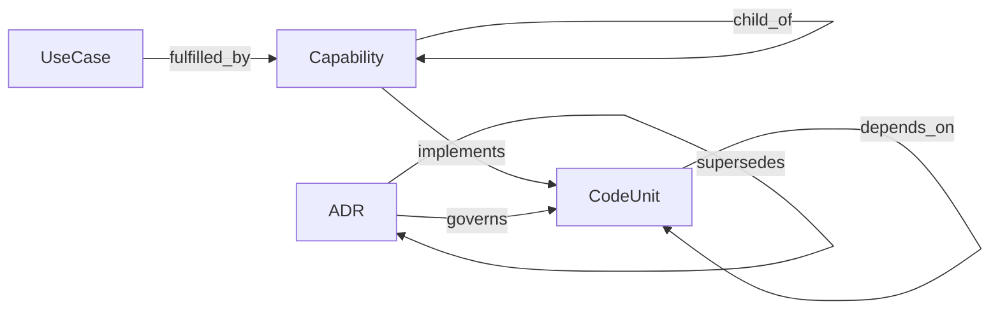

# Graph

> Counts are live — regenerate with `make graph-index` after adding nodes or edges.

| edge | inverse | from → to | source | properties | count |
| --- | --- | --- | --- | --- | --- |
| implements | implemented_by | Capability → CodeUnit | authored | — | 90 |
| child_of | parent_of | Capability → Capability | authored | — | 38 |
| depends_on | depended_on_by | CodeUnit → CodeUnit | derived | — | 51 |
| governs | governed_by | ADR → CodeUnit | authored | — | 24 |
| supersedes | superseded_by | ADR → ADR | authored | — | 1 |
| fulfilled_by | fulfills | UseCase → Capability | authored | — | 2 |

## Nodes

- ADR: 20
- Capability: 52
- CodeUnit: 41
- UseCase: 3

## Meta-schema

