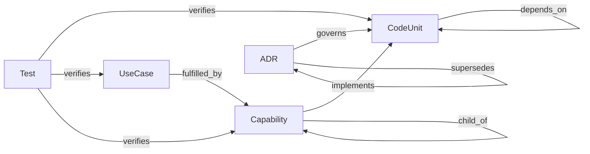

# Graph

> Counts are live — regenerate with `make graph-index` after adding nodes or edges.

| edge | inverse | from → to | source | properties | count |
| --- | --- | --- | --- | --- | --- |
| implements | implemented_by | Capability → CodeUnit | authored | — | 103 |
| child_of | parent_of | Capability → Capability | authored | — | 39 |
| depends_on | depended_on_by | CodeUnit → CodeUnit | derived | — | 56 |
| governs | governed_by | ADR → CodeUnit | authored | — | 24 |
| supersedes | superseded_by | ADR → ADR | authored | — | 1 |
| fulfilled_by | fulfills | UseCase → Capability | authored | — | 52 |
| verifies | verified_by | Test → CodeUnit\|UseCase\|Capability | derived | test_type | 194 |

## Nodes

- ADR: 22
- Capability: 54
- CodeUnit: 47
- Test: 194
- UseCase: 20

## Meta-schema

