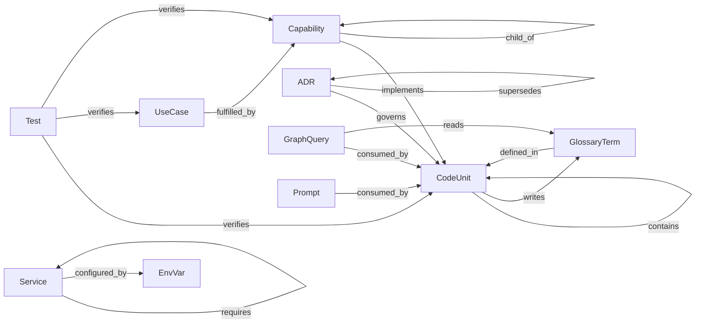

# Graph

> Counts are live — regenerate with `make graph-index` after adding nodes or edges.

| edge | inverse | from → to | source | properties | count |
| --- | --- | --- | --- | --- | --- |
| implements | implemented_by | Capability → CodeUnit | authored | — | 106 |
| child_of | parent_of | Capability → Capability | authored | — | 41 |
| depends_on | depended_on_by | CodeUnit → CodeUnit | derived | — | 381 |
| contains | contained_by | CodeUnit → CodeUnit | derived | — | 168 |
| governs | governed_by | ADR → CodeUnit | authored | — | 106 |
| supersedes | superseded_by | ADR → ADR | authored | — | 1 |
| fulfilled_by | fulfills | UseCase → Capability | authored | — | 55 |
| verifies | verified_by | Test → CodeUnit\|UseCase\|Capability | derived | test_type | 222 |
| defined_in | defines | GlossaryTerm → CodeUnit | authored | — | 110 |
| consumed_by | consumes | GraphQuery → CodeUnit | derived | — | 61 |
| consumed_by | consumes | Prompt → CodeUnit | derived | — | 61 |
| reads | read_by | GraphQuery → GlossaryTerm | derived | — | 134 |
| writes | written_by | CodeUnit → GlossaryTerm | derived | — | 15 |
| requires | required_by | Service → Service | derived | — | 9 |
| configured_by | configures | Service → EnvVar | derived | — | 21 |

## Nodes

- ADR: 28
- Capability: 56
- CodeUnit: 202
- EnvVar: 15
- GlossaryTerm: 111
- GraphQuery: 33
- Prompt: 28
- Service: 7
- Test: 225
- UseCase: 21

## Meta-schema

