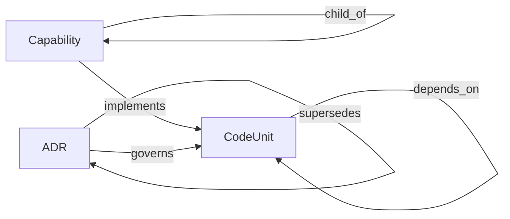

# Graph

| edge | inverse | from → to | source | count |
| --- | --- | --- | --- | --- |
| implements | implemented_by | Capability → CodeUnit | authored | 89 |
| child_of | parent_of | Capability → Capability | authored | 37 |
| depends_on | depended_on_by | CodeUnit → CodeUnit | derived | 48 |
| governs | governed_by | ADR → CodeUnit | authored | 24 |
| supersedes | superseded_by | ADR → ADR | authored | 1 |

## Nodes

- ADR: 20
- Capability: 51
- CodeUnit: 40

## Meta-schema

