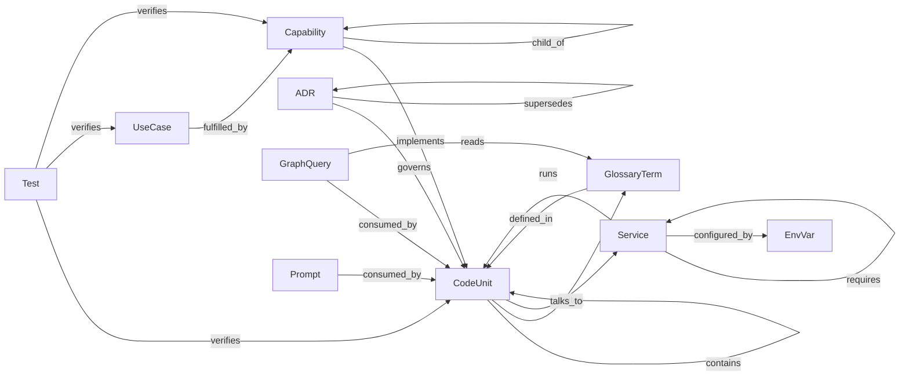

# Graph

> Counts are live — regenerate with `make graph-index` after adding nodes or edges.

| edge | inverse | from → to | source | properties | count |
| --- | --- | --- | --- | --- | --- |
| implements | implemented_by | Capability → CodeUnit | authored | — | 107 |
| child_of | parent_of | Capability → Capability | authored | — | 42 |
| depends_on | depended_on_by | CodeUnit → CodeUnit | derived | — | 391 |
| contains | contained_by | CodeUnit → CodeUnit | derived | — | 173 |
| governs | governed_by | ADR → CodeUnit | authored | — | 114 |
| supersedes | superseded_by | ADR → ADR | authored | — | 1 |
| fulfilled_by | fulfills | UseCase → Capability | authored | — | 55 |
| verifies | verified_by | Test → CodeUnit\|UseCase\|Capability | derived | test_type | 229 |
| defined_in | defines | GlossaryTerm → CodeUnit | authored | — | 110 |
| consumed_by | consumes | GraphQuery → CodeUnit | derived | — | 62 |
| consumed_by | consumes | Prompt → CodeUnit | derived | — | 62 |
| reads | read_by | GraphQuery → GlossaryTerm | derived | — | 135 |
| writes | written_by | CodeUnit → GlossaryTerm | derived | — | 15 |
| requires | required_by | Service → Service | derived | — | 9 |
| configured_by | configures | Service → EnvVar | derived | — | 21 |
| runs | run_by | Service → CodeUnit | derived | — | 3 |
| talks_to | talked_to_by | CodeUnit → Service | derived | — | 5 |

## Nodes

- ADR: 30
- Capability: 57
- CodeUnit: 208
- EnvVar: 15
- GlossaryTerm: 111
- GraphQuery: 34
- Prompt: 28
- Service: 7
- Test: 232
- UseCase: 21

## Meta-schema

```mermaid
graph LR
    Capability -->|implements| CodeUnit
    Capability -->|child_of| Capability
    CodeUnit -->|depends_on| CodeUnit
    CodeUnit -->|contains| CodeUnit
    ADR -->|governs| CodeUnit
    ADR -->|supersedes| ADR
    UseCase -->|fulfilled_by| Capability
    Test -->|verifies| CodeUnit
    Test -->|verifies| UseCase
    Test -->|verifies| Capability
    GlossaryTerm -->|defined_in| CodeUnit
    GraphQuery -->|consumed_by| CodeUnit
    Prompt -->|consumed_by| CodeUnit
    GraphQuery -->|reads| GlossaryTerm
    CodeUnit -->|writes| GlossaryTerm
    Service -->|requires| Service
    Service -->|configured_by| EnvVar
    Service -->|runs| CodeUnit
    CodeUnit -->|talks_to| Service
```
